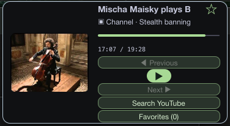

# Align Previous/Next and transport styling with the player reference

ID: 01
Parent: [Responsive SketchyBar player with reference-aligned controls](../map.md)
Type: task
Labels: wayfinder:task
Mode: AFK
Status: resolved
Assignee: root / 01a0f702-d970-7c31-8e5c-44de0c743491
Blocked by: 05

## Question

How can the existing SketchyBar renderer match the supplied reference's horizontal transport strip, replacing the current vertically stacked Previous/Play/Next button rows?

## Goal

Implement and verify a compact player transport that matches the supplied reference: Previous, Play/Pause, and Next appear side by side, evenly aligned in a single pale-green rounded strip beneath progress, with standalone dark transport glyphs and a larger circular central Play/Pause treatment. Remove the stacked labeled Previous/Next button rows while preserving usable click targets, clear enabled/disabled states, and all current player actions and navigation behavior.

## Context and scope

- [Capture the new transport reference](05-capture-transport-reference.md) is resolved. The user explicitly supplied the following target and current-state images; implementation is unblocked.

  

  

- Target composition: square artwork on the left; title, creator, progress and timestamps on the right; transport strip below the progress. The dark compact card should not grow vertically to accommodate one row per transport action. Keep Previous/Next icon-only, visually subordinate to the centered Play/Pause circle. Sample song/artist in the reference is not default content.
- Extend [Compact player popup redesign](../../../docs/tickets/MARO-001-player-redesign.md) and [Next and Previous](../../../docs/tickets/MARO-002-track-navigation.md). Existing navigation is implemented; the older redesign ticket's exclusion of new navigation features does not prohibit styling these working controls.
- Inspect `integrations/sketchybar/plugins/maro.py`, item configuration, and `scripts/check-sketchybar-renderer.py` before editing. Reuse native SketchyBar layout/drawing facilities and current icon/font conventions.
- Retain artwork, metadata, scrolling long titles, progress/timestamps, Favorite star, Search, and Favorites access. Any reference-only shuffle/repeat icons do not authorize those features.

## Acceptance

1. Actual rendered visual evidence shows one shared pale-green capsule with Previous, Play/Pause, and Next in a horizontal line. Previous/Next use dark skip-track icons, without text labels or separate outlined boxes. Play/Pause is centered with the reference's circular emphasis. Align centers and spacing; maintain usable hit targets with accessible labels/tooltips where supported.
2. Preserve the compact two-column composition, readable metadata/progress/timestamps, artwork proportions, and rounded dark card. Use approximately the reference's 360–400 × 150–180 point footprint where practical; document any native-layout limitation rather than claiming a match. Search and Favorites remain visible and usable without splitting transport back into stacked rows.
3. Verify long titles, missing artwork, playing/paused/ended, preparing, source-update-required, and first/last/outside-search-list states. Disabled controls are visibly distinct and non-actionable.
4. Preserve navigation through the full fetched result list, no wrapping, no automatic advance, paused/playing intent, and failed-neighbor behavior. Popup open/close/reopen and Favorite/Search/Favorites remain usable.
5. Run the renderer check and relevant navigation tests. Capture visual evidence using an available browser/computer inspection path or a faithful renderer preview; record which environment was inspected. Property dumps alone do not prove fidelity, and previews do not prove installed physical-click behavior.
6. Record files changed, checks run, visual evidence, and reversible installation instructions. Keep any unavailable installed/manual acceptance explicit; do not claim completion while a required visual check is missing.

## AFK execution

The reference prerequisite is resolved. Follow the map's claim/create_goal/verify/complete contract using the Goal above. Do not start playback simply to inspect the UI.

## Answer

Implemented and installed on 2026-10-01. [Installed native card](../assets/installed-native-player.jpeg) shows the shared pale-green horizontal strip, dark skip-track glyphs, central circular transport, real artwork, progress, accessible Favorite/Search/Favorites actions, and visible source errors.

- Native SketchyBar composition was investigated first. Its [popup layout implementation](https://github.com/FelixKratz/SketchyBar/blob/master/src/popup.c) assigns every horizontal child the same full-height window, and vertical popups cannot contain a horizontal row. Overlaying multiple rows overlaps click targets. The existing Maro companion now owns an AppKit/SwiftUI card; no separate app, dependency, source, or playback engine was added. SketchyBar retains the anchor and routes clicks through a new validated `player` command.
- The card is 392 × 166 points normally and 392 × 188 with one feedback row. Long titles animate through their full text and respect reduced motion. Thumbnail proportions are preserved, with a neutral missing-image fallback. Native buttons have accessibility labels and tooltips.
- The obsolete row renderer was removed. Registration migrates only known Maro children and refreshes the anchor handler, preserving unrelated SketchyBar configuration.
- Validation: 67 Swift tests passed (the opt-in live source probe remains skipped); offline bar routing/migration checks passed; release build and standalone signature verification passed; installer upgrade/rollback checks passed. `scripts/check-player-card.swift` rendered 11 actual native view states and checked open/close/reopen/Escape with zero preparation calls and unchanged paused position. [Native state renders](../assets/native-card-checks/paused.png) include navigation boundaries, missing artwork, unknown duration, preparing, ended, errors, and Favorites.
- Scoped computer-use inspection of the installed app confirmed real layout and accessible disabled Previous/Next controls. Actual clicks switched Favorites → Now Playing, Escape closed the card, and the installed bar handler reopened it. No Play, selection, or navigation action was used for inspection; physical menubar clicking and the earlier 30-minute listening gate are not claimed as newly tested.
- The managed installation preserved the exact paused track/position and favorites at update time. Backup: `/Users/devinhasler/Applications/Maro Local.backup-c3fac28103674324b55a0fc53ef4a07d`. Revert through `python3 scripts/install.py rollback --prefix '/Users/devinhasler/Applications/Maro Local'` after safely stopping Maro, then relaunch and register its restored plugin. Bundle: `/private/tmp/maro-transport-20261001/Maro.app`.

The later live snapshot displayed an audio-preparation timeout after the installed player state changed; this is input to the separate audio goal, not a visual acceptance failure. No success is claimed for that unresolved source issue.
