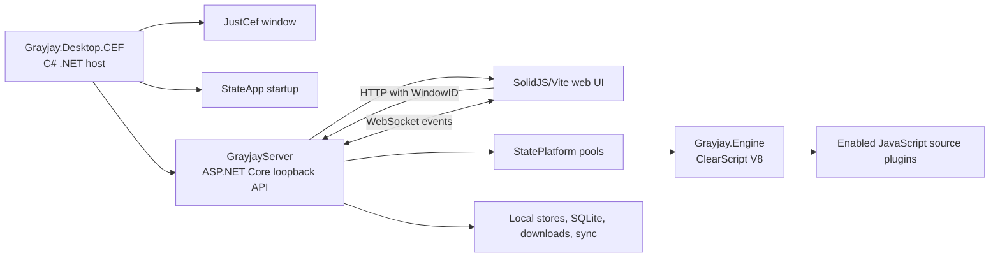
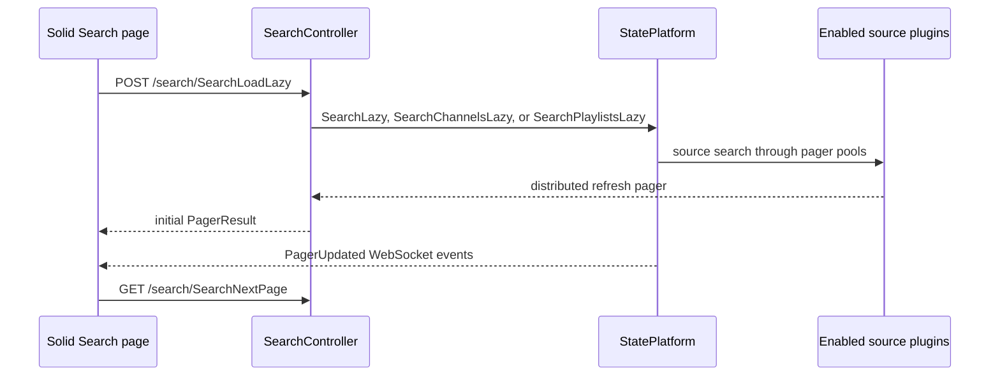
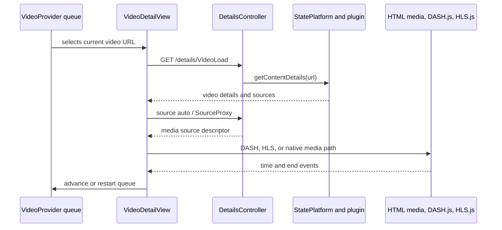

# Grayjay Desktop Reference Research

Research date: 2026-09-06

## Scope and source baseline

This document describes the current state of **Grayjay Desktop**, the FUTO media client meant by the clarified `Ray J` reference. It uses first-party Grayjay/FUTO sources and FUTO-owned official source mirrors. It records observed implementation and behavior only; it does not assess or recommend changes.

| Source | Pinned revision checked | Role |
| --- | --- | --- |
| [FUTO Grayjay Desktop](https://github.com/futo-org/Grayjay.Desktop) | [`b865bb00773710e155461e1412e215a27aa5d9dc`](https://github.com/futo-org/Grayjay.Desktop/commit/b865bb00773710e155461e1412e215a27aa5d9dc) | Desktop host, local client/server, web UI, and desktop tests. The README identifies GitLab as upstream and GitHub as a read-only mirror. |
| [FUTO Grayjay Engine](https://github.com/futo-org/Grayjay.Engine) | [`56e1604cc9dfa403c5bc38e3b747e31908f272c2`](https://github.com/futo-org/Grayjay.Engine/commit/56e1604cc9dfa403c5bc38e3b747e31908f272c2) | Shared C# JavaScript-plugin engine and engine tests. |
| [FUTO YouTube plugin](https://github.com/futo-org/grayjay-plugin-youtube) | [`847a46f00ce6d74f3417b99dc79e84ce2c4eb231`](https://github.com/futo-org/grayjay-plugin-youtube/commit/847a46f00ce6d74f3417b99dc79e84ce2c4eb231) | Official JavaScript source-plugin example. |
| [FUTO Grayjay Android](https://github.com/futo-org/grayjay-android) | [`225f2d29d03c1730560b7cadc0fbe0e084a02898`](https://github.com/futo-org/grayjay-android/commit/225f2d29d03c1730560b7cadc0fbe0e084a02898) | Separate Android product, used here only to distinguish it from Desktop. |

The primary first-party web sources are the [Grayjay Desktop page](https://grayjay.app/desktop), the [official plugin catalog](https://plugins.grayjay.app/), and the Desktop mirror's named upstream, [FUTO GitLab](https://gitlab.futo.org/videostreaming/Grayjay.Desktop).

## Product identity and platform support

- **Grayjay Desktop is a separate desktop application, not the Android app.** Its README describes a multi-platform media application with an extendable plugin system and says plugins are cross-compatible between Android and Desktop. [Desktop README](https://github.com/futo-org/Grayjay.Desktop/blob/b865bb00773710e155461e1412e215a27aa5d9dc/README.md#L2-L8)
- The Desktop solution explicitly includes the CEF executable, client/server, Engine, web frontend, and test projects. [Solution](https://github.com/futo-org/Grayjay.Desktop/blob/b865bb00773710e155461e1412e215a27aa5d9dc/Grayjay.Desktop.sln#L6-L24)
- The Android codebase is an independent Kotlin/Gradle Android application with its own application module. [Android build file](https://github.com/futo-org/grayjay-android/blob/225f2d29d03c1730560b7cadc0fbe0e084a02898/app/build.gradle) It is not the C#/.NET + CEF Desktop implementation.

### First-party distributed desktop builds

| OS | Current builds listed on the official Desktop page |
| --- | --- |
| Windows | x64 installer and portable x64 ZIP |
| Linux | x64 ZIP |
| macOS | Apple Silicon (`arm64`) ZIP and Intel (`x64`) ZIP |

Source: [Grayjay Desktop downloads](https://grayjay.app/desktop). The source README also documents the current `xattr -c` launch preparation for `Grayjay_osx-arm64.app` and `Grayjay_osx-x64.app`. [macOS README section](https://github.com/futo-org/Grayjay.Desktop/blob/b865bb00773710e155461e1412e215a27aa5d9dc/README.md#L10-L18)

At source level, `Grayjay.Desktop.CEF` targets `net8.0`, is configured for self-contained/single-file publishing, and declares Windows, Linux, and macOS RIDs, including `osx-x64` and `osx-arm64`. [Desktop project file](https://github.com/futo-org/Grayjay.Desktop/blob/b865bb00773710e155461e1412e215a27aa5d9dc/Grayjay.Desktop.CEF/Grayjay.Desktop.CEF.csproj#L3-L13) `StateApp` maps the runtime to Windows, Linux, and macOS platform names based on OS and process architecture. [Runtime platform resolution](https://github.com/futo-org/Grayjay.Desktop/blob/b865bb00773710e155461e1412e215a27aa5d9dc/Grayjay.ClientServer/States/StateApp.cs#L48-L64) The RIDs describe source build targets; the table records current first-party downloads.

## Languages, frameworks, and architecture

| Layer | Current implementation |
| --- | --- |
| Desktop executable | C#/.NET 8 `Grayjay.Desktop.CEF`, a `WinExe` referencing `JustCef` and the client/server project. [Project](https://github.com/futo-org/Grayjay.Desktop/blob/b865bb00773710e155461e1412e215a27aa5d9dc/Grayjay.Desktop.CEF/Grayjay.Desktop.CEF.csproj#L3-L61) |
| Embedded window | JustCef/CEF. The host starts a `JustCefProcess`, creates a `JustCefWindow`, and navigates to the local web UI. [Startup/window creation](https://github.com/futo-org/Grayjay.Desktop/blob/b865bb00773710e155461e1412e215a27aa5d9dc/Grayjay.Desktop.CEF/Program.cs#L474-L550), [local navigation](https://github.com/futo-org/Grayjay.Desktop/blob/b865bb00773710e155461e1412e215a27aa5d9dc/Grayjay.Desktop.CEF/Program.cs#L578-L627) |
| Local backend | C# ASP.NET Core/Kestrel in `Grayjay.ClientServer`, exposing controllers, static web files, and WebSockets. [Server setup](https://github.com/futo-org/Grayjay.Desktop/blob/b865bb00773710e155461e1412e215a27aa5d9dc/Grayjay.ClientServer/GrayjayServer.cs#L47-L100), [web and WebSocket routes](https://github.com/futo-org/Grayjay.Desktop/blob/b865bb00773710e155461e1412e215a27aa5d9dc/Grayjay.ClientServer/GrayjayServer.cs#L141-L202) |
| Web UI | TypeScript, SolidJS, Solid Router, and Vite. The package also declares DASH.js and HLS.js. [Web package manifest](https://github.com/futo-org/Grayjay.Desktop/blob/b865bb00773710e155461e1412e215a27aa5d9dc/Grayjay.Desktop.Web/package.json#L5-L32) |
| Source engine | C#/.NET 8 `Grayjay.Engine`, hosting JavaScript plugins with Microsoft ClearScript V8. [Engine project](https://github.com/futo-org/Grayjay.Engine/blob/56e1604cc9dfa403c5bc38e3b747e31908f272c2/Grayjay.Engine/Grayjay.Engine.csproj#L3-L29), [V8 setup](https://github.com/futo-org/Grayjay.Engine/blob/56e1604cc9dfa403c5bc38e3b747e31908f272c2/Grayjay.Engine/GrayjayPlugin.cs#L212-L293) |
| Plugin sources | JavaScript. The official YouTube configuration identifies `YoutubeScript.js` and its allowed engine packages. [YouTube configuration](https://github.com/futo-org/grayjay-plugin-youtube/blob/847a46f00ce6d74f3417b99dc79e84ce2c4eb231/YoutubeConfig.json#L7-L18) |

1. The CEF host calls `StateApp.Startup()`, constructs `GrayjayServer`, waits for its listener, then opens `/web/index.html` from that server. [Host startup sequence](https://github.com/futo-org/Grayjay.Desktop/blob/b865bb00773710e155461e1412e215a27aa5d9dc/Grayjay.Desktop.CEF/Program.cs#L498-L627)
2. In normal UI mode, Kestrel binds to `IPAddress.Loopback` with port `0`, and startup writes the selected port in the application data directory for a later invocation to open a window. [Loopback binding](https://github.com/futo-org/Grayjay.Desktop/blob/b865bb00773710e155461e1412e215a27aa5d9dc/Grayjay.ClientServer/GrayjayServer.cs#L54-L64), [port handoff](https://github.com/futo-org/Grayjay.Desktop/blob/b865bb00773710e155461e1412e215a27aa5d9dc/Grayjay.Desktop.CEF/Program.cs#L401-L448), [port write](https://github.com/futo-org/Grayjay.Desktop/blob/b865bb00773710e155461e1412e215a27aa5d9dc/Grayjay.Desktop.CEF/Program.cs#L606-L623)
3. The server maps controllers, serves packaged `wwwroot/web` assets, and owns a `/ws` endpoint. [Routing](https://github.com/futo-org/Grayjay.Desktop/blob/b865bb00773710e155461e1412e215a27aa5d9dc/Grayjay.ClientServer/GrayjayServer.cs#L141-L202)
4. The SolidJS root routes pages for home, search, subscriptions, creators, playlists, Watch Later, sources, downloads, history, and settings, and wraps them in `VideoProvider`. [Frontend routes](https://github.com/futo-org/Grayjay.Desktop/blob/b865bb00773710e155461e1412e215a27aa5d9dc/Grayjay.Desktop.Web/src/index.tsx#L147-L177)
5. Frontend backend helpers call the local server through `fetch` and add the window's `WindowID` header. [Backend transport](https://github.com/futo-org/Grayjay.Desktop/blob/b865bb00773710e155461e1412e215a27aa5d9dc/Grayjay.Desktop.Web/src/backend/Backend.ts#L5-L98)
6. Startup initializes plugin encryption, available source clients, database tables, and operational state for plugins, subscriptions, history sync, and downloads. [State initialization](https://github.com/futo-org/Grayjay.Desktop/blob/b865bb00773710e155461e1412e215a27aa5d9dc/Grayjay.ClientServer/States/StateApp.cs#L128-L334)

## Source plugin system

- Plugin configuration includes identity, source/config/script URLs, allowed URLs, required/optional packages, desktop authentication/captcha data, testing configuration, capabilities, settings, and enablement flags. [PluginConfig](https://github.com/futo-org/Grayjay.Engine/blob/56e1604cc9dfa403c5bc38e3b747e31908f272c2/Grayjay.Engine/PluginConfig.cs#L13-L57), [desktop auth/captcha fields](https://github.com/futo-org/Grayjay.Engine/blob/56e1604cc9dfa403c5bc38e3b747e31908f272c2/Grayjay.Engine/PluginConfig.cs#L217-L250)
- Installing a source URL downloads the config and script, tests a temporary plugin, persists the descriptor/script, and reloads available source clients. [Installation flow](https://github.com/futo-org/Grayjay.Desktop/blob/b865bb00773710e155461e1412e215a27aa5d9dc/Grayjay.ClientServer/States/StatePlugins.cs#L127-L267)
- Installed descriptors use the encrypted `ManagedStore<PluginDescriptor>` named `plugins`; plugin scripts use a separate `plugin_scripts` store. [Plugin stores](https://github.com/futo-org/Grayjay.Desktop/blob/b865bb00773710e155461e1412e215a27aa5d9dc/Grayjay.ClientServer/States/StatePlugins.cs#L16-L21)
- `StatePlatform` maintains enabled/available clients plus distinct pools for main UI, utilities, pagers, channel/subscription work, playback trackers, and live events. [Client pools](https://github.com/futo-org/Grayjay.Desktop/blob/b865bb00773710e155461e1412e215a27aa5d9dc/Grayjay.ClientServer/States/StatePlatform.cs#L34-L52) It constructs `GrayjayPlugin` instances from persisted descriptors/scripts when rebuilding available clients. [Client construction](https://github.com/futo-org/Grayjay.Desktop/blob/b865bb00773710e155461e1412e215a27aa5d9dc/Grayjay.ClientServer/States/StatePlatform.cs#L954-L993)
- The Engine starts V8, injects JS bridge/polyfill code, initializes configured packages, executes the source script, and determines supported capabilities by checking source methods such as `search`, `getContentDetails`, `getPlaylist`, `saveState`, and `getContentRecommendations`. [Plugin initialization and capability discovery](https://github.com/futo-org/Grayjay.Engine/blob/56e1604cc9dfa403c5bc38e3b747e31908f272c2/Grayjay.Engine/GrayjayPlugin.cs#L212-L293)
- Typed engine wrappers dispatch search as `source.search(query, type, order, filters)` and details as `source.getContentDetails(url)`. [Search wrapper](https://github.com/futo-org/Grayjay.Engine/blob/56e1604cc9dfa403c5bc38e3b747e31908f272c2/Grayjay.Engine/GrayjayPlugin.cs#L509-L518), [details wrapper](https://github.com/futo-org/Grayjay.Engine/blob/56e1604cc9dfa403c5bc38e3b747e31908f272c2/Grayjay.Engine/GrayjayPlugin.cs#L555-L570)

### Official YouTube plugin example

- The FUTO YouTube plugin lists FUTO's `sourceUrl`, its repository/script URLs, an allowlist of YouTube/Google-related domains, and source packages. [Configuration identity and packages](https://github.com/futo-org/grayjay-plugin-youtube/blob/847a46f00ce6d74f3417b99dc79e84ce2c4eb231/YoutubeConfig.json#L2-L44)
- Its script implements search suggestions, video/live search, channel search, and search paging. [Search implementation](https://github.com/futo-org/grayjay-plugin-youtube/blob/847a46f00ce6d74f3417b99dc79e84ce2c4eb231/YoutubeScript.js#L765-L835)
- `source.getContentDetails` requests/parses player/page data, handles session/restriction states, prepares cipher data, and produces `PlatformVideoDetails` sources. [Details entry](https://github.com/futo-org/grayjay-plugin-youtube/blob/847a46f00ce6d74f3417b99dc79e84ce2c4eb231/YoutubeScript.js#L1681-L1716), [details/source parsing](https://github.com/futo-org/grayjay-plugin-youtube/blob/847a46f00ce6d74f3417b99dc79e84ce2c4eb231/YoutubeScript.js#L1717-L1928)
- The playback tracker is available only when the `youtubeActivity` setting is enabled and the plugin is logged in. [Tracker gate](https://github.com/futo-org/grayjay-plugin-youtube/blob/847a46f00ce6d74f3417b99dc79e84ce2c4eb231/YoutubeScript.js#L2947-L3091)
- `source.getContentRecommendations` creates a pager from watch-next related content when available. [Recommendations](https://github.com/futo-org/grayjay-plugin-youtube/blob/847a46f00ce6d74f3417b99dc79e84ce2c4eb231/YoutubeScript.js#L3152-L3208)

## Search flow

1. The Search page maintains query, content type, enabled source IDs, sort, and filters in route/page state; it asks `SearchBackend.searchPagerLazy(...)` for results and renders a `ContentGrid`. [Search UI](https://github.com/futo-org/Grayjay.Desktop/blob/b865bb00773710e155461e1412e215a27aa5d9dc/Grayjay.Desktop.Web/src/pages/Search/index.tsx#L26-L66), [rendering/filters](https://github.com/futo-org/Grayjay.Desktop/blob/b865bb00773710e155461e1412e215a27aa5d9dc/Grayjay.Desktop.Web/src/pages/Search/index.tsx#L164-L265)
2. `SearchBackend` posts the query/type/filter/excluded-plugin payload to `SearchLoadLazy`, constructs a refresh pager, and retrieves later pages from `SearchNextPage`. [Frontend search backend](https://github.com/futo-org/Grayjay.Desktop/blob/b865bb00773710e155461e1412e215a27aa5d9dc/Grayjay.Desktop.Web/src/backend/SearchBackend.ts#L7-L27)
3. `SearchController` selects media, channel, or playlist search based on `ContentType`, saves the pager in per-window state, and exposes the next-page method. [Search controller](https://github.com/futo-org/Grayjay.Desktop/blob/b865bb00773710e155461e1412e215a27aa5d9dc/Grayjay.ClientServer/Controllers/SearchController.cs#L17-L60)
4. `StatePlatform.SearchLazy` selects enabled source clients with search enabled, maps the request filters to plugin capabilities, and invokes each through the pager pool. [Per-source dispatch](https://github.com/futo-org/Grayjay.Desktop/blob/b865bb00773710e155461e1412e215a27aa5d9dc/Grayjay.ClientServer/States/StatePlatform.cs#L278-L302)
5. The distributed-pager mechanism runs source tasks on the app thread pool, supplies placeholders for pending source results, and broadcasts `PagerUpdated` over WebSockets as sources resolve. [Lazy pager implementation](https://github.com/futo-org/Grayjay.Desktop/blob/b865bb00773710e155461e1412e215a27aa5d9dc/Grayjay.ClientServer/States/StatePlatform.cs#L600-L631)
6. Previous search terms are local `ManagedStore` state named `previousSearches_0`, timestamp ordered, and are added only when `GrayjaySettings.Search.SearchHistory` is enabled. [Search state](https://github.com/futo-org/Grayjay.Desktop/blob/b865bb00773710e155461e1412e215a27aa5d9dc/Grayjay.ClientServer/States/StateSearch.cs#L5-L37), [settings gate](https://github.com/futo-org/Grayjay.Desktop/blob/b865bb00773710e155461e1412e215a27aa5d9dc/Grayjay.ClientServer/Controllers/SearchController.cs#L89-L105)

## Playback and queue flow

1. `VideoProvider` owns the in-memory queue/index, repeat and shuffle flags, current video, player display state, and persisted UI preferences. `openVideo`, `setQueue`, and `addToQueue` construct or change the queue. [Video context](https://github.com/futo-org/Grayjay.Desktop/blob/b865bb00773710e155461e1412e215a27aa5d9dc/Grayjay.Desktop.Web/src/contexts/VideoProvider.tsx#L22-L56), [queue changes](https://github.com/futo-org/Grayjay.Desktop/blob/b865bb00773710e155461e1412e215a27aa5d9dc/Grayjay.Desktop.Web/src/contexts/VideoProvider.tsx#L64-L140)
2. The detail UI observes the queue URL, calls `/details/VideoLoad`, and creates comments, chapters, and recommendations pagers after loading. [Detail loading](https://github.com/futo-org/Grayjay.Desktop/blob/b865bb00773710e155461e1412e215a27aa5d9dc/Grayjay.Desktop.Web/src/components/contentDetails/VideoDetailView/index.tsx#L125-L177)
3. `DetailsController.VideoLoad` checks for a downloaded item, asks `StatePlatform` for source-specific details, changes per-window detail state, and returns local and/or online video data. [Video load endpoint](https://github.com/futo-org/Grayjay.Desktop/blob/b865bb00773710e155461e1412e215a27aa5d9dc/Grayjay.ClientServer/Controllers/DetailsController.cs#L309-L377) `StatePlatform` identifies an enabled plugin that accepts the URL and dispatches its `GetContentDetails` through the main client pool. [Plugin selection/details call](https://github.com/futo-org/Grayjay.Desktop/blob/b865bb00773710e155461e1412e215a27aa5d9dc/Grayjay.ClientServer/States/StatePlatform.cs#L168-L193), [URL selection](https://github.com/futo-org/Grayjay.Desktop/blob/b865bb00773710e155461e1412e215a27aa5d9dc/Grayjay.ClientServer/States/StatePlatform.cs#L708-L728)
4. The UI selects a source automatically or manually and passes video/audio/subtitle indexes to `sourceProxy`. [Source selection](https://github.com/futo-org/Grayjay.Desktop/blob/b865bb00773710e155461e1412e215a27aa5d9dc/Grayjay.Desktop.Web/src/components/contentDetails/VideoDetailView/index.tsx#L375-L409), [source-proxy request](https://github.com/futo-org/Grayjay.Desktop/blob/b865bb00773710e155461e1412e215a27aa5d9dc/Grayjay.Desktop.Web/src/backend/DetailsBackend.ts#L73-L85)
5. The server can generate a DASH manifest for selected video/audio/subtitle sources and maps local, direct, and proxied URLs into descriptors. [DASH generation](https://github.com/futo-org/Grayjay.Desktop/blob/b865bb00773710e155461e1412e215a27aa5d9dc/Grayjay.ClientServer/Controllers/DetailsController.cs#L676-L841), [source proxy endpoint](https://github.com/futo-org/Grayjay.Desktop/blob/b865bb00773710e155461e1412e215a27aa5d9dc/Grayjay.ClientServer/Controllers/DetailsController.cs#L1169-L1245)
6. The player uses DASH.js for `application/dash+xml`, HLS.js for supported HLS MIME types, and native HTML media for other direct sources. [Source-to-player handoff](https://github.com/futo-org/Grayjay.Desktop/blob/b865bb00773710e155461e1412e215a27aa5d9dc/Grayjay.Desktop.Web/src/components/player/VideoPlayerView/index.tsx#L294-L336), [player branches](https://github.com/futo-org/Grayjay.Desktop/blob/b865bb00773710e155461e1412e215a27aa5d9dc/Grayjay.Desktop.Web/src/components/player/VideoPlayerView/index.tsx#L621-L1059)
7. At end of playback, the detail view calculates the next queue position from repeat/shuffle flags, selects/restarts it, and removes a loaded finished video from Watch Later. [End handling](https://github.com/futo-org/Grayjay.Desktop/blob/b865bb00773710e155461e1412e215a27aa5d9dc/Grayjay.Desktop.Web/src/components/contentDetails/VideoDetailView/index.tsx#L239-L321)
8. Progress is sent via the details backend; `StateHistory` keeps historical positions and the history controller exposes them for resume behavior. [Progress request](https://github.com/futo-org/Grayjay.Desktop/blob/b865bb00773710e155461e1412e215a27aa5d9dc/Grayjay.Desktop.Web/src/backend/DetailsBackend.ts#L83-L85), [history state](https://github.com/futo-org/Grayjay.Desktop/blob/b865bb00773710e155461e1412e215a27aa5d9dc/Grayjay.ClientServer/States/StateHistory.cs#L23-L54), [history API](https://github.com/futo-org/Grayjay.Desktop/blob/b865bb00773710e155461e1412e215a27aa5d9dc/Grayjay.ClientServer/Controllers/HistoryController.cs#L24-L43)

## Local state, Watch Later, and playlists

- On macOS, Grayjay's base directory is `~/Library/Application Support/Grayjay` when usable; otherwise it uses the application container under `~/Containers/com.futo.grayjay.desktop/Data/Library/Application Support`. [Directory selection](https://github.com/futo-org/Grayjay.Desktop/blob/b865bb00773710e155461e1412e215a27aa5d9dc/Grayjay.ClientServer/Constants/Directories.cs#L17-L75)
- The SQLite database is `database.db` in that base directory. It uses SQLite read/write/create, shared cache, pooling, and WAL initialization. [Database setup](https://github.com/futo-org/Grayjay.Desktop/blob/b865bb00773710e155461e1412e215a27aa5d9dc/Grayjay.ClientServer/Database/DatabaseConnection.cs#L10-L40), [WAL initialization](https://github.com/futo-org/Grayjay.Desktop/blob/b865bb00773710e155461e1412e215a27aa5d9dc/Grayjay.ClientServer/Database/DatabaseConnection.cs#L136-L143)
- Typed `ManagedStore<T>` directories serialize application data with the Grayjay JSON serializer and can encrypt their stored files. [Store construction](https://github.com/futo-org/Grayjay.Desktop/blob/b865bb00773710e155461e1412e215a27aa5d9dc/Grayjay.ClientServer/Store/ManagedStore.cs#L31-L119), [serialization/encryption](https://github.com/futo-org/Grayjay.Desktop/blob/b865bb00773710e155461e1412e215a27aa5d9dc/Grayjay.ClientServer/Store/ManagedStore.cs#L245-L264)
- **Watch Later** stores videos uniquely by URL, separately persists ordering and add/remove/reorder timestamps, and sends an update notification to WebSocket clients. Its controller exposes get, add, remove, and reorder APIs. [State](https://github.com/futo-org/Grayjay.Desktop/blob/b865bb00773710e155461e1412e215a27aa5d9dc/Grayjay.ClientServer/States/StateWatchLater.cs#L17-L130), [controller](https://github.com/futo-org/Grayjay.Desktop/blob/b865bb00773710e155461e1412e215a27aa5d9dc/Grayjay.ClientServer/Controllers/WatchLaterController.cs#L8-L46)
- **User playlists** use a unique store by playlist ID and have a reconstruction form for restoration/import. Adding content copies the video to the playlist and updates timestamps; mutations emit WebSocket/sync changes. The playlist controller provides CRUD and content add/remove functions. [State](https://github.com/futo-org/Grayjay.Desktop/blob/b865bb00773710e155461e1412e215a27aa5d9dc/Grayjay.ClientServer/States/StatePlaylists.cs#L16-L156), [controller](https://github.com/futo-org/Grayjay.Desktop/blob/b865bb00773710e155461e1412e215a27aa5d9dc/Grayjay.ClientServer/Controllers/PlaylistsController.cs#L10-L68)
- **History** uses a local `DBHistory` store indexed by URL and records position, date, and metadata; it offers paging/search. [History persistence](https://github.com/futo-org/Grayjay.Desktop/blob/b865bb00773710e155461e1412e215a27aa5d9dc/Grayjay.ClientServer/States/StateHistory.cs#L23-L54), [history paging/search](https://github.com/futo-org/Grayjay.Desktop/blob/b865bb00773710e155461e1412e215a27aa5d9dc/Grayjay.ClientServer/States/StateHistory.cs#L143-L203)
- **Favorites terminology:** in this revision, the reviewed saved-video state/API/store surface is named **Watch Later** and **Playlists**. A source-tree search found no dedicated `Favorite` or `Favorites` state, controller, or persisted model. Incidental UI prose about favorite creators is not a separate Favorites feature.

## Current testing patterns

- The Desktop solution has `Grayjay.Desktop.Tests`, `Grayjay.Windows.Tests`, and `Grayjay.Engine.Tests` projects. [Solution test entries](https://github.com/futo-org/Grayjay.Desktop/blob/b865bb00773710e155461e1412e215a27aa5d9dc/Grayjay.Desktop.sln#L10-L20)
- Desktop/Windows test projects are .NET 8 MSTest projects with `Microsoft.NET.Test.Sdk`, MSTest adapter/framework, Coverlet collector, and a Windows x64 ClearScript V8 native package. [Desktop tests project](https://github.com/futo-org/Grayjay.Desktop/blob/b865bb00773710e155461e1412e215a27aa5d9dc/Grayjay.Desktop.Tests/Grayjay.Desktop.Tests.csproj#L3-L24), [Windows tests project](https://github.com/futo-org/Grayjay.Desktop/blob/b865bb00773710e155461e1412e215a27aa5d9dc/Grayjay.Windows.Tests/Grayjay.Windows.Tests.csproj#L3-L27)
- The standalone Engine source has its own analogous .NET 8 MSTest/Coverlet project. [Engine tests project](https://github.com/futo-org/Grayjay.Engine/blob/56e1604cc9dfa403c5bc38e3b747e31908f272c2/Grayjay.Engine.Tests/Grayjay.Engine.Tests.csproj#L3-L23)
- Deterministic test examples cover encryption, database storage/query/pager behavior, and extension/domain matching. [Encryption test](https://github.com/futo-org/Grayjay.Desktop/blob/b865bb00773710e155461e1412e215a27aa5d9dc/Grayjay.Desktop.Tests/EncryptionProviderTests.cs#L6-L25), [database tests](https://github.com/futo-org/Grayjay.Desktop/blob/b865bb00773710e155461e1412e215a27aa5d9dc/Grayjay.Desktop.Tests/DatabaseTests.cs#L16-L72), [engine extension tests](https://github.com/futo-org/Grayjay.Engine/blob/56e1604cc9dfa403c5bc38e3b747e31908f272c2/Grayjay.Engine.Tests/ExtensionTests.cs#L10-L55)
- Integration tests instantiate live first-party plugin URLs and call source methods. Desktop's Rumble test covers home and comment replies; Engine's YouTube tests cover home paging, details, performance, and cipher preparation. [Rumble tests](https://github.com/futo-org/Grayjay.Desktop/blob/b865bb00773710e155461e1412e215a27aa5d9dc/Grayjay.Desktop.Tests/Plugins/RumblePluginTests.cs#L11-L73), [YouTube tests](https://github.com/futo-org/Grayjay.Engine/blob/56e1604cc9dfa403c5bc38e3b747e31908f272c2/Grayjay.Engine.Tests/YoutubeTest.cs#L6-L96)
- `GrayjayTestSystem` discovers plugin-provided `GrayjayTests`, creates an isolated test plugin, serializes execution on a worker thread, and records result/time/log information. [Plugin test queue/setup](https://github.com/futo-org/Grayjay.Engine/blob/56e1604cc9dfa403c5bc38e3b747e31908f272c2/Grayjay.Engine/GrayjayTestSystem.cs#L37-L115), [test execution](https://github.com/futo-org/Grayjay.Engine/blob/56e1604cc9dfa403c5bc38e3b747e31908f272c2/Grayjay.Engine/GrayjayTestSystem.cs#L132-L230)
- The web package currently declares only `start`, `dev`, `build`, and `serve` scripts; it does not declare a JavaScript test script or test-runner dependency. [Web scripts](https://github.com/futo-org/Grayjay.Desktop/blob/b865bb00773710e155461e1412e215a27aa5d9dc/Grayjay.Desktop.Web/package.json#L5-L32)
