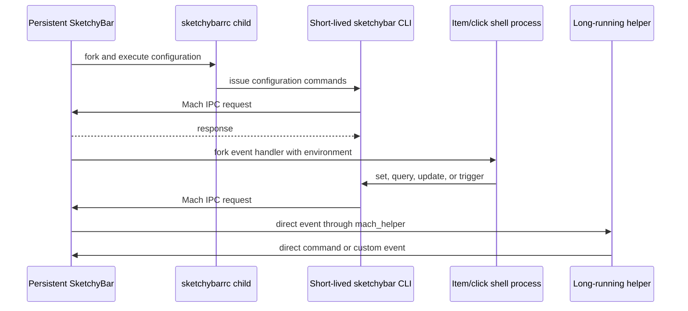
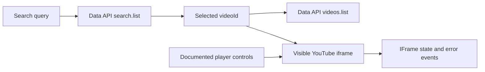
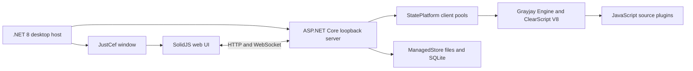
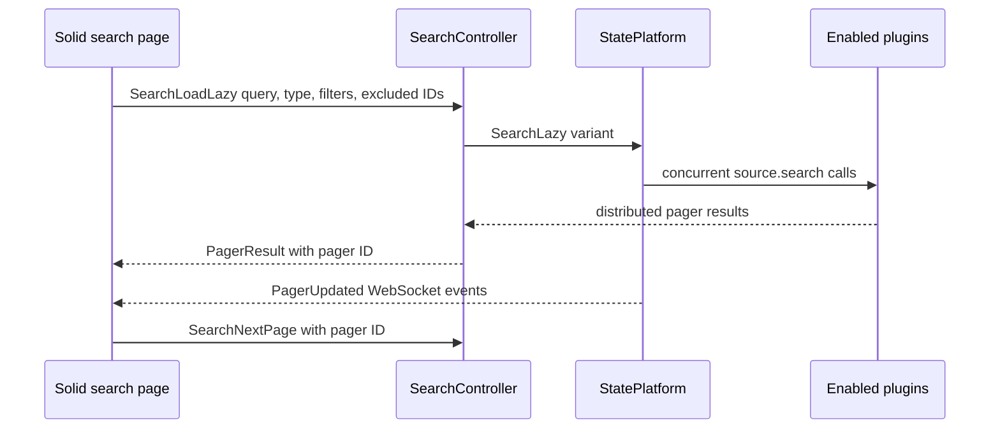
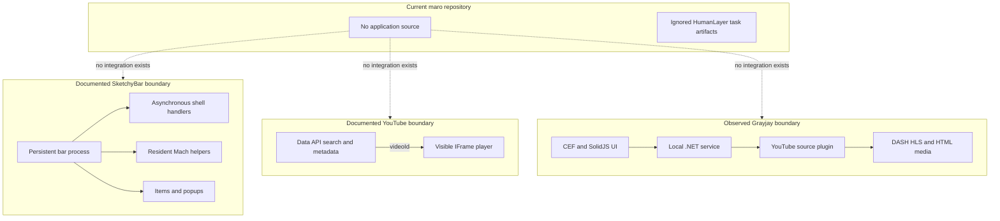

# Research: Ad-free YouTube Music Player Platform and Codebase Map

**Date**: 2026-09-06T23:03:29+02:00  
**Git Commit**: `bfb50e9a5a29541d5ee837d1c5f06496296e3efb`  
**Branch**: `ad-free-youtube-music-player-with-search-and-favorites`  
**Repository**: `DevinHaas/maro`

## Research Question

1. What is the repository's current baseline, including tracked and untracked files, application source, configuration, dependency manifests, build/run entry points, tests, and the boundary between repository content and HumanLayer task metadata?
2. How does SketchyBar currently execute configuration, scripts, events, click handlers, long-running helpers, and `mach_helper` integrations, including lifecycle and timeout behavior?
3. Which presentation, interaction, and styling primitives does SketchyBar expose, and which concrete values and state patterns appear in its first-party examples?
4. How do the current YouTube Data API search, filtering, pagination, video metadata, thumbnail, authentication, quota, error, and availability interfaces behave?
5. How do officially supported YouTube playback interfaces behave, and which visibility, autoplay, advertising, background/audio-only, downloading, and access constraints apply?
6. How does the clarified Grayjay Desktop reference implement search, playback, saved media, and macOS integration, and does its current first-party source include SketchyBar integration?

## Research Methodology (verbatim)

This document will remain objective and factual. It does not contain any recommendations or implementation suggestions.
Open questions will not ask Why things haven't been built or what should be built in the future.

There is no "implementation" section - that is intentional.

## Summary

The repository has no committed files at the researched revision. Its one commit has an empty tree, while the current worktree contains an untracked `.gitignore` and an ignored `.humanlayer/tasks/` area. There is consequently no application source, dependency graph, build or run command, data model, user-interface implementation, or test suite to trace. The HumanLayer material is workspace metadata rather than part of the committed product.

SketchyBar is a persistent macOS process whose ordinary configuration and event handlers are asynchronous child shell processes. Short-lived `sketchybar` CLI calls communicate with the persistent process over Mach IPC. Items react to periodic updates, built-in or custom events, pointer activity, and clicks; long-running native providers can publish events directly, while `mach_helper` attaches an already-running Mach service to an item. The display model is rich enough for bars, item text, images, sliders, graphs, aliases, brackets, and popup trees, but its native interaction model is pointer-oriented and does not provide an editable text field or keyboard-input control.

YouTube separates discovery from playback. The Data API returns search resources and metadata but not media streams. Official playback occurs in a visible embedded YouTube player controlled through the IFrame Player API. That player exposes queueing, playback, playlist navigation, state, timing, and errors, while YouTube's binding policies prohibit blocking ads, hiding the player as a background player, separating audio from video, downloading audiovisual content without approval, and using undocumented APIs or scraping. These are policy constraints in addition to browser autoplay rules and technical embed behavior.

The clarified reference is Grayjay Desktop, FUTO's cross-platform media client. It is a separate product from Grayjay Android and is implemented as a self-contained .NET 8/CEF desktop application with a SolidJS/Vite interface, a loopback ASP.NET Core service, and JavaScript source plugins hosted in ClearScript V8. Its YouTube plugin searches YouTube through website/Innertube endpoints, resolves direct media sources and manifests, and hands those sources to DASH.js, HLS.js, or the browser's native media element. Current first-party macOS builds target Apple Silicon and Intel.

## Detailed Findings

### 1. The repository is an empty committed tree surrounded by local task metadata

The repository is on branch `ad-free-youtube-music-player-with-search-and-favorites` at `bfb50e9a5a29541d5ee837d1c5f06496296e3efb`, the sole commit (`Initial commit`). Local `main`, `origin/main`, and `origin/HEAD` resolve to the same commit. Both the recursive commit tree and Git index contain zero paths.

The current worktree has two visible categories:

```text
maro/
├── .git/          # Git administrative data
├── .gitignore     # untracked worktree file
└── .humanlayer/   # local workspace metadata
    └── tasks/     # ignored cloud-synced task artifacts
```

The untracked `.gitignore` labels the task directory as cloud-synced Riptide artifacts and ignores `.humanlayer/tasks/`; both the comment and rule appear twice (`.gitignore:2-6`). `git check-ignore -v` attributes the ignored task-directory status to `.gitignore:6`. The configured global excludes file covers backup files, `.DS_Store`, and Claude-local settings, but does not establish this `.humanlayer` boundary.

| Surface | Current state | Git relationship |
| --- | --- | --- |
| Application source | No files or directories | No tracked or untracked application paths |
| Dependency manifests and lockfiles | None | No dependencies declared |
| Build and runtime configuration | None | No build or run entrypoint |
| Tests and fixtures | None | No repository test pattern |
| `.gitignore` | Present | Untracked; not part of the commit |
| `.humanlayer/tasks/` | Present | Ignored workspace/task metadata |

The artifact directory contains planning and research material, but its contents sit behind the ignored `.humanlayer/tasks/` boundary. The technical findings below therefore describe external platform behavior; they do not describe an existing local application integration.

#### Testing patterns

There are no tracked or untracked application tests, test runners, test configuration files, fixtures, mocks, or CI test commands in the repository. The only non-ignored worktree file is `.gitignore`.

### 2. SketchyBar routes configuration and updates through one persistent process and Mach IPC

SketchyBar's executable has two roles. Without CLI message arguments, it becomes the persistent bar process: it initializes integrations and its Mach server, asynchronously executes `sketchybarrc`, watches the configuration directory, and enters the application run loop ([startup source](https://github.com/FelixKratz/SketchyBar/blob/6284ee816601486ace33ca48a0271832eec6de35/src/sketchybar.c#L202-L256), [configuration execution](https://github.com/FelixKratz/SketchyBar/blob/6284ee816601486ace33ca48a0271832eec6de35/src/hotload.c#L19-L70)). With CLI arguments, it acts as a short-lived client: it packs arguments into a NUL-delimited message, locates the instance's bootstrap Mach port, sends the request, receives and prints a response, and exits ([CLI dispatch](https://github.com/FelixKratz/SketchyBar/blob/6284ee816601486ace33ca48a0271832eec6de35/src/sketchybar.c#L60-L108), [Mach transport](https://github.com/FelixKratz/SketchyBar/blob/6284ee816601486ace33ca48a0271832eec6de35/src/mach.c#L127-L199)).



A batched CLI message can contain several command domains. SketchyBar freezes visual updates while processing the batch, performs one refresh, and then replies ([transaction handling](https://github.com/FelixKratz/SketchyBar/blob/6284ee816601486ace33ca48a0271832eec6de35/src/message.c#L596-L668), [batching documentation](https://github.com/FelixKratz/SketchyBar/blob/6ed777608bc981937a929126abe4d5fffcf74c52/docs/config/Tricks.md#L8-L28)).

Periodic item work is scheduled by a one-second run-loop timer. `update_freq` is an integer number of seconds, and `0` disables periodic execution. Periodic, event-driven, and forced updates converge on the same item dispatch path ([scheduler](https://github.com/FelixKratz/SketchyBar/blob/6284ee816601486ace33ca48a0271832eec6de35/src/bar_manager.c#L63-L79), [dispatch](https://github.com/FelixKratz/SketchyBar/blob/6284ee816601486ace33ca48a0271832eec6de35/src/bar_item.c#L111-L174)).

#### Testing patterns

The local repository has no SketchyBar integration or tests. These lifecycle findings come from the current upstream source and official documentation rather than a local unit, integration, or end-to-end suite.

### 3. Ordinary item handlers are independent asynchronous shells, while helpers remain resident

Each ordinary `script` and `click_script` invocation starts a fresh `/usr/bin/env sh -c` child. SketchyBar returns to its event loop immediately, does not capture handler output, does not retain a per-item child handle, and does not serialize subsequent invocations behind an earlier handler. Multiple invocations for one item can therefore coexist ([script properties](https://github.com/FelixKratz/SketchyBar/blob/6284ee816601486ace33ca48a0271832eec6de35/src/bar_item.c#L318-L345), [spawn behavior](https://github.com/FelixKratz/SketchyBar/blob/6284ee816601486ace33ca48a0271832eec6de35/src/misc/helpers.h#L441-L461)).

Handlers receive item variables together with `NAME`, `SENDER`, and event-specific values. A periodic update uses `SENDER=routine`; `--update` uses `SENDER=forced` ([environment construction](https://github.com/FelixKratz/SketchyBar/blob/6284ee816601486ace33ca48a0271832eec6de35/src/bar_item.c#L137-L158), [environment documentation](https://github.com/FelixKratz/SketchyBar/blob/6ed777608bc981937a929126abe4d5fffcf74c52/docs/config/Events.md#L37-L50)). On mouse-up, SketchyBar invokes `click_script` and separately emits `SENDER=mouse.clicked` to the general script when the item subscribes to that event, so one click can initiate both paths ([click routing](https://github.com/FelixKratz/SketchyBar/blob/6284ee816601486ace33ca48a0271832eec6de35/src/event.c#L72-L106), [handler order](https://github.com/FelixKratz/SketchyBar/blob/6284ee816601486ace33ca48a0271832eec6de35/src/bar_item.c#L201-L258)).

Custom events are named channels created with `--add event <name> [NSDistributedNotificationName]`. `--trigger <event> KEY=value...` dispatches a custom event and adds supplied values to subscriber environments ([custom-event documentation](https://github.com/FelixKratz/SketchyBar/blob/6ed777608bc981937a929126abe4d5fffcf74c52/docs/config/Events.md#L64-L89), [routing source](https://github.com/FelixKratz/SketchyBar/blob/6284ee816601486ace33ca48a0271832eec6de35/src/message.c#L66-L101)). The current built-in registry covers application, space, display, volume, brightness, power, Wi-Fi, media, sleep/wake, pointer, click, and scroll changes ([event documentation](https://felixkratz.github.io/SketchyBar/config/events), [registry source](https://github.com/FelixKratz/SketchyBar/blob/6284ee816601486ace33ca48a0271832eec6de35/src/custom_events.c#L18-L41)).

```text
item update
  choose sender: routine, forced, built-in event, or custom event
  assemble NAME, SENDER, item variables, and event payload
  if mach_helper is registered and event is eligible
    serialize environment and send directly to helper port
  if shell script is configured
    spawn independent shell child
```

`mach_helper=<bootstrap-name>` resolves an already-running Mach service and stores its port on the item. Eligible event environments are serialized and sent directly without waiting for a response; an item can have both a shell script and a helper ([lookup and dispatch](https://github.com/FelixKratz/SketchyBar/blob/6284ee816601486ace33ca48a0271832eec6de35/src/bar_item.c#L137-L171), [helper contract](https://github.com/FelixKratz/SketchyBarHelper/blob/73ee34d377f62fc12ddbf519a2bcdb4b7946292a/README.md#L15-L36)). SbarLua implements this contract, converts event environments to Lua tables, and executes callbacks on its event-loop thread; its subscription bridge clears the item's shell script when binding its helper ([subscription bridge](https://github.com/FelixKratz/SbarLua/blob/dba9cc421b868c918d5c23c408544a28aadf2f2f/src/sketchybar.c#L292-L369), [callback dispatch](https://github.com/FelixKratz/SbarLua/blob/dba9cc421b868c918d5c23c408544a28aadf2f2f/src/sketchybar.c#L255-L289)).

First-party continuous CPU and network providers follow a different resident-producer pattern: launchers terminate an old provider before starting its replacement; the native provider disables its process alarm, samples continuously, and publishes custom events over direct Mach IPC ([CPU launcher](https://github.com/FelixKratz/dotfiles/blob/67ad686ea6d4c29ccd54fdaa42cdf35f37a7219c/.config/sketchybar/items/widgets/cpu.lua#L5-L8), [CPU provider](https://github.com/FelixKratz/dotfiles/blob/67ad686ea6d4c29ccd54fdaa42cdf35f37a7219c/.config/sketchybar/helpers/event_providers/cpu_load/cpu_load.c#L4-L39)).

| Timing boundary | Current behavior |
| --- | --- |
| Configuration, item, and click shells | Receive a 60-second process alarm ([docs](https://github.com/FelixKratz/SketchyBar/blob/6ed777608bc981937a929126abe4d5fffcf74c52/docs/config/Events.md#L60-L63), [source](https://github.com/FelixKratz/SketchyBar/blob/6284ee816601486ace33ca48a0271832eec6de35/src/misc/helpers.h#L441-L461)) |
| SbarLua `sbar.exec` | Installs its own 60-second alarm ([source](https://github.com/FelixKratz/SbarLua/blob/dba9cc421b868c918d5c23c408544a28aadf2f2f/src/sketchybar.c#L714-L763)) |
| Core CLI reply | 100 ms receive timeout ([source](https://github.com/FelixKratz/SketchyBar/blob/6284ee816601486ace33ca48a0271832eec6de35/src/mach.c#L27-L50)) |
| Response-bearing SbarLua/helper calls | 1000 ms receive timeout ([SbarLua](https://github.com/FelixKratz/SbarLua/blob/dba9cc421b868c918d5c23c408544a28aadf2f2f/src/mach.h#L91-L185), [helper](https://github.com/FelixKratz/SketchyBarHelper/blob/73ee34d377f62fc12ddbf519a2bcdb4b7946292a/sketchybar.h#L75-L98)) |
| Animation duration | 60 Hz-equivalent steps; seconds are `duration / 60` ([docs](https://github.com/FelixKratz/SketchyBar/blob/6ed777608bc981937a929126abe4d5fffcf74c52/docs/config/Animations.md#L6-L24)) |
| Popup visibility | Stateful until `popup.drawing` changes; no automatic dismissal timer ([source](https://github.com/FelixKratz/SketchyBar/blob/6284ee816601486ace33ca48a0271832eec6de35/src/popup.c#L233-L250)) |

On reload, SketchyBar tears down and reinitializes the bar manager, sends a two-byte termination message to registered helpers, and executes the configuration again ([reload event](https://github.com/FelixKratz/SketchyBar/blob/6284ee816601486ace33ca48a0271832eec6de35/src/event.c#L339-L344), [teardown](https://github.com/FelixKratz/SketchyBar/blob/6284ee816601486ace33ca48a0271832eec6de35/src/bar_manager.c#L1063-L1089)). Sleep suppresses the central item-script update path; wake emits an immediate event and another after 500 ms ([sleep/wake source](https://github.com/FelixKratz/SketchyBar/blob/6284ee816601486ace33ca48a0271832eec6de35/src/bar_manager.c#L1016-L1043)).

#### Testing patterns

The local repository contains no script, helper, or event tests. The documented process and timeout behavior is traced from SketchyBar, SbarLua, SketchyBarHelper, and FelixKratz's first-party configuration source.

### 4. SketchyBar provides composable display primitives but no native editable search field

Every item owns a popup; children enter that popup through `position=popup.<host>`. Popups support vertical or horizontal layout, host-relative alignment, topmost placement, nesting, offsets, blur, and the same background styling vocabulary used elsewhere ([popup documentation](https://felixkratz.github.io/SketchyBar/config/popups), [layout source](https://github.com/FelixKratz/SketchyBar/blob/6284ee816601486ace33ca48a0271832eec6de35/src/popup.c#L74-L230)). Popup visibility is explicit state rather than an automatically expiring transient.

SketchyBar's visual surface includes text-bearing items, graphs, sliders, aliases, brackets, images attached to backgrounds, and nested popup items. Background images can come from a file, an application icon (`app.<name-or-bundle-id>`), a space snapshot (`space.<sid>`), or current media artwork (`media.artwork`) ([image loader](https://github.com/FelixKratz/SketchyBar/blob/6284ee816601486ace33ca48a0271832eec6de35/src/image.c#L39-L125), [space preview example](https://github.com/FelixKratz/dotfiles/blob/67ad686ea6d4c29ccd54fdaa42cdf35f37a7219c/.config/sketchybar/items/spaces.lua#L56-L94)). Icons and labels are CoreText-rendered UTF-8 strings with font, color, highlight, padding, width, alignment, truncation, scrolling, nested background, and shadow properties ([text properties](https://github.com/FelixKratz/SketchyBar/blob/6ed777608bc981937a929126abe4d5fffcf74c52/docs/config/Items.md#L73-L94), [drawing source](https://github.com/FelixKratz/SketchyBar/blob/6284ee816601486ace33ca48a0271832eec6de35/src/text.c#L313-L356)).

The native event surface is pointer-based: mouse up, drag, enter, exit, wheel, and scroll. Click metadata distinguishes `left`, `right`, `other`, and modifiers. Slider drag changes geometry continuously and sends `PERCENTAGE` on release; scroll supplies `SCROLL_DELTA`, `MODIFIER`, and `INFO` ([mouse events](https://github.com/FelixKratz/SketchyBar/blob/6284ee816601486ace33ca48a0271832eec6de35/src/mouse.c#L4-L38), [slider behavior](https://github.com/FelixKratz/SketchyBar/blob/6ed777608bc981937a929126abe4d5fffcf74c52/docs/config/Components.md#L154-L177)). The complete item and event APIs expose no keyboard focus, key event, editable text field, caret, selection, or in-bar text-entry primitive ([items API](https://felixkratz.github.io/SketchyBar/config/items), [events API](https://felixkratz.github.io/SketchyBar/config/events)). Labels display strings but do not accept text input.

SketchyBar has no named theme object. Styling is stateful configuration applied to items and inherited defaults: ARGB colors, font descriptors, backgrounds, borders, images, shadows, blur, and animation ([default inheritance](https://github.com/FelixKratz/SketchyBar/blob/6ed777608bc981937a929126abe4d5fffcf74c52/docs/config/Items.md#L139-L146)). FelixKratz's current first-party configuration defines this palette and baseline:

| Role | Exact value or property |
| --- | --- |
| Black / white | `0xff181819` / `0xffe2e2e3` |
| Red / green / blue | `0xfffc5d7c` / `0xff9ed072` / `0xff76cce0` |
| Yellow / orange / magenta | `0xffe7c664` / `0xfff39660` / `0xffb39df3` |
| Grey / transparent | `0xff7f8490` / `0x00000000` |
| Backgrounds | `0xff363944`, `0xff414550` |
| Bar fill / border | `0xf02c2e34` / `0xff2c2e34` |
| Popup fill / border | `0xc02c2e34` / `0xff7f8490` |
| Text fonts | SF Pro; SF Mono for numbers |
| Icon defaults | Bold 14, white, 3-point horizontal padding |
| Label defaults | Semibold 13, white, 3-point horizontal padding |
| Item background | Height 28, radius 9, border 2 |
| Popup background | Border 2, radius 9, blur 50, shadow enabled |
| Bar | Height 40, 2-point left/right padding |

The exact colors come from the [first-party palette](https://github.com/FelixKratz/dotfiles/blob/67ad686ea6d4c29ccd54fdaa42cdf35f37a7219c/.config/sketchybar/colors.lua#L1-L28); font and dimension defaults come from the [font table](https://github.com/FelixKratz/dotfiles/blob/67ad686ea6d4c29ccd54fdaa42cdf35f37a7219c/.config/sketchybar/helpers/default_font.lua#L1-L13), [item defaults](https://github.com/FelixKratz/dotfiles/blob/67ad686ea6d4c29ccd54fdaa42cdf35f37a7219c/.config/sketchybar/default.lua#L4-L52), and [bar defaults](https://github.com/FelixKratz/dotfiles/blob/67ad686ea6d4c29ccd54fdaa42cdf35f37a7219c/.config/sketchybar/bar.lua#L1-L9).

First-party state changes are property changes rather than a separate component-state system. Space selection changes number, app-label, inner-border, and outer-border colors; hover reveal animates borders and dynamic label width over 30 steps; CPU thresholds move from blue through yellow and orange to red; media labels animate between width `0` and `dynamic`, with pointer and playback events controlling visibility ([space states](https://github.com/FelixKratz/dotfiles/blob/67ad686ea6d4c29ccd54fdaa42cdf35f37a7219c/.config/sketchybar/items/spaces.lua#L69-L80), [hover transition](https://github.com/FelixKratz/dotfiles/blob/67ad686ea6d4c29ccd54fdaa42cdf35f37a7219c/.config/sketchybar/items/spaces.lua#L149-L173), [CPU thresholds](https://github.com/FelixKratz/dotfiles/blob/67ad686ea6d4c29ccd54fdaa42cdf35f37a7219c/.config/sketchybar/items/widgets/cpu.lua#L34-L54), [media transitions](https://github.com/FelixKratz/dotfiles/blob/67ad686ea6d4c29ccd54fdaa42cdf35f37a7219c/.config/sketchybar/items/media.lua#L75-L118)).

#### Testing patterns

The local repository has no visual configuration, interaction tests, snapshots, or end-to-end UI tests. The presentation surface is documented from official API documentation, current upstream source, and first-party example configuration.

### 5. YouTube discovery is a two-call metadata flow rather than a playback stream API

The YouTube Data API v3 discovery boundary is `GET https://www.googleapis.com/youtube/v3/search`. `part=snippet` is required. By default, results may identify videos, channels, or playlists; each result's `id.kind` and corresponding resource ID identify which persistent resource can be fetched next ([search reference](https://developers.google.com/youtube/v3/docs/search/list), [search resource](https://developers.google.com/youtube/v3/docs/search)). A search item is a search-result representation, not the complete video resource.

```text
GET /youtube/v3/search
  required: part=snippet
  common:   q=<terms>&type=video&maxResults=<0..50>&pageToken=<token>
  filters:  order, publishedAfter, publishedBefore, regionCode,
            relevanceLanguage, safeSearch, topicId, channelId,
            videoCaption, videoCategoryId, videoDefinition,
            videoDuration, videoEmbeddable, videoLicense,
            videoPaidProductPlacement, videoSyndicated, videoType

GET /youtube/v3/videos
  required: part=<metadata sections>
  selector: id=<comma-separated video IDs> | chart=mostPopular | myRating=<value>
```

`type=video` activates video-only filters. Query text supports `-` for NOT and `|` for OR. Search can filter by dates, channel, region, language, SafeSearch setting, topic, ownership, and video properties; ordering supports `date`, `rating`, `relevance`, `title`, `videoCount`, and `viewCount` ([search parameters](https://developers.google.com/youtube/v3/docs/search/list)). A `channelId` plus `type=video` search is capped at 500 videos unless an ownership filter is present.

Pagination uses `maxResults` from 0 through 50, with 5 as the documented default, and opaque `pageToken` values. Responses expose `nextPageToken` and `prevPageToken` when those pages exist. A page may have fewer than `maxResults` entries even when another page exists; `pageInfo.totalResults` is approximate and capped at 1,000,000 ([pagination guide](https://developers.google.com/youtube/v3/guides/implementation/pagination), [search response](https://developers.google.com/youtube/v3/docs/search/list)). The search documentation also records indexing delays for `order=date` and potentially incomplete result sets for non-relevance ordering, particularly with publication-date filters.

For selected video IDs, `videos.list` can return `snippet`, `contentDetails`, `statistics`, `status`, `player`, `liveStreamingDetails`, `topicDetails`, and other owner-oriented sections ([videos.list](https://developers.google.com/youtube/v3/docs/videos/list)). Relevant fields include title, description, channel, publication time, thumbnails, tags, category, duration, live state, caption availability, regional restrictions, privacy, licensing, embeddability, statistics, and Made for Kids status ([video resource](https://developers.google.com/youtube/v3/docs/videos)). Owner-only fields include file details, processing details, suggestions, and general-public access to dislike count. Unlisted metadata remains retrievable when the caller knows the video ID; private access depends on owner authorization.

Thumbnails are maps keyed by available sizes. Entries provide a URL and can provide width and height. Typical video sizes are `default` 120x90, `medium` 320x180, `high` 480x360, `standard` 640x480, and `maxres` 1280x720, but `standard` and `maxres` exist only for some resources and dimensions are not guaranteed ([thumbnail resource](https://developers.google.com/youtube/v3/docs/thumbnails)).

The Data API exposes metadata and account operations, not an audio/video stream URL. Search results can feed a selected video ID to an official player, but media transport remains a separate embedded-player boundary.

#### Testing patterns

There is no local Data API client, response fixture, mock server, contract test, or integration test. The request and response contracts in this section are the current published API contracts, not behavior exercised by this repository.

### 6. Data API access combines project identity, user authorization, quota buckets, and structured errors

Every Data API request requires project credentials. Public-data requests use an API key to identify the project for access and quota; private user data requires an OAuth 2.0 access token with user consent and suitable scopes ([credential registration](https://developers.google.com/youtube/registering_an_application), [authentication guide](https://developers.google.com/youtube/v3/guides/authentication)). YouTube user data does not support service-account authorization; the documented failure is `NoLinkedYouTubeAccount`.

The current quota calculator describes separate default daily allocations of 100 `search.list` calls, 100 `videos.insert` calls, and 10,000 units shared by other endpoints, with reset at midnight Pacific Time ([quota calculator](https://developers.google.com/youtube/v3/determine_quota_cost)). `videos.list` costs one unit in the other-endpoints bucket. Each additional page is another request, and invalid requests consume at least one quota point. Default allocation can change; the documented route for more allocation includes a compliance audit ([quota and compliance](https://developers.google.com/youtube/v3/guides/quota_and_compliance_audits)).

API failures have a common JSON envelope:

```text
error
  code: HTTP status
  message: summary
  errors[]
    domain
    reason
    message
    location (when tied to a parameter)
```

General failures include incompatible or missing parameters, invalid page tokens, missing authorization, insufficient permissions, quota exhaustion, and missing resources ([core error shape](https://developers.google.com/youtube/v3/docs/core_errors), [error catalog](https://developers.google.com/youtube/v3/docs/errors)). `search.list` additionally reports invalid filter combinations, channels, locations, and relevance languages; `videos.list` reports unauthorized owner-only metadata and unknown videos ([search errors](https://developers.google.com/youtube/v3/docs/search/list), [video errors](https://developers.google.com/youtube/v3/docs/videos/list)).

#### Testing patterns

The repository has no credential configuration, API adapter, retry behavior, quota accounting, error mapping, or tests. All behavior in this section is defined by current official documentation.

### 7. Official playback is a visible YouTube embed controlled by the IFrame Player API

YouTube's current general-purpose playback surface is the embedded HTML5 player. A plain iframe can load a video, playlist, or user's uploads; `enablejsapi=1` allows programmatic control through the IFrame Player API ([player parameters](https://developers.google.com/youtube/player_parameters), [IFrame API](https://developers.google.com/youtube/iframe_api_reference)). Privacy Enhanced Mode uses `youtube-nocookie.com` and changes personalization behavior, including non-personalized ads, but remains the same embedded-player model and does not remove API policy obligations ([embed help](https://support.google.com/youtube/answer/171780?hl=en)).

The IFrame API can cue or load a video by ID, cue or load playlists and uploads, move with `nextVideo`, `previousVideo`, and `playVideoAt`, seek, play, pause, stop, mute, set volume, and choose an available playback rate. Cue methods prepare media without starting it; load methods initiate playback ([function reference](https://developers.google.com/youtube/iframe_api_reference#Functions)). Embedded-player search feeds are no longer supported: `listType=search` and search-form playlist loads return a 4xx response, leaving Data API `search.list` as the documented discovery interface ([revision history](https://developers.google.com/youtube/iframe_api_revision_history)).



The state model is `unstarted (-1)`, `ended (0)`, `playing (1)`, `paused (2)`, `buffering (3)`, and `video cued (5)`, available from `getPlayerState()` and `onStateChange` ([state reference](https://developers.google.com/youtube/iframe_api_reference#Playback_status)). Information methods expose current time, duration, buffered fraction, video URL, embed code, playlist contents/order, and playback rates. `getDuration()` remains zero until metadata has loaded and represents elapsed stream time for live content.

Documented playback errors are:

| Code | Meaning |
| --- | --- |
| `2` | Invalid request parameter |
| `5` | HTML5/player playability failure |
| `100` | Removed or private video |
| `101`, `150` | Owner has disallowed embedding |
| `153` | Missing `Referer` or equivalent client identity |

These are runtime player outcomes ([error reference](https://developers.google.com/youtube/iframe_api_reference#onError)). Data API metadata such as `status.embeddable` and regional restrictions can describe availability, but does not replace the embed's runtime decision.

`autoplay=1`, `playVideo`, and load methods can request playback. Browsers can block those attempts, particularly unmuted playback without prior user interaction or cross-origin iframe autoplay permission; `onAutoplayBlocked` reports the outcome ([autoplay parameter](https://developers.google.com/youtube/player_parameters#autoplay), [blocked event](https://developers.google.com/youtube/iframe_api_reference#onAutoplayBlocked)). YouTube documents a technical minimum viewport of 200x200 and recommends 480x270 for 16:9 playback. The binding policy separately requires automatic playback to begin only when the player is visible and more than half visible, and limits a page or screen to one automatically playing YouTube player ([minimum functionality](https://developers.google.com/youtube/terms/required-minimum-functionality#autoplay-and-scripted-playbacks)).

The embedded client supplies playback context and identity. `origin` secures IFrame API communication and `widget_referrer` attributes embedding context. The policy additionally requires an HTTP `Referer` or a documented equivalent for clients such as WebViews; missing identity can produce error `153` ([identity requirements](https://developers.google.com/youtube/terms/required-minimum-functionality#embedded-player-api-client-identity)).

#### Testing patterns

There is no local iframe host, player wrapper, state reducer, fake player, browser test, or media integration test. The state machine and errors here are official external contracts rather than locally exercised paths.

### 8. Official playback policy keeps ads, video, attribution, and player visibility together

Technical player capability and permission to alter playback are separate boundaries. The current binding requirements prohibit overlays or frames that obscure any part of the embedded player, altering player attributes outside documented parameters, blocking player controls or YouTube links, and hiding YouTube attribution ([overlay requirements](https://developers.google.com/youtube/terms/required-minimum-functionality#overlays-and-frames), [player attributes](https://developers.google.com/youtube/terms/required-minimum-functionality#youtube-player-attributes), [branding policy](https://developers.google.com/youtube/terms/developer-policies#branding)).

The Developer Policies expressly prohibit modifying, replacing, interfering with, or blocking YouTube-served advertisements in the player or audiovisual content. Privacy Enhanced Mode changes ad personalization, not whether YouTube can serve ads ([advertising restriction](https://developers.google.com/youtube/terms/developer-policies#additional-prohibitions), [embed help](https://support.google.com/youtube/answer/171780?hl=en)).

The same policy section prohibits a background player, defined as a player not shown in the page, tab, or screen the user is viewing. It separately prohibits isolating, modifying, or separately promoting a video's audio or video component. No official playback API exposes an isolated audio stream or downloadable media file ([additional prohibitions](https://developers.google.com/youtube/terms/developer-policies#additional-prohibitions)).

API clients may not download, import, back up, cache, store, or make YouTube audiovisual content available offline without prior written approval ([content handling policy](https://developers.google.com/youtube/terms/developer-policies#handling-youtube-data-and-content)). The public Terms likewise prohibit downloading or other use outside the service, written permission, or applicable law, while allowing display through the embeddable player ([YouTube Terms](https://www.youtube.com/t/terms?hl=en&override_hl=1)).

Access is limited to documented API means. The Developer Policies prohibit undocumented APIs, reverse-engineering undocumented services, scraping YouTube or Google applications, and obtaining scraped YouTube data or content ([access policy](https://developers.google.com/youtube/terms/developer-policies#accessing-youtube-api-services), [scraping policy](https://developers.google.com/youtube/terms/developer-policies#handling-youtube-data-and-content)).

| Requested characteristic | Current official YouTube boundary |
| --- | --- |
| Search | Data API `search.list` |
| Metadata and thumbnails | Data API resource methods |
| Playback control | Visible embedded player through the IFrame API |
| Ad suppression | Explicitly prohibited |
| Hidden/background playback | Explicitly prohibited |
| Audio-only separation | Explicitly prohibited |
| Download/offline media | No public media endpoint; storage prohibited without approval |
| Undocumented extraction | Undocumented API access, reverse engineering, and scraping prohibited |

#### Testing patterns

The repository has no policy checks, embed-visibility tests, attribution assertions, advertisement handling, download code, or tests around these behaviors. This section records the current published constraints.

### 9. Grayjay Desktop is a local CEF application backed by a .NET service and JavaScript source plugins

The clarified reference is [Grayjay Desktop](https://grayjay.app/desktop), FUTO's desktop media client. It is separate from the Kotlin/Gradle [Grayjay Android](https://github.com/futo-org/grayjay-android) application. The Desktop solution combines a C#/.NET 8 executable, an embedded JustCef/CEF window, an ASP.NET Core/Kestrel local service, a TypeScript/SolidJS/Vite frontend, and the C# Grayjay Engine running JavaScript plugins in ClearScript V8 ([Desktop solution](https://github.com/futo-org/Grayjay.Desktop/blob/b865bb00773710e155461e1412e215a27aa5d9dc/Grayjay.Desktop.sln#L6-L24), [desktop project](https://github.com/futo-org/Grayjay.Desktop/blob/b865bb00773710e155461e1412e215a27aa5d9dc/Grayjay.Desktop.CEF/Grayjay.Desktop.CEF.csproj#L3-L61), [web manifest](https://github.com/futo-org/Grayjay.Desktop/blob/b865bb00773710e155461e1412e215a27aa5d9dc/Grayjay.Desktop.Web/package.json#L5-L32), [engine project](https://github.com/futo-org/Grayjay.Engine/blob/56e1604cc9dfa403c5bc38e3b747e31908f272c2/Grayjay.Engine/Grayjay.Engine.csproj#L3-L29)).



In normal desktop operation, the host starts application state and a Kestrel server on loopback with an ephemeral port, then loads `/web/index.html` into a CEF window. Controllers, static web assets, and a WebSocket endpoint share the local server boundary ([host startup](https://github.com/futo-org/Grayjay.Desktop/blob/b865bb00773710e155461e1412e215a27aa5d9dc/Grayjay.Desktop.CEF/Program.cs#L498-L627), [server routing](https://github.com/futo-org/Grayjay.Desktop/blob/b865bb00773710e155461e1412e215a27aa5d9dc/Grayjay.ClientServer/GrayjayServer.cs#L47-L202)). The frontend sends HTTP requests with a window ID and receives asynchronous state changes over WebSockets ([frontend transport](https://github.com/futo-org/Grayjay.Desktop/blob/b865bb00773710e155461e1412e215a27aa5d9dc/Grayjay.Desktop.Web/src/backend/Backend.ts#L5-L98)).

Plugins describe identity, script locations, URL permissions, packages, settings, authentication, capabilities, and test definitions. Installation downloads a plugin config and script, tests a temporary instance, persists both, and reloads available clients ([plugin configuration](https://github.com/futo-org/Grayjay.Engine/blob/56e1604cc9dfa403c5bc38e3b747e31908f272c2/Grayjay.Engine/PluginConfig.cs#L13-L57), [installation flow](https://github.com/futo-org/Grayjay.Desktop/blob/b865bb00773710e155461e1412e215a27aa5d9dc/Grayjay.ClientServer/States/StatePlugins.cs#L127-L267)). The Engine initializes V8, injects bridge and polyfill code, loads configured packages, executes the plugin, and detects capabilities by checking exported source methods ([engine initialization](https://github.com/futo-org/Grayjay.Engine/blob/56e1604cc9dfa403c5bc38e3b747e31908f272c2/Grayjay.Engine/GrayjayPlugin.cs#L212-L293)).

#### Testing patterns

Grayjay Desktop and Engine use .NET 8 MSTest projects with `Microsoft.NET.Test.Sdk`, MSTest adapter/framework, and Coverlet ([Desktop tests](https://github.com/futo-org/Grayjay.Desktop/blob/b865bb00773710e155461e1412e215a27aa5d9dc/Grayjay.Desktop.Tests/Grayjay.Desktop.Tests.csproj#L3-L24), [Engine tests](https://github.com/futo-org/Grayjay.Engine/blob/56e1604cc9dfa403c5bc38e3b747e31908f272c2/Grayjay.Engine.Tests/Grayjay.Engine.Tests.csproj#L3-L23)). Tests cover database behavior, encryption, keyring, licensing, proxying, sync, engine utilities, and live plugin integration. The web package declares development and build scripts but no JavaScript test script or test-runner dependency.

### 10. Grayjay search fans out across enabled plugins and refreshes results asynchronously

The source-plugin contract defines search suggestions, search capabilities, typed search, content-detail URL matching, and content-detail retrieval. The Engine wraps plugin calls such as `source.search(query, type, order, filters)` and `source.getContentDetails(url)` ([source contract](https://gitlab.futo.org/videostreaming/Grayjay.Engine/-/blob/56e1604cc9dfa403c5bc38e3b747e31908f272c2/Grayjay.Engine/ScriptDeps/source.js#L724), [typed wrappers](https://github.com/futo-org/Grayjay.Engine/blob/56e1604cc9dfa403c5bc38e3b747e31908f272c2/Grayjay.Engine/GrayjayPlugin.cs#L509-L570)).



`SearchController` routes media or unknown searches to `SearchLazy`, creator searches to `SearchChannelsLazy`, and playlist searches to `SearchPlaylistsLazy`, then keeps the pager in per-window state ([controller](https://github.com/futo-org/Grayjay.Desktop/blob/b865bb00773710e155461e1412e215a27aa5d9dc/Grayjay.ClientServer/Controllers/SearchController.cs#L17-L60)). `StatePlatform` selects enabled plugins with matching capabilities and invokes them concurrently through pager pools. Sources that finish promptly contribute results immediately; pending sources appear as placeholders and later produce `PagerUpdated` WebSocket events ([dispatch](https://github.com/futo-org/Grayjay.Desktop/blob/b865bb00773710e155461e1412e215a27aa5d9dc/Grayjay.ClientServer/States/StatePlatform.cs#L278-L302), [lazy pager](https://github.com/futo-org/Grayjay.Desktop/blob/b865bb00773710e155461e1412e215a27aa5d9dc/Grayjay.ClientServer/States/StatePlatform.cs#L600-L631)). Pagination uses the engine's `IPager<T>` contract with `HasMorePages`, `NextPage`, and `GetResults`; V8 pagers forward those operations to the plugin object ([pager contract](https://gitlab.futo.org/videostreaming/Grayjay.Engine/-/blob/56e1604cc9dfa403c5bc38e3b747e31908f272c2/Grayjay.Engine/Pagers/IPager.cs#L7), [V8 pager](https://gitlab.futo.org/videostreaming/Grayjay.Engine/-/blob/56e1604cc9dfa403c5bc38e3b747e31908f272c2/Grayjay.Engine/Pagers/V8Pager.cs#L29)).

Grayjay's FUTO-served YouTube plugin does not call the documented YouTube Data API v3. Its current script uses YouTube website and Innertube endpoints, including `www.youtube.com/youtubei/v1/search`, `youtubei.googleapis.com/youtubei/v1/player`, browse, next, guide, and watchtime endpoints ([plugin constants](https://gitlab.futo.org/videostreaming/plugins/youtube/-/blob/847a46f00ce6d74f3417b99dc79e84ce2c4eb231/YoutubeScript.js#L21), [endpoint use](https://gitlab.futo.org/videostreaming/plugins/youtube/-/blob/847a46f00ce6d74f3417b99dc79e84ce2c4eb231/YoutubeScript.js#L7341)). It advertises video/live result types, chronological/views/rating sorts, source-specific filters, and separate video, channel, and playlist pagers. Subsequent pages POST continuation tokens back to the Innertube search endpoint ([search implementation](https://github.com/futo-org/grayjay-plugin-youtube/blob/847a46f00ce6d74f3417b99dc79e84ce2c4eb231/YoutubeScript.js#L765-L835), [continuation paging](https://gitlab.futo.org/videostreaming/plugins/youtube/-/blob/847a46f00ce6d74f3417b99dc79e84ce2c4eb231/YoutubeScript.js#L7050)).

#### Testing patterns

Grayjay's plugin test system creates an isolated plugin, serializes test execution on a worker, and records timing and logs ([test system](https://github.com/futo-org/Grayjay.Engine/blob/56e1604cc9dfa403c5bc38e3b747e31908f272c2/Grayjay.Engine/GrayjayTestSystem.cs#L37-L230)). Current engine tests include live YouTube home paging, details, performance, and cipher preparation. The served YouTube configuration declares cipher, home-flow, content-detail, channel, and channel-content tests; it does not declare a search integration test.

### 11. Grayjay resolves plugin media sources and plays them outside YouTube's embedded player

For playback, `StatePlatform` selects the enabled plugin whose `isContentDetailsUrl(url)` accepts the content URL, invokes `getContentDetails`, and stamps the resulting details with the plugin ID ([plugin selection](https://github.com/futo-org/Grayjay.Desktop/blob/b865bb00773710e155461e1412e215a27aa5d9dc/Grayjay.ClientServer/States/StatePlatform.cs#L168-L193), [engine details call](https://gitlab.futo.org/videostreaming/Grayjay.Engine/-/blob/56e1604cc9dfa403c5bc38e3b747e31908f272c2/Grayjay.Engine/GrayjayPlugin.cs#L562)). The shared model represents either muxed media or separate video and audio sources. Source variants include direct/ranged URLs, HLS manifests, local files, raw DASH, and source descriptions ([video descriptor](https://gitlab.futo.org/videostreaming/Grayjay.Engine/-/blob/56e1604cc9dfa403c5bc38e3b747e31908f272c2/Grayjay.Engine/Models/Video/VideoDescriptor.cs#L14), [source types](https://gitlab.futo.org/videostreaming/Grayjay.Engine/-/blob/56e1604cc9dfa403c5bc38e3b747e31908f272c2/Grayjay.Engine/Models/Video/Sources/IVideoSource.cs#L13)).

The YouTube plugin recognizes watch, short-link, live, Shorts, clip, `/v/`, and embed URLs. It resolves metadata, captions, HLS/DASH manifests, adaptive formats, cipher and proof-of-origin token data, and server-side ABR/UMP sources ([URL matching](https://gitlab.futo.org/videostreaming/plugins/youtube/-/blob/847a46f00ce6d74f3417b99dc79e84ce2c4eb231/YoutubeScript.js#L858), [details and sources](https://github.com/futo-org/grayjay-plugin-youtube/blob/847a46f00ce6d74f3417b99dc79e84ce2c4eb231/YoutubeScript.js#L1681-L1928), [ABR sources](https://gitlab.futo.org/videostreaming/plugins/youtube/-/blob/847a46f00ce6d74f3417b99dc79e84ce2c4eb231/YoutubeScript.js#L4084)).

```text
selected content URL
  find enabled plugin accepting the URL
  ask plugin for content details and media descriptors
  choose video, audio, and subtitle sources
  request /details/SourceProxy or /details/SourceDash
  generate or proxy a playable source when needed
  play with DASH.js, HLS.js, or the native HTML media element
  report local watch progress and advance the queue on end
```

The desktop service can generate and cache a DASH manifest for selected video, audio, and subtitle sources, or proxy requests through plugin-provided executors ([DASH route](https://gitlab.futo.org/videostreaming/Grayjay.Desktop/-/blob/b865bb00773710e155461e1412e215a27aa5d9dc/Grayjay.ClientServer/Controllers/DetailsController.cs#L677), [DASH builder](https://gitlab.futo.org/videostreaming/Grayjay.Engine/-/blob/56e1604cc9dfa403c5bc38e3b747e31908f272c2/Grayjay.Engine/Dash/DashBuilder.cs#L155)). The frontend uses DASH.js for DASH, HLS.js for HLS, and the HTML `<video>` element for other media. Its player owns teardown/recreation, play/pause, seek, volume, rate, fullscreen, scrubbing, chapters, quality changes, casting handoff, and progress callbacks ([source handoff](https://github.com/futo-org/Grayjay.Desktop/blob/b865bb00773710e155461e1412e215a27aa5d9dc/Grayjay.Desktop.Web/src/components/player/VideoPlayerView/index.tsx#L294-L336), [player branches](https://github.com/futo-org/Grayjay.Desktop/blob/b865bb00773710e155461e1412e215a27aa5d9dc/Grayjay.Desktop.Web/src/components/player/VideoPlayerView/index.tsx#L621-L1059)). `VideoProvider` maintains the in-memory queue, current index, shuffle, repeat, current video, and player display state ([video context](https://github.com/futo-org/Grayjay.Desktop/blob/b865bb00773710e155461e1412e215a27aa5d9dc/Grayjay.Desktop.Web/src/contexts/VideoProvider.tsx#L22-L140)).

Grayjay's optional YouTube playback tracker is gated by both the `youtubeActivity` source setting, which defaults to false, and an authenticated YouTube session. When active, it sends initial playback and watchtime requests ([YouTube configuration](https://plugins.grayjay.app/Youtube/YoutubeConfig.json), [tracker gate](https://gitlab.futo.org/videostreaming/plugins/youtube/-/blob/847a46f00ce6d74f3417b99dc79e84ce2c4eb231/YoutubeScript.js#L2947)). This direct-source pipeline is materially different from the officially documented YouTube IFrame playback boundary described in sections 7 and 8.

#### Testing patterns

The first-party Engine test suite exercises YouTube content-detail extraction and cipher preparation, while plugin-declared tests cover configured detail URLs and flow checks. The current served YouTube plugin configuration does not declare an end-to-end media playback test. The SolidJS player package has no declared frontend test runner.

### 12. Grayjay's macOS builds package CEF helpers and persist local library state under Application Support

The Desktop project declares `osx-x64` and `osx-arm64` runtime identifiers, and the official download page publishes separate Intel and Apple Silicon ZIPs ([project RIDs](https://github.com/futo-org/Grayjay.Desktop/blob/b865bb00773710e155461e1412e215a27aa5d9dc/Grayjay.Desktop.CEF/Grayjay.Desktop.CEF.csproj#L3-L13), [downloads](https://grayjay.app/desktop)). The macOS packaging script builds signed `.app` bundles containing the .NET executable, V8, SQLite, libsodium, FFmpeg, curl-impersonate/curlshim, FCast sender, CEF framework/resources, web assets, a Keychain framework, and CEF Helper, Alerts, GPU, Plugin, and Renderer applications ([bundle script](https://gitlab.futo.org/videostreaming/Grayjay.Desktop/-/blob/b865bb00773710e155461e1412e215a27aa5d9dc/Grayjay.Desktop.CEF/bundle-self-distributed.sh#L157), [helper bundles](https://gitlab.futo.org/videostreaming/Grayjay.Desktop/-/blob/b865bb00773710e155461e1412e215a27aa5d9dc/Grayjay.Desktop.CEF/bundle-self-distributed.sh#L195)). The signing flow signs nested apps, frameworks, and Mach-O binaries, verifies them, and submits the app for notarization ([signing script](https://gitlab.futo.org/videostreaming/Grayjay.Desktop/-/blob/b865bb00773710e155461e1412e215a27aa5d9dc/Grayjay.Desktop.CEF/sign-macos.sh#L9)).

On macOS, application data normally resolves to `~/Library/Application Support/Grayjay`, with a container-style Application Support fallback ([directory selection](https://github.com/futo-org/Grayjay.Desktop/blob/b865bb00773710e155461e1412e215a27aa5d9dc/Grayjay.ClientServer/Constants/Directories.cs#L17-L75)). Grayjay uses both a `database.db` SQLite subsystem and typed, file-backed `ManagedStore<T>` directories ([database](https://github.com/futo-org/Grayjay.Desktop/blob/b865bb00773710e155461e1412e215a27aa5d9dc/Grayjay.ClientServer/Database/DatabaseConnection.cs#L10-L40), [managed stores](https://github.com/futo-org/Grayjay.Desktop/blob/b865bb00773710e155461e1412e215a27aa5d9dc/Grayjay.ClientServer/Store/ManagedStore.cs#L31-L119)).

The current saved-video vocabulary is Watch Later and Playlists rather than a dedicated Favorites store. Watch Later stores videos uniquely by URL and persists ordering and mutation timestamps; local playlists contain copied `PlatformVideo` entries; history stores URL-indexed position, date, and metadata for resume and browsing ([Watch Later](https://github.com/futo-org/Grayjay.Desktop/blob/b865bb00773710e155461e1412e215a27aa5d9dc/Grayjay.ClientServer/States/StateWatchLater.cs#L17-L130), [playlists](https://github.com/futo-org/Grayjay.Desktop/blob/b865bb00773710e155461e1412e215a27aa5d9dc/Grayjay.ClientServer/States/StatePlaylists.cs#L16-L156), [history](https://github.com/futo-org/Grayjay.Desktop/blob/b865bb00773710e155461e1412e215a27aa5d9dc/Grayjay.ClientServer/States/StateHistory.cs#L23-L54)). No first-party Grayjay code in the researched revision establishes a SketchyBar integration; its macOS integration is the packaged desktop `.app`, native signing/notarization, platform-specific paths, and bundled helper processes.

#### Testing patterns

Desktop MSTest coverage includes file/database persistence, encryption and keyring behavior, and sync state. Packaging and signing are shell-scripted build paths; no macOS UI automation or SketchyBar integration test appears in the researched first-party source.

## Code References

### Local repository baseline (exhaustive)

- `.gitignore:2-6` — Untracked duplicate comments and rules that mark `.humanlayer/tasks/` as ignored cloud-synced Riptide artifacts.
- `.humanlayer/tasks/` — Ignored task-artifact boundary; it is workspace metadata and is absent from the committed tree.
- Git commit `bfb50e9a5a29541d5ee837d1c5f06496296e3efb` — Empty committed tree; there are no source, configuration, manifest, entrypoint, or test files to enumerate.

### SketchyBar runtime and event flow (key upstream files; other source files exist)

- [`src/sketchybar.c`](https://github.com/FelixKratz/SketchyBar/blob/6284ee816601486ace33ca48a0271832eec6de35/src/sketchybar.c#L60-L108) — CLI client path and process-role selection.
- [`src/hotload.c`](https://github.com/FelixKratz/SketchyBar/blob/6284ee816601486ace33ca48a0271832eec6de35/src/hotload.c#L19-L110) — Configuration execution and hotload monitoring.
- [`src/mach.c`](https://github.com/FelixKratz/SketchyBar/blob/6284ee816601486ace33ca48a0271832eec6de35/src/mach.c#L27-L199) — Mach request/reply transport and timeout.
- [`src/message.c`](https://github.com/FelixKratz/SketchyBar/blob/6284ee816601486ace33ca48a0271832eec6de35/src/message.c#L596-L668) — Batched command transaction processing.
- [`src/bar_manager.c`](https://github.com/FelixKratz/SketchyBar/blob/6284ee816601486ace33ca48a0271832eec6de35/src/bar_manager.c#L63-L79) — Periodic scheduler.
- [`src/bar_item.c`](https://github.com/FelixKratz/SketchyBar/blob/6284ee816601486ace33ca48a0271832eec6de35/src/bar_item.c#L111-L295) — Environment construction, helper dispatch, scripts, clicks, scroll, and slider events.
- [`src/event.c`](https://github.com/FelixKratz/SketchyBar/blob/6284ee816601486ace33ca48a0271832eec6de35/src/event.c#L72-L106) — Pointer/click routing.
- [`src/custom_events.c`](https://github.com/FelixKratz/SketchyBar/blob/6284ee816601486ace33ca48a0271832eec6de35/src/custom_events.c#L18-L41) — Built-in event registry.
- [`src/misc/helpers.h`](https://github.com/FelixKratz/SketchyBar/blob/6284ee816601486ace33ca48a0271832eec6de35/src/misc/helpers.h#L441-L461) — Shell child creation and process alarm.
- [`SketchyBarHelper/README.md`](https://github.com/FelixKratz/SketchyBarHelper/blob/73ee34d377f62fc12ddbf519a2bcdb4b7946292a/README.md#L15-L36) — Standalone helper contract.
- [`SbarLua/src/sketchybar.c`](https://github.com/FelixKratz/SbarLua/blob/dba9cc421b868c918d5c23c408544a28aadf2f2f/src/sketchybar.c#L255-L369) — Helper subscription and Lua callback dispatch.

### SketchyBar presentation and first-party examples (key files; other examples exist)

- [`docs/config/Items.md`](https://github.com/FelixKratz/SketchyBar/blob/6ed777608bc981937a929126abe4d5fffcf74c52/docs/config/Items.md#L73-L146) — Text properties and default inheritance.
- [`docs/config/Events.md`](https://github.com/FelixKratz/SketchyBar/blob/6ed777608bc981937a929126abe4d5fffcf74c52/docs/config/Events.md#L37-L89) — Script environments, timeout, and custom events.
- [`src/popup.c`](https://github.com/FelixKratz/SketchyBar/blob/6284ee816601486ace33ca48a0271832eec6de35/src/popup.c#L74-L250) — Popup layout and stateful visibility.
- [`src/image.c`](https://github.com/FelixKratz/SketchyBar/blob/6284ee816601486ace33ca48a0271832eec6de35/src/image.c#L39-L125) — Background image source resolution.
- [`src/text.c`](https://github.com/FelixKratz/SketchyBar/blob/6284ee816601486ace33ca48a0271832eec6de35/src/text.c#L313-L356) — Text rendering.
- [`src/mouse.c`](https://github.com/FelixKratz/SketchyBar/blob/6284ee816601486ace33ca48a0271832eec6de35/src/mouse.c#L4-L38) — Native pointer event registration.
- [`.config/sketchybar/colors.lua`](https://github.com/FelixKratz/dotfiles/blob/67ad686ea6d4c29ccd54fdaa42cdf35f37a7219c/.config/sketchybar/colors.lua#L1-L28) — Exact first-party ARGB palette.
- [`.config/sketchybar/default.lua`](https://github.com/FelixKratz/dotfiles/blob/67ad686ea6d4c29ccd54fdaa42cdf35f37a7219c/.config/sketchybar/default.lua#L4-L52) — First-party item, popup, text, and shadow defaults.
- [`.config/sketchybar/items/media.lua`](https://github.com/FelixKratz/dotfiles/blob/67ad686ea6d4c29ccd54fdaa42cdf35f37a7219c/.config/sketchybar/items/media.lua#L75-L118) — Media visibility and popup state transitions.

### YouTube discovery and metadata (official interfaces; comprehensive for the researched API surface)

- [Search list](https://developers.google.com/youtube/v3/docs/search/list) — Query, filters, paging, quota, response, and method-specific errors.
- [Search resource](https://developers.google.com/youtube/v3/docs/search) — Search-result resource shape.
- [Pagination guide](https://developers.google.com/youtube/v3/guides/implementation/pagination) — Page-token behavior.
- [Videos list](https://developers.google.com/youtube/v3/docs/videos/list) — Video retrieval selectors, parts, quota, and errors.
- [Video resource](https://developers.google.com/youtube/v3/docs/videos) — Metadata fields and access restrictions.
- [Thumbnail resource](https://developers.google.com/youtube/v3/docs/thumbnails) — Thumbnail size map and availability.
- [Authentication guide](https://developers.google.com/youtube/v3/guides/authentication) — OAuth flows and service-account limitation.
- [Quota calculator](https://developers.google.com/youtube/v3/determine_quota_cost) — Current default buckets and method costs.
- [Core errors](https://developers.google.com/youtube/v3/docs/core_errors) — Error envelope.

### YouTube playback and policy (official interfaces; comprehensive for the researched constraints)

- [Embedded player parameters](https://developers.google.com/youtube/player_parameters) — Embed construction, parameters, and dimensions.
- [IFrame Player API](https://developers.google.com/youtube/iframe_api_reference) — Methods, state, events, data access, autoplay reporting, and errors.
- [IFrame API revision history](https://developers.google.com/youtube/iframe_api_revision_history) — Removed search and quality-control behavior.
- [Required Minimum Functionality](https://developers.google.com/youtube/terms/required-minimum-functionality) — Visibility, autoplay, overlays, identity, and platform requirements.
- [Developer Policies](https://developers.google.com/youtube/terms/developer-policies) — Advertising, background playback, component isolation, branding, access, scraping, and content handling.
- [YouTube Terms](https://www.youtube.com/t/terms?hl=en&override_hl=1) — Public service access and content-use restrictions.
- [Privacy Enhanced Mode help](https://support.google.com/youtube/answer/171780?hl=en) — `youtube-nocookie.com`, personalization, and ad behavior.

### Grayjay Desktop and Engine (key first-party files; other application files exist)

- [`Grayjay.Desktop.sln`](https://github.com/futo-org/Grayjay.Desktop/blob/b865bb00773710e155461e1412e215a27aa5d9dc/Grayjay.Desktop.sln#L6-L24) — Desktop host, client/server, Engine, web UI, and test project composition.
- [`Grayjay.Desktop.CEF/Program.cs`](https://github.com/futo-org/Grayjay.Desktop/blob/b865bb00773710e155461e1412e215a27aa5d9dc/Grayjay.Desktop.CEF/Program.cs#L474-L627) — CEF process/window creation, local server startup, and web UI navigation.
- [`Grayjay.ClientServer/GrayjayServer.cs`](https://github.com/futo-org/Grayjay.Desktop/blob/b865bb00773710e155461e1412e215a27aa5d9dc/Grayjay.ClientServer/GrayjayServer.cs#L47-L202) — Loopback Kestrel host, controllers, static assets, and WebSockets.
- [`Grayjay.ClientServer/States/StatePlatform.cs`](https://github.com/futo-org/Grayjay.Desktop/blob/b865bb00773710e155461e1412e215a27aa5d9dc/Grayjay.ClientServer/States/StatePlatform.cs#L168-L302) — Plugin selection, content details, and distributed search.
- [`Grayjay.ClientServer/Controllers/SearchController.cs`](https://github.com/futo-org/Grayjay.Desktop/blob/b865bb00773710e155461e1412e215a27aa5d9dc/Grayjay.ClientServer/Controllers/SearchController.cs#L17-L60) — Typed search routing and per-window pager state.
- [`Grayjay.ClientServer/Controllers/DetailsController.cs`](https://github.com/futo-org/Grayjay.Desktop/blob/b865bb00773710e155461e1412e215a27aa5d9dc/Grayjay.ClientServer/Controllers/DetailsController.cs#L309-L377) — Detail loading and source-specific playback state.
- [`Grayjay.Desktop.Web/src/components/player/VideoPlayerView/index.tsx`](https://github.com/futo-org/Grayjay.Desktop/blob/b865bb00773710e155461e1412e215a27aa5d9dc/Grayjay.Desktop.Web/src/components/player/VideoPlayerView/index.tsx#L621-L1059) — DASH.js, HLS.js, and native media playback branches.
- [`Grayjay.Desktop.Web/src/contexts/VideoProvider.tsx`](https://github.com/futo-org/Grayjay.Desktop/blob/b865bb00773710e155461e1412e215a27aa5d9dc/Grayjay.Desktop.Web/src/contexts/VideoProvider.tsx#L22-L140) — Queue, shuffle, repeat, current media, and player display state.
- [`Grayjay.Engine/GrayjayPlugin.cs`](https://github.com/futo-org/Grayjay.Engine/blob/56e1604cc9dfa403c5bc38e3b747e31908f272c2/Grayjay.Engine/GrayjayPlugin.cs#L212-L293) — ClearScript V8 initialization and plugin capability discovery.
- [`Grayjay.Engine/Models/Video/VideoDescriptor.cs`](https://gitlab.futo.org/videostreaming/Grayjay.Engine/-/blob/56e1604cc9dfa403c5bc38e3b747e31908f272c2/Grayjay.Engine/Models/Video/VideoDescriptor.cs#L14) — Muxed and split video/audio descriptor model.
- [`grayjay-plugin-youtube/YoutubeScript.js`](https://github.com/futo-org/grayjay-plugin-youtube/blob/847a46f00ce6d74f3417b99dc79e84ce2c4eb231/YoutubeScript.js#L765-L835) — YouTube search methods and pager construction.
- [`grayjay-plugin-youtube/YoutubeScript.js`](https://github.com/futo-org/grayjay-plugin-youtube/blob/847a46f00ce6d74f3417b99dc79e84ce2c4eb231/YoutubeScript.js#L1681-L1928) — YouTube content-detail and media-source extraction.
- [`Grayjay.ClientServer/Constants/Directories.cs`](https://github.com/futo-org/Grayjay.Desktop/blob/b865bb00773710e155461e1412e215a27aa5d9dc/Grayjay.ClientServer/Constants/Directories.cs#L17-L75) — macOS application-data directory selection.
- [`Grayjay.Desktop.CEF/bundle-self-distributed.sh`](https://gitlab.futo.org/videostreaming/Grayjay.Desktop/-/blob/b865bb00773710e155461e1412e215a27aa5d9dc/Grayjay.Desktop.CEF/bundle-self-distributed.sh#L157) — macOS app bundle contents and helper applications.

## Architecture Documentation

There is no local application architecture at the researched commit. The architecture available to map is therefore the boundary among SketchyBar, official YouTube interfaces, and the clarified Grayjay reference.

SketchyBar owns menu-bar presentation and event routing. Its persistent process renders item state and dispatches work. Short-lived shell handlers can translate events into CLI mutations, while resident helpers can avoid repeated process startup by exchanging serialized messages over Mach ports. Its popup tree and styled text/image primitives form a display surface, but keyboard text capture is not one of its native component or event contracts.

YouTube owns discovery data and embedded media playback through separate APIs. A client searches with the Data API, obtains persistent video metadata with `videos.list`, and gives a selected ID to a visible IFrame player. The IFrame player, rather than the Data API, owns playback state and media delivery. YouTube's policy boundary keeps the visible player, attribution, audiovisual composition, and advertisements intact and limits access to documented APIs.

Grayjay follows a different external architecture. Its desktop UI talks to a local .NET service; that service hosts JavaScript source plugins through the Grayjay Engine. The FUTO YouTube plugin searches website/Innertube endpoints and resolves media descriptors that Grayjay plays through DASH.js, HLS.js, or native HTML media rather than through the official YouTube IFrame player. On macOS, this stack is distributed as a signed CEF-based `.app` with x64 and arm64 variants. No Grayjay-to-SketchyBar connection exists in the researched first-party source.



## Open Questions

None.
