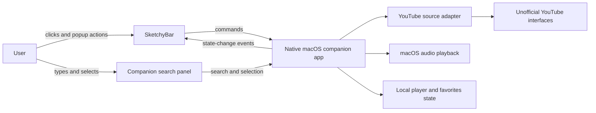
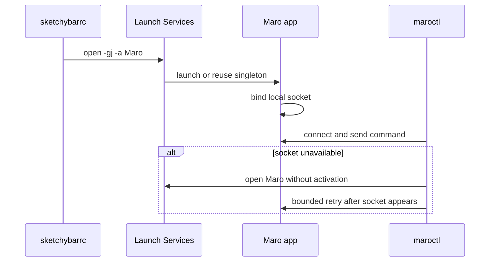
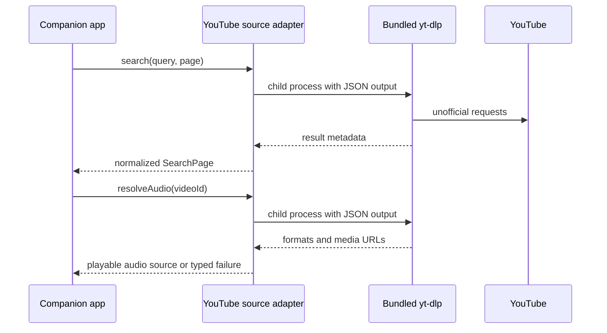
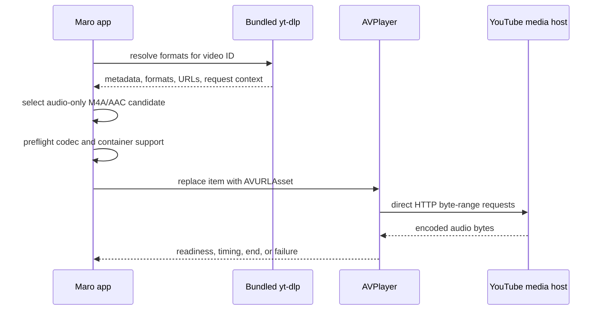
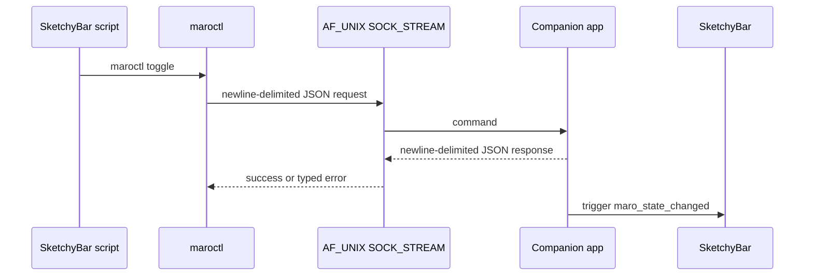
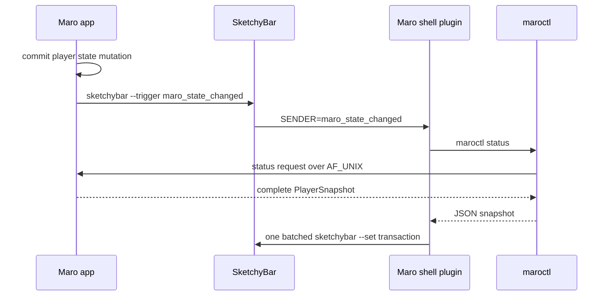
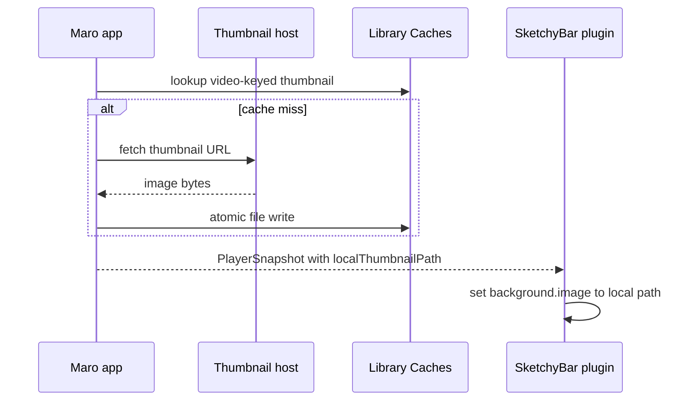
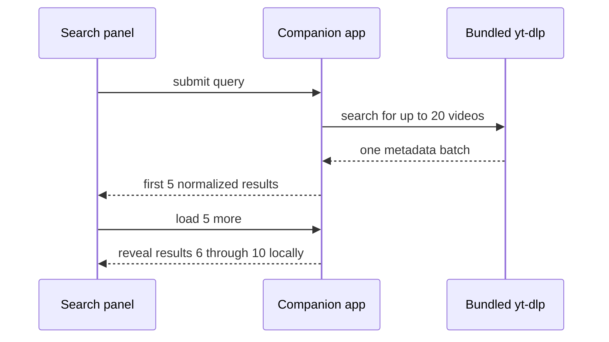

# SketchyBar Music Player Technical Design

### System Design

#### One native companion app owns every durable player responsibility

The repository currently has no application code. The new system adds one long-running native macOS companion app as the authority for search, source resolution, audio playback, loaded-video state, playback position, favorites, and the focused search panel. SketchyBar remains a presentation and command surface; it does not own playback state and may reload without interrupting audio.



The companion app stays alive independently of SketchyBar's script timeout and helper teardown. It restores the last loaded video and position in a paused state, while live playback continues across SketchyBar hot reloads.

The app is implemented in Swift with AppKit owning the menu-less companion lifecycle and focused search panel, and AVFoundation owning audio playback. This keeps the macOS UI, media, process, and persistence boundaries native while avoiding a C-to-Objective-C bridge for first-release application behavior.

#### A non-sandboxed hardened app preserves the required local integrations

Maro runs without the App Sandbox so it can execute the bundled yt-dlp child process, own the Unix-domain socket, invoke the external `sketchybar` CLI, and integrate with the user's configuration and cache directories without a separate privileged helper. The release build enables the Hardened Runtime and uses only the entitlements required by the chosen implementation; it does not disable library validation or request broad file access preemptively.

Local development and acceptance builds may use ad-hoc signing. The package remains eligible for Developer ID signing and notarization later without changing the process architecture. The app binds no network listener, accepts local commands only through its user-owned Unix socket, and treats yt-dlp output and all remote data as untrusted input.

#### SketchyBar launches the app, while maroctl recovers a missing process

The active `sketchybarrc` starts Maro idempotently with Launch Services. macOS enforces a single companion-app instance, so SketchyBar hot reloads reconnect to the existing process without interrupting playback. Maro is not installed as a separate login item in the first release.

If `maroctl` cannot connect because the socket is absent or stale, it asks Launch Services to open Maro without foreground activation, waits for the socket within a short bounded startup window, and retries the command once. A failed retry returns a clear local-service error to the calling script rather than spawning repeatedly.



#### A pinned yt-dlp binary isolates unofficial YouTube extraction

The companion app bundles a known-compatible `yt-dlp` executable and invokes it as a child process behind a source-adapter boundary. Search and video resolution consume `yt-dlp`'s structured output; only the selected audio-only stream URL and normalized video metadata cross into the rest of the app. Playback and UI components never depend on extractor-specific JSON.



```text
search(query, continuation?) -> SearchPage
resolveAudio(videoId) -> ResolvedAudio | SourceFailure

ResolvedAudio
  video: VideoSummary
  streamURL: ephemeral URL
  mimeType: audio MIME type
  expiresAt: optional timestamp
```

The application pins the bundled version so releases are reproducible. A compatible application update replaces the binary when YouTube protocol drift breaks extraction; the app does not self-modify the executable or silently download extractor updates at runtime.

#### AVPlayer streams a compatible audio-only URL directly from YouTube's media host

For each selected video, the source adapter inspects yt-dlp's resolved formats and chooses the highest-quality audio-only M4A/AAC candidate that AVFoundation reports as playable. yt-dlp returns the selected URL and request context, then exits; it does not download, pipe, proxy, remux, or transcode the media payload. An `AVURLAsset` retrieves the encoded audio bytes directly from the remote media host, an `AVPlayerItem` owns that asset's playback status and timing, and the singleton `AVPlayer` owns play, pause, seek, replay, and item replacement.



The normalized playback descriptor is a value passed between extraction and playback, not another process or byte-stream component:

```text
PlaybackDescriptor
  url: ephemeral remote media URL
  mimeType: audio/mp4
  audioCodec: AAC family identifier
  userAgent: optional documented AVURLAsset option
  cookies: optional documented AVURLAsset option
```

Signed media URLs are never persisted. Maro resolves a fresh descriptor immediately before starting or resuming a restored video. If access expires during playback, Maro resolves a new descriptor, replaces the player item, and seeks near the last known position. If there is no compatible audio-only M4A/AAC rendition, AVFoundation rejects the asset, or the source needs unsupported request behavior, the selected video is unavailable and current playback remains unchanged.

The first release deliberately has no loopback media proxy, `AVAssetResourceLoader` implementation, yt-dlp stdout pipe, FFmpeg remuxing/transcoding, combined video/audio fallback, or permanent media download. Playback tests classify format absence, static AVFoundation incompatibility, HTTP/access failure, expiry recovery, and playback stalls separately so source breakage is not mislabeled as codec incompatibility.

#### The existing shell-based SketchyBar configuration is the integration target

The implementation will be exercised through the user's active configuration at `/Users/devinhasler/.config/sketchybar`. That configuration already sources item modules from `items/`, delegates item behavior to `plugins/`, and batches runtime mutations through the `sketchybar` CLI. The music integration will follow that boundary rather than replacing the existing bar configuration or its native CPU helper.

```text
/Users/devinhasler/.config/sketchybar/sketchybarrc
  sources music item definition
    item actions send commands to companion app
    companion state updates trigger batched SketchyBar mutations
```

#### SketchyBar commands use a local AF_UNIX stream protocol

SketchyBar click scripts invoke a small `maroctl` client. The client connects to the companion app through an `AF_UNIX` `SOCK_STREAM` socket stored under the user's Application Support directory. The transport is local to the Mac and the socket file is accessible only to the current user.



Each connection carries one newline-delimited JSON request and one matching response before closing. A request ID correlates the response, and an explicit protocol version permits future additive changes.

```text
socket: ~/Library/Application Support/Maro/maro.sock

request:  { "version": 1, "id": "42", "command": "toggle" }\n
response: { "version": 1, "id": "42", "ok": true, "state": "paused" }\n

error:    { "version": 1, "id": "43", "ok": false,
            "error": { "code": "video_unavailable", "message": "No usable audio source" } }\n
```

The companion removes a stale socket before binding and removes its socket on orderly shutdown. A missing or refused socket enters the bounded Launch Services recovery path described above rather than writing command files or retrying in the background.

#### State changes notify SketchyBar, which pulls one authoritative snapshot

After a successful state mutation, the companion app triggers the custom SketchyBar event `maro_state_changed` without embedding player data in the event. The subscribed shell plugin calls `maroctl status`, receives the complete current snapshot, and applies the resulting UI changes in one batched `sketchybar` command. This keeps item names, colors, icons, popup layout, and rendering policy inside `/Users/devinhasler/.config/sketchybar` rather than coupling them to the app.



The same snapshot pull runs after initial item registration and after SketchyBar hot reload, so event loss does not make the bar authoritative or leave it permanently stale.

#### One versioned JSON document persists the bounded local state

The companion app stores its durable state in `~/Library/Application Support/Maro/state.json`. The document contains a schema version, the last loaded video's stable metadata and position, and the favorite records in most-recently-added order. Ephemeral stream URLs, extractor output, active searches, and transient errors are never persisted.

```text
state.json
  schemaVersion: 1
  loadedVideo: null | {
    video: VideoSummary
    positionSeconds: number
  }
  favorites: Favorite[0...20]
```

Every mutation writes a complete encoded document to a temporary sibling and atomically replaces `state.json`, preventing a partial write from becoming the primary state. The app validates and migrates the versioned document before using it. If it cannot decode or migrate the file, it preserves the unreadable file for diagnosis, starts with empty state, and exposes a local-state error without attempting to reconstruct favorites from YouTube.

Playback-position updates are coalesced before persistence and flushed on pause, track end, replacement, and app termination. Relaunch restores the loaded video and saved position as paused, then resolves a fresh ephemeral stream only when the user requests playback.

#### Thumbnail files form a rebuildable cache for SketchyBar

Video records persist their remote thumbnail URL, while downloaded image bytes live under `~/Library/Caches/Maro/thumbnails/`. Files use a stable key derived from the video ID and image variant, and the player snapshot exposes only an existing local file path to SketchyBar. This satisfies SketchyBar's file-backed background-image boundary without treating derived artwork as user-owned state.



Cache loss never removes a favorite or loaded video. A missing file is fetched again from the persisted thumbnail URL when that record next becomes visible. Failed thumbnail retrieval leaves playback and metadata available and makes the SketchyBar item render without artwork. Maro may evict unreferenced and old files opportunistically; correctness never depends on cache contents.

#### Search fetches one larger batch and reveals five results at a time

Each submitted query asks the bundled extractor for one bounded batch of up to 20 YouTube video results. The companion normalizes that response into an in-memory search session, initially exposes the first five records, and reveals five more locally for each **Load 5 more** action. Loading more performs no additional network or extractor request and never changes playback.



The in-memory session is replaced when the query changes or the panel submits another search, and it is discarded when the app exits. Search results carry identity and display metadata only; selecting one performs the separate audio-resolution step before any loaded video or playback state changes. Fewer than 20 upstream results simply shortens the local session and removes **Load 5 more** once all records are visible.

### Program Design

#### Swift Package Manager builds the app, CLI, shared core, and tests

The repository uses Swift Package Manager as its source and dependency boundary. A deterministic packaging script assembles the `MaroApp` executable, resources, and pinned yt-dlp binary into `Maro.app`, installs `maroctl` beside the app or into the configured local bin directory, and applies ad-hoc or Developer ID signing selected by the build environment.

```diff
 maro/
+├── Package.swift
+├── Sources/
+│   ├── MaroApp/          # AppKit lifecycle and focused search panel
+│   ├── MaroCore/         # domain state, extraction, playback, persistence, IPC server
+│   └── MaroCLI/          # maroctl IPC client and command output
+├── Resources/
+│   └── yt-dlp            # pinned executable copied into Maro.app
+├── Tests/
+│   ├── MaroCoreTests/    # deterministic domain and adapter tests
+│   └── MaroCLITests/     # protocol and command behavior
+└── scripts/
+    ├── package-app.sh    # assembles and signs Maro.app
+    └── install-local.sh  # installs app, CLI, and SketchyBar integration
```

`MaroCore` is a library target shared by the app and tests. `MaroApp` alone imports AppKit and owns application activation and windows. `MaroCLI` remains a small Swift executable so the app and CLI share the same Codable IPC contracts without generated code or a C bridge.

```text
swift build
  builds MaroCore, MaroApp, and maroctl

swift test
  runs MaroCoreTests and MaroCLITests

scripts/package-app.sh
  swift build --configuration release
  creates Maro.app/Contents/{MacOS,Resources}
  copies MaroApp and pinned yt-dlp
  writes Info.plist
  signs the completed bundle
```

#### One main-actor controller serializes every player-state mutation

`MaroController` is the single in-memory authority for the loaded video, playback state, position, favorites, active search session, and user-visible failure. IPC commands, search-panel actions, and AVPlayer callbacks all enter this controller on the main actor, so competing actions cannot mutate mirrored state independently.

```swift
@MainActor
final class MaroController {
    private let source: YouTubeSource
    private let player: PlaybackEngine
    private let store: StateStore
    private let thumbnails: ThumbnailCache
    private let notifier: SketchyBarNotifier

    private(set) var snapshot: PlayerSnapshot
    private(set) var searchSession: SearchSession?

    func handle(_ command: PlayerCommand) async -> CommandResult
    func search(_ query: String) async -> SearchViewState
    func revealMoreResults() -> SearchViewState
    func select(_ video: VideoSummary) async -> CommandResult
    func handlePlaybackEvent(_ event: PlaybackEvent)
}
```

Slow work does not block the main actor. Source extraction, thumbnail retrieval, and file I/O execute through asynchronous collaborators, then return typed values for the controller to validate and commit. Each source request carries an operation identity; results from a superseded search or selection are discarded rather than overwriting newer user intent.

```text
IPC server / AppKit action / AVPlayer callback
  MaroController on MainActor
    decide transition
    await asynchronous collaborator
    reject result if operation was superseded
    commit one new snapshot
    persist durable projection when changed
    notify UI observers
    trigger SketchyBar state event
```

The controller publishes snapshots to AppKit observers only after state is internally consistent. `MaroController` does not contain view construction, yt-dlp JSON parsing, AVPlayer API calls, Codable file mechanics, or `Process` invocation details; those remain behind its injected collaborators.

### Patterns to Follow
