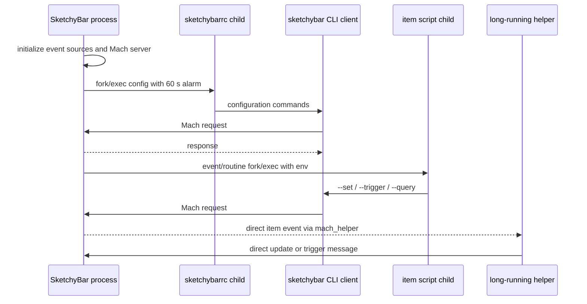

# SketchyBar Runtime and Interface Research

Research date: 2026-09-06

## Scope and source baseline

This report answers the SketchyBar runtime-architecture and interface questions in the task. It describes observed current behavior only and gives no implementation recommendations. The evidence set is limited to primary sources owned by FelixKratz: the official SketchyBar site, the `FelixKratz/SketchyBar` source and documentation branches, `FelixKratz/SbarLua`, `FelixKratz/SketchyBarHelper`, and FelixKratz's own `dotfiles` configuration.

The checked revisions are:

| Source | Revision and source date | Role |
| --- | --- | --- |
| SketchyBar | [`6284ee816601486ace33ca48a0271832eec6de35`](https://github.com/FelixKratz/SketchyBar/commit/6284ee816601486ace33ca48a0271832eec6de35), 2026-06-04 | Current `master`; identifies itself as 2.24.0 in [`src/sketchybar.c#L29-L31`](https://github.com/FelixKratz/SketchyBar/blob/6284ee816601486ace33ca48a0271832eec6de35/src/sketchybar.c#L29-L31). |
| Official documentation source | [`6ed777608bc981937a929126abe4d5fffcf74c52`](https://github.com/FelixKratz/SketchyBar/commit/6ed777608bc981937a929126abe4d5fffcf74c52), 2025-11-02 | Source of the official configuration documentation. |
| Published official site | [`a1d07a95287d694933c6883bc98111c4c4bdc6d0`](https://github.com/FelixKratz/SketchyBar/commit/a1d07a95287d694933c6883bc98111c4c4bdc6d0), 2025-11-02 | `gh-pages` build; commit message says it is the documentation update for v2.23.0. |
| FelixKratz dotfiles | [`67ad686ea6d4c29ccd54fdaa42cdf35f37a7219c`](https://github.com/FelixKratz/dotfiles/commit/67ad686ea6d4c29ccd54fdaa42cdf35f37a7219c), 2025-10-04 | First-party advanced SketchyBar configuration and helper examples. |
| SbarLua | [`dba9cc421b868c918d5c23c408544a28aadf2f2f`](https://github.com/FelixKratz/SbarLua/commit/dba9cc421b868c918d5c23c408544a28aadf2f2f), 2026-03-06 | First-party Lua API and long-running callback process. |
| SketchyBarHelper | [`73ee34d377f62fc12ddbf519a2bcdb4b7946292a`](https://github.com/FelixKratz/SketchyBarHelper/commit/73ee34d377f62fc12ddbf519a2bcdb4b7946292a), 2023-11-12 | First-party C/C++ direct-Mach helper example. |

The official website therefore documents v2.23.0-era behavior while the current source is v2.24.0. Where documentation and source differ, this report treats the current source as authoritative and calls out the discrepancy.

## Findings at a glance

- SketchyBar is a persistent event-loop process. Its configuration is an executable child process, and ordinary item scripts and click scripts are separate asynchronous shell children. CLI invocations are short-lived Mach IPC clients, not edits to a static config file. [Official bar docs](https://felixkratz.github.io/SketchyBar/config/bar), [startup source](https://github.com/FelixKratz/SketchyBar/blob/6284ee816601486ace33ca48a0271832eec6de35/src/sketchybar.c#L202-L256), [config execution source](https://github.com/FelixKratz/SketchyBar/blob/6284ee816601486ace33ca48a0271832eec6de35/src/hotload.c#L46-L70).
- Item scripts are event/routine reactions. Each invocation is spawned through `/usr/bin/env sh -c`, inherits event variables, and is terminated by a 60-second alarm. The bar neither waits for one invocation nor serializes a later invocation behind it. [Script execution](https://github.com/FelixKratz/SketchyBar/blob/6284ee816601486ace33ca48a0271832eec6de35/src/bar_item.c#L111-L174), [process spawn](https://github.com/FelixKratz/SketchyBar/blob/6284ee816601486ace33ca48a0271832eec6de35/src/misc/helpers.h#L441-L461), [documented limit](https://felixkratz.github.io/SketchyBar/config/events#events-and-scripting).
- `mach_helper` is a direct, fire-and-forget event route from an item to an already-running Mach service. It can coexist with a shell script, although SbarLua intentionally clears the shell script when installing its own helper. [Item dispatch](https://github.com/FelixKratz/SketchyBar/blob/6284ee816601486ace33ca48a0271832eec6de35/src/bar_item.c#L137-L171), [SbarLua subscription wiring](https://github.com/FelixKratz/SbarLua/blob/dba9cc421b868c918d5c23c408544a28aadf2f2f/src/sketchybar.c#L292-L339).
- Long-running first-party providers explicitly call `alarm(0)` to cancel any active process alarm, trigger custom events over Mach IPC, and use `killall` before relaunch to avoid duplicate providers. [CPU launcher](https://github.com/FelixKratz/dotfiles/blob/67ad686ea6d4c29ccd54fdaa42cdf35f37a7219c/.config/sketchybar/items/widgets/cpu.lua#L5-L8), [CPU provider](https://github.com/FelixKratz/dotfiles/blob/67ad686ea6d4c29ccd54fdaa42cdf35f37a7219c/.config/sketchybar/helpers/event_providers/cpu_load/cpu_load.c#L4-L39), [network launcher](https://github.com/FelixKratz/dotfiles/blob/67ad686ea6d4c29ccd54fdaa42cdf35f37a7219c/.config/sketchybar/items/widgets/wifi.lua#L5-L9).
- The native interaction vocabulary is pointer-only: click/up, drag for sliders, enter, exit, and scroll, including global enter/exit/scroll variants. SketchyBar exposes no keyboard-focus or editable-text primitive. [Official event list](https://felixkratz.github.io/SketchyBar/config/events), [installed Carbon events](https://github.com/FelixKratz/SketchyBar/blob/6284ee816601486ace33ca48a0271832eec6de35/src/mouse.c#L4-L38), [non-activating window tag](https://github.com/FelixKratz/SketchyBar/blob/6284ee816601486ace33ca48a0271832eec6de35/src/window.c#L53-L85).
- Presentation is composed from items, icon/label CoreText runs, nested backgrounds, raster images, shadows, brackets, graphs, sliders, and popup windows. There is no named theme object; theming is property/default configuration, usually factored into a palette and font table by SbarLua configs. [Official item properties](https://felixkratz.github.io/SketchyBar/config/items), [default inheritance](https://github.com/FelixKratz/SketchyBar/blob/6ed777608bc981937a929126abe4d5fffcf74c52/docs/config/Items.md#L139-L146), [first-party palette](https://github.com/FelixKratz/dotfiles/blob/67ad686ea6d4c29ccd54fdaa42cdf35f37a7219c/.config/sketchybar/colors.lua#L1-L28).

## 1. Runtime architecture

### 1.1 Persistent bar, executable configuration, and startup

The bar derives its instance name from `argv[0]`, exports it as `BAR_NAME`, rejects root execution, and uses an advisory lock file keyed by instance name and user to prevent a second process with the same name. This also underlies the documented multiple-bars mechanism, where a differently named symlink creates an independent instance and config directory. [Process setup](https://github.com/FelixKratz/SketchyBar/blob/6284ee816601486ace33ca48a0271832eec6de35/src/sketchybar.c#L110-L149), [main](https://github.com/FelixKratz/SketchyBar/blob/6284ee816601486ace33ca48a0271832eec6de35/src/sketchybar.c#L202-L215), [official multiple-bars docs](https://github.com/FelixKratz/SketchyBar/blob/6ed777608bc981937a929126abe4d5fffcf74c52/docs/config/Tricks.md#L89-L104).

Startup initializes workspace, display, mouse, bar manager, Mach server, power, network, and media integrations; it then executes the config, starts config-directory monitoring, and enters the macOS application event loop. [Startup sequence](https://github.com/FelixKratz/SketchyBar/blob/6284ee816601486ace33ca48a0271832eec6de35/src/sketchybar.c#L212-L256). The official docs define `~/.config/sketchybar/sketchybarrc` as a regular script executed at launch and say persistent configuration belongs there. [Official bar docs](https://github.com/FelixKratz/SketchyBar/blob/6ed777608bc981937a929126abe4d5fffcf74c52/docs/config/Bar.md#L6-L17).

The current source searches `$XDG_CONFIG_HOME/<bar-name>/sketchybarrc`, then `~/.config/<bar-name>/sketchybarrc`, then `~/.sketchybarrc`. It resolves the selected path, exports `CONFIG_DIR`, changes working directory to the config directory, adds owner-executable permission if needed, and launches the file through the same asynchronous `fork_exec` path used for item scripts. [Config discovery and execution](https://github.com/FelixKratz/SketchyBar/blob/6284ee816601486ace33ca48a0271832eec6de35/src/hotload.c#L19-L70). This is broader than the official setup page, which names the conventional `~/.config/sketchybar/sketchybarrc` path and `--config <path>`. [Official setup](https://felixkratz.github.io/SketchyBar/setup).

### 1.2 CLI updates are IPC transactions

Any invocation with arguments, except `--version`, `--help`, and startup `--config`, becomes a client. The client packs arguments as NUL-delimited strings, looks up the running instance's bootstrap Mach port, sends the request, waits briefly for a response, prints errors to stderr or normal output to stdout, and exits. [Argument dispatch and client packing](https://github.com/FelixKratz/SketchyBar/blob/6284ee816601486ace33ca48a0271832eec6de35/src/sketchybar.c#L60-L108), [argument parsing](https://github.com/FelixKratz/SketchyBar/blob/6284ee816601486ace33ca48a0271832eec6de35/src/sketchybar.c#L161-L185).

The persistent process registers its receive port with the bootstrap server and attaches it to the main CFRunLoop. [Mach server setup](https://github.com/FelixKratz/SketchyBar/blob/6284ee816601486ace33ca48a0271832eec6de35/src/mach.c#L127-L199). A received message is posted onto the main event path, parsed as one or more batched domains, applied while bar updates are frozen, then unfrozen, refreshed, and answered. [Message transaction](https://github.com/FelixKratz/SketchyBar/blob/6284ee816601486ace33ca48a0271832eec6de35/src/message.c#L596-L668), [completion and reply](https://github.com/FelixKratz/SketchyBar/blob/6284ee816601486ace33ca48a0271832eec6de35/src/message.c#L759-L780). This explains why command batching redraws once and is faster than separate CLI calls, as the official docs state. [Official batching docs](https://github.com/FelixKratz/SketchyBar/blob/6ed777608bc981937a929126abe4d5fffcf74c52/docs/config/Tricks.md#L8-L28).

Runtime state can be changed at any point with `--bar`, `--default`, `--add`, `--set`, `--subscribe`, `--trigger`, `--push`, `--remove`, `--move`, `--reorder`, `--rename`, `--animate`, and related domains. It can be inspected as JSON with `--query bar`, `--query <name>`, `--query defaults`, `--query events`, `--query default_menu_items`, and `--query displays`. [Official query docs](https://felixkratz.github.io/SketchyBar/config/querying), [current command parser](https://github.com/FelixKratz/SketchyBar/blob/6284ee816601486ace33ca48a0271832eec6de35/src/message.c#L610-L755).

### 1.3 Item configuration and routine updates

Each item stores drawing, update, association, geometry, icon, label, background, popup, graph, alias, slider, shell-script, click-script, and optional Mach-port state. A newly initialized ordinary item has `updates=on`, `update_freq=0`, `drawing=on`, and no script or event port. New items inherit the current default item after their base fields are initialized. [Item initialization](https://github.com/FelixKratz/SketchyBar/blob/6284ee816601486ace33ca48a0271832eec6de35/src/bar_item.c#L10-L65).

The bar manager owns a one-second repeating CFRunLoop timer. Each tick increments every item's counter. An item runs when its integer `update_freq` is reached, when an event supplies a sender, or when an update is forced. `updates=off` blocks non-forced work, while `updates=when_shown` permits work only while the item is associated with a visible bar. [One-second scheduler](https://github.com/FelixKratz/SketchyBar/blob/6284ee816601486ace33ca48a0271832eec6de35/src/bar_manager.c#L63-L79), [item scheduling](https://github.com/FelixKratz/SketchyBar/blob/6284ee816601486ace33ca48a0271832eec6de35/src/bar_item.c#L111-L158), [documented scripting properties](https://felixkratz.github.io/SketchyBar/config/items#scripting-properties).

Before dispatch, SketchyBar supplies persistent item variables plus `NAME` and `SENDER`; a routine tick uses `SENDER=routine`, while `--update` uses `SENDER=forced`. Event-specific variables are merged into that environment. [Dispatch environment](https://github.com/FelixKratz/SketchyBar/blob/6284ee816601486ace33ca48a0271832eec6de35/src/bar_item.c#L137-L158). The official docs identify `NAME`, `SENDER`, and `CONFIG_DIR`, and define `--update` as forcing every script and event while warning against calling it from an item script because that creates an infinite loop. [Official event environment and forced update](https://github.com/FelixKratz/SketchyBar/blob/6ed777608bc981937a929126abe4d5fffcf74c52/docs/config/Events.md#L37-L50), [official `--update` warning](https://github.com/FelixKratz/SketchyBar/blob/6ed777608bc981937a929126abe4d5fffcf74c52/docs/config/Events.md#L91-L98).

If an item has both a non-empty `script` and a valid `mach_helper` port, the same update spawns the script and sends the serialized environment to the helper. These are independent paths. [Dual dispatch](https://github.com/FelixKratz/SketchyBar/blob/6284ee816601486ace33ca48a0271832eec6de35/src/bar_item.c#L137-L171).

### 1.4 Executable scripts and process behavior

`script` and `click_script` accept either a path or shell command. SketchyBar resolves configured paths, then invokes each occurrence through `/usr/bin/env sh -c <command>` in a new `vfork` child. The parent returns immediately; it does not wait for completion, capture output, queue later events, or keep a per-item child handle. [Script property assignment](https://github.com/FelixKratz/SketchyBar/blob/6284ee816601486ace33ca48a0271832eec6de35/src/bar_item.c#L318-L345), [spawn implementation](https://github.com/FelixKratz/SketchyBar/blob/6284ee816601486ace33ca48a0271832eec6de35/src/misc/helpers.h#L441-L461). The bar process globally ignores `SIGCHLD`, so completed children are reaped by that signal disposition. [Signal setup](https://github.com/FelixKratz/SketchyBar/blob/6284ee816601486ace33ca48a0271832eec6de35/src/sketchybar.c#L129-L149).

Because dispatch has no running-child guard, events that arrive before an earlier script completes can produce overlapping script processes. This follows directly from the update path spawning on every eligible event and immediately returning. [Item update path](https://github.com/FelixKratz/SketchyBar/blob/6284ee816601486ace33ca48a0271832eec6de35/src/bar_item.c#L111-L174), [spawn return](https://github.com/FelixKratz/SketchyBar/blob/6284ee816601486ace33ca48a0271832eec6de35/src/misc/helpers.h#L454-L461).

Scripts update the persistent UI by making another CLI call such as `sketchybar --set $NAME ...`; the stock plugins follow exactly this pattern. For example, the stock front-app plugin sets `label="$INFO"`, the volume plugin maps volume ranges to icons and sets both icon and label, and the space plugin maps `$SELECTED` to `icon.highlight`. [Front app](https://github.com/FelixKratz/SketchyBar/blob/6284ee816601486ace33ca48a0271832eec6de35/plugins/front_app.sh#L1-L3), [volume](https://github.com/FelixKratz/SketchyBar/blob/6284ee816601486ace33ca48a0271832eec6de35/plugins/volume.sh#L1-L22), [space](https://github.com/FelixKratz/SketchyBar/blob/6284ee816601486ace33ca48a0271832eec6de35/plugins/space.sh#L1-L3).

### 1.5 Built-in and custom events

The official event surface is:

| Event | Current documented trigger and payload |
| --- | --- |
| `front_app_switched` | Front application changes; `$INFO` is its name. It does not fire for a window switch within the same application. |
| `space_change` | Active Mission Control space changes; `$INFO` is JSON for active spaces on all displays. |
| `space_windows_change` | A window is created or destroyed on a space; `$INFO` is JSON with the space and its app windows. |
| `display_change` | Active display changes; `$INFO` is the active display id. |
| `volume_change` | System output volume changes; `$INFO` is percent. |
| `brightness_change` | Display brightness changes; `$INFO` is percent. |
| `power_source_change` | Power source changes; `$INFO` is `AC` or `BATTERY`. |
| `wifi_change` | Wi-Fi connects/disconnects; `$INFO` is SSID or empty. Official docs mark this not working since macOS Sonoma. |
| `media_change` | Now-playing media changes; `$INFO` is media JSON. Official docs mark this deprecated on macOS 26.0. |
| `system_will_sleep`, `system_woke` | Sleep lifecycle; no documented `$INFO`. |
| `mouse.entered`, `mouse.exited` | Pointer enters or exits an item. |
| `mouse.entered.global`, `mouse.exited.global` | Pointer enters any bar region or leaves all bar and popup regions. |
| `mouse.clicked` | Item receives mouse-up; click metadata is provided. |
| `mouse.scrolled` | Pointer scrolls over an item; scroll delta and modifier are provided. |
| `mouse.scrolled.global` | Pointer scrolls over an empty bar or popup region. |

The table is transcribed from the [official current event documentation](https://felixkratz.github.io/SketchyBar/config/events) and its [pinned source](https://github.com/FelixKratz/SketchyBar/blob/6ed777608bc981937a929126abe4d5fffcf74c52/docs/config/Events.md#L14-L38). The current source initializes the same 18 built-ins. [Built-in registry](https://github.com/FelixKratz/SketchyBar/blob/6284ee816601486ace33ca48a0271832eec6de35/src/custom_events.c#L18-L41). Some expensive OS feeds start lazily only when an item subscribes: volume, brightness, media, and space-window subscriptions explicitly start their corresponding receiver. [Subscription side effects](https://github.com/FelixKratz/SketchyBar/blob/6284ee816601486ace33ca48a0271832eec6de35/src/bar_item.c#L1236-L1267).

`--add event <name> [NSDistributedNotificationName]` adds an arbitrary event. If a distributed-notification name is supplied, SketchyBar creates an observer and places notification data in `$INFO` when available. `--trigger <event> KEY=value...` sends a previously added event and makes each supplied value available in subscriber environments. [Official custom-event docs](https://github.com/FelixKratz/SketchyBar/blob/6ed777608bc981937a929126abe4d5fffcf74c52/docs/config/Events.md#L64-L89), [event creation](https://github.com/FelixKratz/SketchyBar/blob/6284ee816601486ace33ca48a0271832eec6de35/src/message.c#L172-L184), [trigger routing](https://github.com/FelixKratz/SketchyBar/blob/6284ee816601486ace33ca48a0271832eec6de35/src/message.c#L66-L101).

Subscriptions are stored as bits in each item's update mask. When an event is delivered, subscribed items enter the same item-update path as routine polling, with the event name as `SENDER` and its data as environment variables. [Subscription mask](https://github.com/FelixKratz/SketchyBar/blob/6284ee816601486ace33ca48a0271832eec6de35/src/bar_item.c#L1236-L1267), [event-to-item dispatch](https://github.com/FelixKratz/SketchyBar/blob/6284ee816601486ace33ca48a0271832eec6de35/src/bar_manager.c#L537-L565).

### 1.6 Click handlers, pointer metadata, and slider drag

On mouse-up, SketchyBar finds an item by window id or point. It builds `INFO` JSON plus `BUTTON` and `MODIFIER`, handles slider geometry when applicable, spawns `click_script` first, and then dispatches the ordinary item `script` with `SENDER=mouse.clicked` if the item subscribed. Thus `click_script` and `mouse.clicked` are not aliases: both can run for one click, and the latter uses the item's general event script. [Click routing](https://github.com/FelixKratz/SketchyBar/blob/6284ee816601486ace33ca48a0271832eec6de35/src/event.c#L72-L106), [handler order and environment](https://github.com/FelixKratz/SketchyBar/blob/6284ee816601486ace33ca48a0271832eec6de35/src/bar_item.c#L201-L258), [documented properties](https://github.com/FelixKratz/SketchyBar/blob/6ed777608bc981937a929126abe4d5fffcf74c52/docs/config/Items.md#L63-L72).

Buttons are `left`, `right`, or `other`. Current source can report no modifier as `none`, the `fn` key, or comma-separated combinations of `shift`, `ctrl`, `alt`, `cmd`, and `fn`. [Current mapping](https://github.com/FelixKratz/SketchyBar/blob/6284ee816601486ace33ca48a0271832eec6de35/src/misc/helpers.h#L169-L200). This is more precise than the official docs, which say `$MODIFIER` is “either” `shift`, `ctrl`, `alt`, or `cmd` and do not mention combinations, `fn`, or `none`. [Older documented wording](https://github.com/FelixKratz/SketchyBar/blob/6ed777608bc981937a929126abe4d5fffcf74c52/docs/config/Events.md#L52-L60).

Scroll handlers receive `SCROLL_DELTA`, `MODIFIER`, and `INFO` JSON. Slider pointer movement continuously changes the drawn percentage during drag, but the subscribed click event is sent once on mouse release and includes `PERCENTAGE`. [Scroll environment](https://github.com/FelixKratz/SketchyBar/blob/6284ee816601486ace33ca48a0271832eec6de35/src/bar_item.c#L260-L295), [drag tracking](https://github.com/FelixKratz/SketchyBar/blob/6284ee816601486ace33ca48a0271832eec6de35/src/event.c#L108-L129), [official slider behavior](https://github.com/FelixKratz/SketchyBar/blob/6ed777608bc981937a929126abe4d5fffcf74c52/docs/config/Components.md#L154-L177).

### 1.7 Long-running event-provider processes

FelixKratz's current dotfiles contain a distinct first-party pattern for continuously sampled CPU and network data:

1. The Lua config calls `sbar.exec("killall <provider>; <provider> ... 2.0")`, making provider startup asynchronous and removing a prior same-named process on config reload. [CPU launcher](https://github.com/FelixKratz/dotfiles/blob/67ad686ea6d4c29ccd54fdaa42cdf35f37a7219c/.config/sketchybar/items/widgets/cpu.lua#L5-L8), [network launcher](https://github.com/FelixKratz/dotfiles/blob/67ad686ea6d4c29ccd54fdaa42cdf35f37a7219c/.config/sketchybar/items/widgets/wifi.lua#L5-L9).
2. Each C provider immediately executes `alarm(0)`, explicitly canceling any active process alarm after being launched through `sbar.exec`. [CPU provider](https://github.com/FelixKratz/dotfiles/blob/67ad686ea6d4c29ccd54fdaa42cdf35f37a7219c/.config/sketchybar/helpers/event_providers/cpu_load/cpu_load.c#L4-L18), [network provider](https://github.com/FelixKratz/dotfiles/blob/67ad686ea6d4c29ccd54fdaa42cdf35f37a7219c/.config/sketchybar/helpers/event_providers/network_load/network_load.c#L5-L16).
3. The provider adds its custom event once, samples forever, sends `--trigger` with key/value payload, and sleeps for the supplied floating-point interval. [CPU loop](https://github.com/FelixKratz/dotfiles/blob/67ad686ea6d4c29ccd54fdaa42cdf35f37a7219c/.config/sketchybar/helpers/event_providers/cpu_load/cpu_load.c#L20-L39), [network loop](https://github.com/FelixKratz/dotfiles/blob/67ad686ea6d4c29ccd54fdaa42cdf35f37a7219c/.config/sketchybar/helpers/event_providers/network_load/network_load.c#L18-L40).
4. Its bundled header sends directly to the bar's Mach bootstrap port without waiting for a response. If sending fails, it refreshes the port and tries once more; a second failure exits the provider. [Provider IPC and exit behavior](https://github.com/FelixKratz/dotfiles/blob/67ad686ea6d4c29ccd54fdaa42cdf35f37a7219c/.config/sketchybar/helpers/event_providers/sketchybar.h#L30-L50), [send/retry](https://github.com/FelixKratz/dotfiles/blob/67ad686ea6d4c29ccd54fdaa42cdf35f37a7219c/.config/sketchybar/helpers/event_providers/sketchybar.h#L52-L121).

These providers are event producers. They do not use the item's `mach_helper` property and do not receive item events from SketchyBar.

### 1.8 `mach_helper` and SbarLua

`mach_helper=<bootstrap-name>` performs a bootstrap lookup immediately and stores the resulting Mach port on the item. The official helper documentation consequently requires the helper to be running before the property is set. [Current lookup](https://github.com/FelixKratz/SketchyBar/blob/6284ee816601486ace33ca48a0271832eec6de35/src/bar_item.c#L378-L381), [official helper contract](https://github.com/FelixKratz/SketchyBarHelper/blob/73ee34d377f62fc12ddbf519a2bcdb4b7946292a/README.md#L15-L36).

For an eligible event, SketchyBar serializes the item's environment and sends it to that port without awaiting a reply. The helper callback can then send separate direct commands back to SketchyBar; the C example reacts to `front_app_switched` by setting the item's label. [Bar-to-helper send](https://github.com/FelixKratz/SketchyBar/blob/6284ee816601486ace33ca48a0271832eec6de35/src/bar_item.c#L164-L170), [C callback example](https://github.com/FelixKratz/SketchyBarHelper/blob/73ee34d377f62fc12ddbf519a2bcdb4b7946292a/helper.c#L1-L24).

The standalone C helper server blocks in a receive loop with a one-second timeout. On each pass it exits if it has become orphaned (`getppid()==1`), and it also exits when it receives the two-byte `k` control message. [Helper lifecycle](https://github.com/FelixKratz/SketchyBarHelper/blob/73ee34d377f62fc12ddbf519a2bcdb4b7946292a/sketchybar.h#L164-L219). Its README's launch snippet compiles the binary, kills an older same-named process, and launches the new binary in the background. [Official launch example](https://github.com/FelixKratz/SketchyBarHelper/blob/73ee34d377f62fc12ddbf519a2bcdb4b7946292a/README.md#L38-L50).

SbarLua is itself a `mach_helper` implementation. Loading the module registers a process-specific bootstrap name. `item:subscribe(...)` records a Lua callback, creates/ensures the event, sets the item to `script=` plus `mach_helper=<SbarLua-port>`, and subscribes the item. [Module initialization](https://github.com/FelixKratz/SbarLua/blob/dba9cc421b868c918d5c23c408544a28aadf2f2f/src/sketchybar.c#L848-L899), [subscription bridge](https://github.com/FelixKratz/SbarLua/blob/dba9cc421b868c918d5c23c408544a28aadf2f2f/src/sketchybar.c#L292-L369). Incoming serialized environments are converted to Lua tables, including automatic JSON parsing, and the matching callback runs on the Lua event-loop thread. [Callback dispatch](https://github.com/FelixKratz/SbarLua/blob/dba9cc421b868c918d5c23c408544a28aadf2f2f/src/sketchybar.c#L255-L289).

The SbarLua README states that `os.execute` and `io.popen` block the entire Lua event-handler thread. Its `sbar.exec` API instead forks a child and optionally reports captured output and exit status through a Mach completion message. [Official SbarLua behavior](https://github.com/FelixKratz/SbarLua/blob/dba9cc421b868c918d5c23c408544a28aadf2f2f/README.md#L34-L51), [async implementation](https://github.com/FelixKratz/SbarLua/blob/dba9cc421b868c918d5c23c408544a28aadf2f2f/src/sketchybar.c#L714-L763).

`sbar.event_loop()` first forces a bar update, calls `alarm(0)` to cancel any active process alarm, starts the helper receive source, checks once per second whether its parent is gone, and then runs the CFRunLoop. [SbarLua event-loop lifecycle](https://github.com/FelixKratz/SbarLua/blob/dba9cc421b868c918d5c23c408544a28aadf2f2f/src/sketchybar.c#L618-L641). On a bar teardown/reload, SketchyBar sends `k` to every item's registered helper port; SbarLua's Mach callback exits immediately on that control message. [Bar teardown](https://github.com/FelixKratz/SketchyBar/blob/6284ee816601486ace33ca48a0271832eec6de35/src/bar_manager.c#L1063-L1069), [SbarLua kill handling](https://github.com/FelixKratz/SbarLua/blob/dba9cc421b868c918d5c23c408544a28aadf2f2f/src/mach.h#L233-L248).

### 1.9 Reload, hotload, sleep, and exit lifecycle

`--reload [path]` posts the same internal `HOTLOAD` event used by file watching. That event destroys and reinitializes the bar manager, then executes the config again. Destruction sends `k` to registered Mach helpers before removing items and windows. [Official reload docs](https://felixkratz.github.io/SketchyBar/config/reloading), [reload command](https://github.com/FelixKratz/SketchyBar/blob/6284ee816601486ace33ca48a0271832eec6de35/src/message.c#L734-L750), [reload event](https://github.com/FelixKratz/SketchyBar/blob/6284ee816601486ace33ca48a0271832eec6de35/src/event.c#L339-L344), [destruction](https://github.com/FelixKratz/SketchyBar/blob/6284ee816601486ace33ca48a0271832eec6de35/src/bar_manager.c#L1063-L1089).

Hotload watches the whole config directory. Its current FSEvent stream has 0.5-second latency and a separate monotonic throttle requiring more than `2^30` nanoseconds (about 1.074 seconds) between accepted reloads. These timing values are source behavior, not stated on the official reload page. [Hotload source](https://github.com/FelixKratz/SketchyBar/blob/6284ee816601486ace33ca48a0271832eec6de35/src/hotload.c#L72-L110).

On `system_will_sleep`, SketchyBar emits that event, destroys its display-link animator, and marks the manager asleep. While asleep, the central update function returns without running item scripts. On wake it clears the sleep flag, immediately handles display/event work, and schedules a second wake event 500 ms later because display layout changes may trail the OS notification. [Sleep/wake source](https://github.com/FelixKratz/SketchyBar/blob/6284ee816601486ace33ca48a0271832eec6de35/src/bar_manager.c#L1016-L1043), [update sleep guard](https://github.com/FelixKratz/SketchyBar/blob/6284ee816601486ace33ca48a0271832eec6de35/src/bar_manager.c#L537-L549).

`--exit` destroys the manager and exits the persistent process. [Exit domain](https://github.com/FelixKratz/SketchyBar/blob/6284ee816601486ace33ca48a0271832eec6de35/src/message.c#L721-L728). The first-party polling-provider header separately exits after it can no longer reach the bar, while official launch commands use `killall` to replace an earlier provider. Those lifecycle mechanisms are independent of item-script child tracking. [Provider retry/exit](https://github.com/FelixKratz/dotfiles/blob/67ad686ea6d4c29ccd54fdaa42cdf35f37a7219c/.config/sketchybar/helpers/event_providers/sketchybar.h#L109-L121).

## 2. Timing and timeout constraints

### 2.1 Documented constraints

| Constraint | Current behavior | Evidence |
| --- | --- | --- |
| Item/config/click shell process limit | Official docs say all scripts are forcibly terminated after 60 seconds and do not run while sleeping. Current core sets `FORK_TIMEOUT=60` and calls `alarm(60)` in every `fork_exec`; the same function launches `sketchybarrc`, item `script`, and `click_script`. | [Official docs](https://github.com/FelixKratz/SketchyBar/blob/6ed777608bc981937a929126abe4d5fffcf74c52/docs/config/Events.md#L60-L63), [constant and spawn](https://github.com/FelixKratz/SketchyBar/blob/6284ee816601486ace33ca48a0271832eec6de35/src/misc/helpers.h#L17-L18), [alarm](https://github.com/FelixKratz/SketchyBar/blob/6284ee816601486ace33ca48a0271832eec6de35/src/misc/helpers.h#L441-L461), [config use](https://github.com/FelixKratz/SketchyBar/blob/6284ee816601486ace33ca48a0271832eec6de35/src/hotload.c#L58-L69). |
| `update_freq` | Positive integer seconds between routine invocations; `0` means never. The implementation advances counters on a one-second run-loop timer. | [Official item docs](https://github.com/FelixKratz/SketchyBar/blob/6ed777608bc981937a929126abe4d5fffcf74c52/docs/config/Items.md#L63-L71), [timer](https://github.com/FelixKratz/SketchyBar/blob/6284ee816601486ace33ca48a0271832eec6de35/src/bar_manager.c#L63-L79). |
| Alias refresh | Alias defaults to one refresh per second; `alias.update_freq` changes the interval in seconds and `0` disables updates in current source. | [Official component docs](https://github.com/FelixKratz/SketchyBar/blob/6ed777608bc981937a929126abe4d5fffcf74c52/docs/config/Components.md#L148-L152), [source default and zero behavior](https://github.com/FelixKratz/SketchyBar/blob/6284ee816601486ace33ca48a0271832eec6de35/src/alias.c#L189-L189), [source update logic](https://github.com/FelixKratz/SketchyBar/blob/6284ee816601486ace33ca48a0271832eec6de35/src/alias.c#L263-L269). |
| Animation duration | `duration` is a number of 60 Hz-equivalent steps; temporal seconds are `duration / 60`. Examples: 30 is 0.5 s, 10 is about 0.167 s. The source converts to seconds with exactly `duration / 60.0`. | [Official animation docs](https://github.com/FelixKratz/SketchyBar/blob/6ed777608bc981937a929126abe4d5fffcf74c52/docs/config/Animations.md#L6-L24), [source conversion](https://github.com/FelixKratz/SketchyBar/blob/6284ee816601486ace33ca48a0271832eec6de35/src/animation.c#L28-L31). |
| Text `scroll_duration` | Official default is `100` and is described as scroll speed for truncated text. Current source treats it as animation-step duration: one leg is `scroll_duration`, while another is scaled by visible-width/full-text-width. | [Official text docs](https://github.com/FelixKratz/SketchyBar/blob/6ed777608bc981937a929126abe4d5fffcf74c52/docs/config/Items.md#L75-L94), [source default and sequence](https://github.com/FelixKratz/SketchyBar/blob/6284ee816601486ace33ca48a0271832eec6de35/src/text.c#L133-L154), [scroll timing calculation](https://github.com/FelixKratz/SketchyBar/blob/6284ee816601486ace33ca48a0271832eec6de35/src/text.c#L274-L308). |

The 60-second constraint also exists independently in SbarLua's `sbar.exec`, which calls `alarm(60)` before either `execvp` or output-capturing `popen`. [SbarLua execution source](https://github.com/FelixKratz/SbarLua/blob/dba9cc421b868c918d5c23c408544a28aadf2f2f/src/sketchybar.c#L714-L763). First-party long-running paths explicitly cancel that alarm: `sbar.event_loop()` does so before entering its run loop, and both C polling providers do so at startup. [SbarLua cancellation](https://github.com/FelixKratz/SbarLua/blob/dba9cc421b868c918d5c23c408544a28aadf2f2f/src/sketchybar.c#L622-L640), [provider cancellation](https://github.com/FelixKratz/dotfiles/blob/67ad686ea6d4c29ccd54fdaa42cdf35f37a7219c/.config/sketchybar/helpers/event_providers/cpu_load/cpu_load.c#L4-L12).

### 2.2 Source-only timing behavior

These are current hard-coded timing behaviors but are not documented as public configuration constraints:

| Timing | Current source behavior | Evidence |
| --- | --- | --- |
| CLI response wait | Core CLI receives with a 100 ms Mach timeout. The send itself uses `MACH_MSG_TIMEOUT_NONE`. No response is represented as an empty response, and the client still returns success unless a returned message is marked as an error. | [Core Mach IPC](https://github.com/FelixKratz/SketchyBar/blob/6284ee816601486ace33ca48a0271832eec6de35/src/mach.c#L27-L50), [send/receive](https://github.com/FelixKratz/SketchyBar/blob/6284ee816601486ace33ca48a0271832eec6de35/src/mach.c#L52-L124), [client result](https://github.com/FelixKratz/SketchyBar/blob/6284ee816601486ace33ca48a0271832eec6de35/src/sketchybar.c#L91-L107). |
| SbarLua outbound response wait | 1000 ms when SbarLua makes a call that requests a response. Fire-and-forget calls do not allocate a response port. | [SbarLua Mach IPC](https://github.com/FelixKratz/SbarLua/blob/dba9cc421b868c918d5c23c408544a28aadf2f2f/src/mach.h#L91-L116), [response path](https://github.com/FelixKratz/SbarLua/blob/dba9cc421b868c918d5c23c408544a28aadf2f2f/src/mach.h#L116-L185). |
| Standalone C helper wait | 1000 ms per event-server receive and 1000 ms per direct-command response. The event-server timeout permits the orphan check to run. | [Helper receive](https://github.com/FelixKratz/SketchyBarHelper/blob/73ee34d377f62fc12ddbf519a2bcdb4b7946292a/sketchybar.h#L75-L98), [server loop](https://github.com/FelixKratz/SketchyBarHelper/blob/73ee34d377f62fc12ddbf519a2bcdb4b7946292a/sketchybar.h#L203-L216). |
| Scroll coalescing | Deltas arriving within 150,000,000 monotonic nanoseconds (150 ms) are accumulated; an idle gap over twice that value (300 ms) clears the accumulator. | [Scroll source](https://github.com/FelixKratz/SketchyBar/blob/6284ee816601486ace33ca48a0271832eec6de35/src/event.c#L233-L307). |
| Wake follow-up | A second `system_woke` event is queued 500,000 microseconds (500 ms) later. | [Wake source](https://github.com/FelixKratz/SketchyBar/blob/6284ee816601486ace33ca48a0271832eec6de35/src/bar_manager.c#L1024-L1043). |
| Hotload | FSEvent stream latency is 0.5 s; accepted reloads are throttled to gaps greater than `2^30` ns, about 1.074 s. | [Hotload source](https://github.com/FelixKratz/SketchyBar/blob/6284ee816601486ace33ca48a0271832eec6de35/src/hotload.c#L72-L110). |
| SbarLua orphan check | Once per second after a one-second initial delay. | [SbarLua event loop](https://github.com/FelixKratz/SbarLua/blob/dba9cc421b868c918d5c23c408544a28aadf2f2f/src/sketchybar.c#L618-L640). |
| First-party CPU/network provider cadence | Both are launched with an exact `2.0` second interval and multiply that floating-point value by 1,000,000 for `usleep`. | [CPU launcher](https://github.com/FelixKratz/dotfiles/blob/67ad686ea6d4c29ccd54fdaa42cdf35f37a7219c/.config/sketchybar/items/widgets/cpu.lua#L5-L8), [CPU loop](https://github.com/FelixKratz/dotfiles/blob/67ad686ea6d4c29ccd54fdaa42cdf35f37a7219c/.config/sketchybar/helpers/event_providers/cpu_load/cpu_load.c#L20-L39), [network loop](https://github.com/FelixKratz/dotfiles/blob/67ad686ea6d4c29ccd54fdaa42cdf35f37a7219c/.config/sketchybar/helpers/event_providers/network_load/network_load.c#L21-L40). |
| SbarLua delayed callback | `sbar.delay(seconds, callback)` creates a one-shot CFRunLoop timer for the supplied floating-point duration; the source imposes no maximum. | [Delay source](https://github.com/FelixKratz/SbarLua/blob/dba9cc421b868c918d5c23c408544a28aadf2f2f/src/sketchybar.c#L766-L809). |

Popups have no documented or source-level automatic dismissal timeout. `popup.drawing` remains stateful until changed, its window is closed when set false or destroyed, and first-party examples explicitly toggle or hide it on click/event. [Popup drawing lifecycle](https://github.com/FelixKratz/SketchyBar/blob/6284ee816601486ace33ca48a0271832eec6de35/src/popup.c#L233-L250), [drawing setter](https://github.com/FelixKratz/SketchyBar/blob/6284ee816601486ace33ca48a0271832eec6de35/src/popup.c#L319-L352), [first-party media toggle/hide](https://github.com/FelixKratz/dotfiles/blob/67ad686ea6d4c29ccd54fdaa42cdf35f37a7219c/.config/sketchybar/items/media.lua#L86-L118).

## 3. Presentation, interaction, and design primitives

### 3.1 Rendering model

SketchyBar creates private macOS window-server windows and CoreGraphics drawing surfaces, binds Core Animation layers, and paints bitmap content into them. Windows are 2x resolution, non-opaque, and tagged to prevent application activation. [Window creation](https://github.com/FelixKratz/SketchyBar/blob/6284ee816601486ace33ca48a0271832eec6de35/src/window.c#L53-L90), [surface creation](https://github.com/FelixKratz/SketchyBar/blob/6284ee816601486ace33ca48a0271832eec6de35/src/surface.c#L14-L48), [layer setup](https://github.com/FelixKratz/SketchyBar/blob/6284ee816601486ace33ca48a0271832eec6de35/src/layer.m#L12-L32).

The public composition units are ordinary items plus graphs, spaces, brackets, aliases, and sliders. [Official components](https://felixkratz.github.io/SketchyBar/config/components). Every item has geometry, icon text, label text, background, scripting, and popup properties; icons and labels both use the same text primitive, and text/background/image objects can each have nested background or shadow behavior as documented. [Official item model](https://felixkratz.github.io/SketchyBar/config/items).

### 3.2 Popups

Every item or component owns a popup. Child items join it by using `position=popup.<host-name>`. A popup can be vertical or horizontal, topmost or normal-level, aligned left/center/right to its host, offset vertically, blurred, and styled with the full background property set. Its cell height defaults semantically to the host/bar item window height unless explicitly overridden. [Official popup docs](https://felixkratz.github.io/SketchyBar/config/popups), [current defaults](https://github.com/FelixKratz/SketchyBar/blob/6284ee816601486ace33ca48a0271832eec6de35/src/popup.c#L7-L28), [host-height resolution](https://github.com/FelixKratz/SketchyBar/blob/6284ee816601486ace33ca48a0271832eec6de35/src/popup.c#L74-L109).

Vertical popups stack cells; horizontal popups sum item widths and use the maximum item/cell height. A popup background image can establish a minimum width/height and center horizontal content within it. [Popup layout](https://github.com/FelixKratz/SketchyBar/blob/6284ee816601486ace33ca48a0271832eec6de35/src/popup.c#L111-L230). Because popup children are themselves items with their own popups, the source also supports nested popup positioning; a nested popup opens left or right of its parent popup according to alignment. [Nested anchor logic](https://github.com/FelixKratz/SketchyBar/blob/6284ee816601486ace33ca48a0271832eec6de35/src/popup.c#L83-L108).

The popup background and each popup child are separate ordered windows at either `kCGPopUpMenuWindowLevel` or `kCGBackstopMenuLevel + 1`. Pointer tracking covers the popup background and child windows, enabling global exit behavior across the composite. [Window ordering](https://github.com/FelixKratz/SketchyBar/blob/6284ee816601486ace33ca48a0271832eec6de35/src/popup.c#L43-L71), [popup draw and tracking](https://github.com/FelixKratz/SketchyBar/blob/6284ee816601486ace33ca48a0271832eec6de35/src/popup.c#L327-L352).

### 3.3 Labels, icons, typography, and text behavior

Icons and labels are static renderable UTF-8 strings, not editable fields. Their properties are drawing, highlight state, regular/highlight colors, padding, vertical offset, font family/style/size, string, maximum characters, scroll duration, fixed/dynamic width, alignment, background, and shadow. Defaults are white regular color (`0xffffffff`), black highlight color (`0xff000000`), Hack Nerd Font Bold 14, left alignment, dynamic width, and no truncation. [Official text-property table](https://github.com/FelixKratz/SketchyBar/blob/6ed777608bc981937a929126abe4d5fffcf74c52/docs/config/Items.md#L73-L94), [source defaults](https://github.com/FelixKratz/SketchyBar/blob/6284ee816601486ace33ca48a0271832eec6de35/src/text.c#L133-L154), [source font defaults](https://github.com/FelixKratz/SketchyBar/blob/6284ee816601486ace33ca48a0271832eec6de35/src/font.c#L155-L160).

Text is laid out and drawn with CoreText. `highlight` selects between regular and highlight colors; `max_chars` clips drawing, and `scroll_texts=on` periodically animates clipped icon, label, and slider-knob text. [Text drawing](https://github.com/FelixKratz/SketchyBar/blob/6284ee816601486ace33ca48a0271832eec6de35/src/text.c#L313-L356), [item scroll scheduling](https://github.com/FelixKratz/SketchyBar/blob/6284ee816601486ace33ca48a0271832eec6de35/src/bar_item.c#L111-L118).

Current source additionally accepts `font.features` and maps OpenType tags including `liga`, `dlig`, `tnum`, `pnum`, `smcp`, `c2sc`, `onum`, `lnum`, `frac`, `zero`, `calt`, and `ss01` through `ss20` to CoreText features. This property is absent from the current official item-property table. [Feature mappings](https://github.com/FelixKratz/SketchyBar/blob/6284ee816601486ace33ca48a0271832eec6de35/src/font.c#L5-L47), [property parser](https://github.com/FelixKratz/SketchyBar/blob/6284ee816601486ace33ca48a0271832eec6de35/src/font.c#L245-L267). The official setup page separately documents process-local font loading with `sketchybar --load-font <path>`. [Official font setup](https://github.com/FelixKratz/SketchyBar/blob/6ed777608bc981937a929126abe4d5fffcf74c52/docs/setup.md#L42-L54).

### 3.4 Images and background images

An image is not a standalone item type. It is attached through a background: item backgrounds, icon/label text backgrounds, popup backgrounds, and other background-bearing components all expose `image` and `image.<property>`. Public image properties are drawing, scale, border color/width, corner radius, left/right padding, vertical offset, string source, and shadow. [Official background/image tables](https://github.com/FelixKratz/SketchyBar/blob/6ed777608bc981937a929126abe4d5fffcf74c52/docs/config/Items.md#L96-L128), [background delegation](https://github.com/FelixKratz/SketchyBar/blob/6284ee816601486ace33ca48a0271832eec6de35/src/background.c#L361-L388).

Current source accepts:

- a file path; `.png` is decoded as PNG and every other existing file is attempted as JPEG;
- `app.<name-or-bundle-id>` for an application icon;
- `space.<sid>` for a captured Mission Control space image;
- `media.artwork` as a live link to the bar manager's current artwork.

[Current image loader](https://github.com/FelixKratz/SketchyBar/blob/6284ee816601486ace33ca48a0271832eec6de35/src/image.c#L39-L125). `space.<sid>` works in current source and FelixKratz's dotfiles use it for a popup preview, but it is omitted from the official site's documented image-source values. [First-party space preview](https://github.com/FelixKratz/dotfiles/blob/67ad686ea6d4c29ccd54fdaa42cdf35f37a7219c/.config/sketchybar/items/spaces.lua#L56-L67), [preview state update](https://github.com/FelixKratz/dotfiles/blob/67ad686ea6d4c29ccd54fdaa42cdf35f37a7219c/.config/sketchybar/items/spaces.lua#L82-L94).

Images are scaled into bounds, clipped to a rounded rectangle when dimensions permit, then painted and bordered. Shadows are offset rounded silhouettes behind the image. [Image sizing](https://github.com/FelixKratz/SketchyBar/blob/6284ee816601486ace33ca48a0271832eec6de35/src/image.c#L147-L185), [image drawing](https://github.com/FelixKratz/SketchyBar/blob/6284ee816601486ace33ca48a0271832eec6de35/src/image.c#L254-L316). A background draws its shadow, rounded fill/border, and then its image. [Background drawing order](https://github.com/FelixKratz/SketchyBar/blob/6284ee816601486ace33ca48a0271832eec6de35/src/background.c#L181-L230).

### 3.5 Backgrounds, borders, shadows, blur, and brackets

Backgrounds provide drawing, ARGB fill, ARGB border, border width, height override, corner radius, left/right padding, x/y offset, bar clipping, image, and shadow. Setting a color enables the background. Rounded-corner radius is clamped to half the smaller inset dimension at draw time. [Official properties](https://felixkratz.github.io/SketchyBar/config/items#background-properties), [enable/color behavior](https://github.com/FelixKratz/SketchyBar/blob/6284ee816601486ace33ca48a0271832eec6de35/src/background.c#L46-L70), [rounded drawing](https://github.com/FelixKratz/SketchyBar/blob/6284ee816601486ace33ca48a0271832eec6de35/src/background.c#L181-L193).

Shadows default to disabled, black `0xff000000`, angle 30 degrees, distance 5 points; changing shadow color implicitly enables it. These shadows exist independently on text, images, backgrounds, and popup backgrounds. [Official shadow table](https://github.com/FelixKratz/SketchyBar/blob/6ed777608bc981937a929126abe4d5fffcf74c52/docs/config/Items.md#L130-L137), [current shadow source](https://github.com/FelixKratz/SketchyBar/blob/6284ee816601486ace33ca48a0271832eec6de35/src/shadow.c#L4-L49).

Bar, item, and popup blur radii are window-background blur controls, separate from painted shadows. [Official bar blur](https://felixkratz.github.io/SketchyBar/config/bar), [official item/popup blur](https://felixkratz.github.io/SketchyBar/config/popups), [window blur source](https://github.com/FelixKratz/SketchyBar/blob/6284ee816601486ace33ca48a0271832eec6de35/src/window.c#L317-L325).

A bracket groups existing item windows under one common background. It exposes background features rather than its own label/icon content, can take explicit names or a regex, and can span items in different bar positions. [Official bracket docs](https://github.com/FelixKratz/SketchyBar/blob/6ed777608bc981937a929126abe4d5fffcf74c52/docs/config/Components.md#L77-L102).

### 3.6 Pointer events, keyboard input, and text entry

The native event listener installs only mouse up, mouse drag, mouse enter, mouse exit, mouse-wheel moved, and mouse-scroll Carbon event types. [Installed event list](https://github.com/FelixKratz/SketchyBar/blob/6284ee816601486ace33ca48a0271832eec6de35/src/mouse.c#L4-L38). Windows receive tracking rectangles, and event routing identifies items, bars, and popups by window id and pointer coordinates. [Tracking region](https://github.com/FelixKratz/SketchyBar/blob/6284ee816601486ace33ca48a0271832eec6de35/src/window.c#L317-L320), [pointer routing](https://github.com/FelixKratz/SketchyBar/blob/6284ee816601486ace33ca48a0271832eec6de35/src/event.c#L72-L230).

There is no documented keyboard event, focus property, text field, caret, selection, key handler, or editable-label API in the complete official item, popup, event, and component surfaces. [Items](https://felixkratz.github.io/SketchyBar/config/items), [popups](https://felixkratz.github.io/SketchyBar/config/popups), [events](https://felixkratz.github.io/SketchyBar/config/events), [components](https://felixkratz.github.io/SketchyBar/config/components). Current windows carry `kCGSPreventsActivationTagBit`, the source registers no keyboard event types, and labels are rendered CoreText lines. [Window tags](https://github.com/FelixKratz/SketchyBar/blob/6284ee816601486ace33ca48a0271832eec6de35/src/window.c#L53-L85), [text drawing](https://github.com/FelixKratz/SketchyBar/blob/6284ee816601486ace33ca48a0271832eec6de35/src/text.c#L313-L356). Current native SketchyBar therefore has pointer interaction and display-only text, not keyboard focus or in-bar text entry.

### 3.7 Theming and dynamic states

Colors use `0xAARRGGBB`. Every ARGB property can also mutate `alpha`, `red`, `green`, or `blue` channels as floating-point values from 0 to 1. Boolean properties accept on/off synonyms, `toggle`, and negation with `!`. [Official type semantics](https://felixkratz.github.io/SketchyBar/config/types), [pinned type docs](https://github.com/FelixKratz/SketchyBar/blob/6ed777608bc981937a929126abe4d5fffcf74c52/docs/config/Types.md#L6-L36).

`--default` changes the template inherited only by subsequently created items. There is no first-class named theme selector in the official property surface; first-party Lua configuration constructs one from `colors.lua`, `settings.lua`, and a default-property table. [Default semantics](https://github.com/FelixKratz/SketchyBar/blob/6ed777608bc981937a929126abe4d5fffcf74c52/docs/config/Items.md#L139-L146), [first-party defaults](https://github.com/FelixKratz/dotfiles/blob/67ad686ea6d4c29ccd54fdaa42cdf35f37a7219c/.config/sketchybar/default.lua#L1-L52), [first-party settings](https://github.com/FelixKratz/dotfiles/blob/67ad686ea6d4c29ccd54fdaa42cdf35f37a7219c/.config/sketchybar/settings.lua#L1-L22).

Animations can interpolate every ARGB, integer, and positive-integer transition in `--set` and `--bar` commands. Queues can be chained in one command; a new command targeting an animated property cancels its existing queue and starts from current state or applies immediately. [Official animation semantics](https://felixkratz.github.io/SketchyBar/config/animations), [pinned docs](https://github.com/FelixKratz/SketchyBar/blob/6ed777608bc981937a929126abe4d5fffcf74c52/docs/config/Animations.md#L23-L44). This is the primitive behind first-party hover reveals and selected-state transitions rather than a separate component-state system.

## 4. Exact first-party design patterns

All values in this section come from FelixKratz-owned example/config repositories at the pinned revisions above.

### 4.1 Palette

FelixKratz's active dotfiles palette is exact ARGB:

| Token | ARGB hex | Visible RGB |
| --- | --- | --- |
| `black` | `0xff181819` | `#181819` |
| `white` | `0xffe2e2e3` | `#e2e2e3` |
| `red` | `0xfffc5d7c` | `#fc5d7c` |
| `green` | `0xff9ed072` | `#9ed072` |
| `blue` | `0xff76cce0` | `#76cce0` |
| `yellow` | `0xffe7c664` | `#e7c664` |
| `orange` | `0xfff39660` | `#f39660` |
| `magenta` | `0xffb39df3` | `#b39df3` |
| `grey` | `0xff7f8490` | `#7f8490` |
| `transparent` | `0x00000000` | transparent black |
| bar background | `0xf02c2e34` | `#2c2e34` at alpha `0xf0` |
| bar border | `0xff2c2e34` | `#2c2e34` |
| popup background | `0xc02c2e34` | `#2c2e34` at alpha `0xc0` |
| popup border | `0xff7f8490` | `#7f8490` |
| `bg1` | `0xff363944` | `#363944` |
| `bg2` | `0xff414550` | `#414550` |

Source: [`colors.lua#L1-L28`](https://github.com/FelixKratz/dotfiles/blob/67ad686ea6d4c29ccd54fdaa42cdf35f37a7219c/.config/sketchybar/colors.lua#L1-L28). Its `with_alpha` helper floors `alpha * 255`, clears the old alpha byte, and installs the new byte. Thus `with_alpha(white, 0.6)` used for the media artist is exactly `0x99e2e2e3`. [Helper](https://github.com/FelixKratz/dotfiles/blob/67ad686ea6d4c29ccd54fdaa42cdf35f37a7219c/.config/sketchybar/colors.lua#L24-L27), [media use](https://github.com/FelixKratz/dotfiles/blob/67ad686ea6d4c29ccd54fdaa42cdf35f37a7219c/.config/sketchybar/items/media.lua#L26-L40).

### 4.2 Global typography, spacing, borders, shadow, and bar

The active font table uses `SF Pro` for text and `SF Mono` for numbers, with literal style names `Regular`, `Semibold`, `Bold`, `Heavy`, and `Black`. The settings define general padding `3` and group padding `5`. [Font table](https://github.com/FelixKratz/dotfiles/blob/67ad686ea6d4c29ccd54fdaa42cdf35f37a7219c/.config/sketchybar/helpers/default_font.lua#L1-L13), [settings](https://github.com/FelixKratz/dotfiles/blob/67ad686ea6d4c29ccd54fdaa42cdf35f37a7219c/.config/sketchybar/settings.lua#L1-L8).

The inherited item style is:

- `updates="when_shown"`;
- icon: SF Pro Bold 14, white, 3-point left/right padding, background-image corner radius 9;
- label: SF Pro Semibold 13, white, 3-point left/right padding;
- item background: height 28, corner radius 9, border width 2, border color `bg2` (`0xff414550`);
- background image: corner radius 9, border `grey` (`0xff7f8490`) at width 1;
- popup: border width 2, corner radius 9, border `0xff7f8490`, fill `0xc02c2e34`, shadow enabled, blur radius 50;
- item outer padding: 5 left and 5 right; scrolling text enabled.

Source: [`default.lua#L4-L52`](https://github.com/FelixKratz/dotfiles/blob/67ad686ea6d4c29ccd54fdaa42cdf35f37a7219c/.config/sketchybar/default.lua#L4-L52). Because no shadow color/angle/distance overrides are supplied, that enabled popup shadow uses SketchyBar's current defaults: black `0xff000000`, 30 degrees, 5 points. [Shadow defaults](https://github.com/FelixKratz/SketchyBar/blob/6284ee816601486ace33ca48a0271832eec6de35/src/shadow.c#L4-L14).

The bar is height 40, fill `0xf02c2e34`, with 2 points of left and right padding. [Bar config](https://github.com/FelixKratz/dotfiles/blob/67ad686ea6d4c29ccd54fdaa42cdf35f37a7219c/.config/sketchybar/bar.lua#L1-L9).

The stock shell example in the main repository establishes a separate exact baseline: top bar, height 40, blur 30, fill `0x40000000`; item defaults use Hack Nerd Font Bold 17 for icons, Bold 14 for labels, white `0xffffffff`, 5-point item padding, and 4-point icon/label padding. [Stock `sketchybarrc`](https://github.com/FelixKratz/SketchyBar/blob/6284ee816601486ace33ca48a0271832eec6de35/sketchybarrc#L8-L34).

### 4.3 Double borders and selected spaces

Each space item uses a 26-point `bg1` (`0xff363944`) inner background with a 1-point black (`0xff181819`) border. Its number has left/right padding 15/8, white regular color, red (`0xfffc5d7c`) highlight color. Its app-glyph label has right padding 20, regular grey, highlighted white, `sketchybar-app-font:Regular:16.0`, and y offset `-1`. The item has 1-point outer left/right padding. [Space base style](https://github.com/FelixKratz/dotfiles/blob/67ad686ea6d4c29ccd54fdaa42cdf35f37a7219c/.config/sketchybar/items/spaces.lua#L8-L35).

A single-item bracket adds the second border: transparent fill, height 28, width 2, initial `bg2` (`0xff414550`) border. [Outer bracket](https://github.com/FelixKratz/dotfiles/blob/67ad686ea6d4c29ccd54fdaa42cdf35f37a7219c/.config/sketchybar/items/spaces.lua#L39-L47). On `space_change`, selected state changes number white to red through `highlight`, label grey to white through `highlight`, inner border from `bg2` to black, and outer border from `bg2` to grey; deselection reverses those values. [Selected-state callback](https://github.com/FelixKratz/dotfiles/blob/67ad686ea6d4c29ccd54fdaa42cdf35f37a7219c/.config/sketchybar/items/spaces.lua#L69-L80).

The Apple item uses another double-border variant: icon size 16 with 8-point left/right padding; inner fill `bg2`, 1-point black border; 1-point outer left/right padding; and a transparent single-item bracket of height 30 with grey border. Five- and seven-point spacer items bracket the group. [Apple pattern](https://github.com/FelixKratz/dotfiles/blob/67ad686ea6d4c29ccd54fdaa42cdf35f37a7219c/.config/sketchybar/items/apple.lua#L5-L37).

### 4.4 Popup media controls and artwork

The media cover is a right-positioned item whose background image is `media.artwork` at scale `0.85`; its fill is transparent and its icon/label are hidden. Its popup is centered and horizontal. [Media cover](https://github.com/FelixKratz/dotfiles/blob/67ad686ea6d4c29ccd54fdaa42cdf35f37a7219c/.config/sketchybar/items/media.lua#L7-L24). Three popup children hide labels and use back, play/pause, and forward icons, with click scripts `nowplaying-cli previous`, `nowplaying-cli togglePlayPause`, and `nowplaying-cli next`. [Controls](https://github.com/FelixKratz/dotfiles/blob/67ad686ea6d4c29ccd54fdaa42cdf35f37a7219c/.config/sketchybar/items/media.lua#L56-L73).

Artist text is size 9, `0x99e2e2e3`, max 18 characters, y offset `+6`; title is size 11, max 16, y offset `-5`. The artist item and label widths are both 0, while the title label width is 0. [Metadata styling](https://github.com/FelixKratz/dotfiles/blob/67ad686ea6d4c29ccd54fdaa42cdf35f37a7219c/.config/sketchybar/items/media.lua#L26-L54). A `tanh` animation of 30 steps (0.5 s) changes both label widths between 0 and `dynamic`; playback reveals detail, holds it for a five-second `sbar.delay`, then collapses it. Pointer enter reveals, pointer exit collapses, click toggles the popup, and `mouse.exited.global` on the title closes it. [State transitions](https://github.com/FelixKratz/dotfiles/blob/67ad686ea6d4c29ccd54fdaa42cdf35f37a7219c/.config/sketchybar/items/media.lua#L75-L118).

### 4.5 Space-image popup

Each space owns a popup child with 5-point left padding, zero right padding, enabled background image, corner radius 9, and scale `0.2`. [Preview child](https://github.com/FelixKratz/dotfiles/blob/67ad686ea6d4c29ccd54fdaa42cdf35f37a7219c/.config/sketchybar/items/spaces.lua#L56-L67). An `other` mouse button sets the image to `space.<SID>` and toggles the popup; left click focuses the space, right click destroys it, and pointer exit closes the popup. [Preview interaction](https://github.com/FelixKratz/dotfiles/blob/67ad686ea6d4c29ccd54fdaa42cdf35f37a7219c/.config/sketchybar/items/spaces.lua#L82-L94).

### 4.6 Volume slider and device popup

The volume popup's children establish a 250-point content width. Its slider highlight is blue (`0xff76cce0`); track height is 6, radius 3, and fill `bg2` (`0xff414550`); the knob is the literal SF Symbol glyph `􀀁`; a second background acts as a separator with `bg1` (`0xff363944`), height 2, and y offset `-20`. Its click script sets macOS volume from `$PERCENTAGE`. [Popup width token](https://github.com/FelixKratz/dotfiles/blob/67ad686ea6d4c29ccd54fdaa42cdf35f37a7219c/.config/sketchybar/items/widgets/volume.lua#L5-L5), [slider definition](https://github.com/FelixKratz/dotfiles/blob/67ad686ea6d4c29ccd54fdaa42cdf35f37a7219c/.config/sketchybar/items/widgets/volume.lua#L53-L69).

Generated audio-device rows are each width 250 and centered. The current device is white (`0xffe2e2e3`) and other devices are grey (`0xff7f8490`); a click resets all rows to grey and the clicked row to white. [Device state](https://github.com/FelixKratz/dotfiles/blob/67ad686ea6d4c29ccd54fdaa42cdf35f37a7219c/.config/sketchybar/items/widgets/volume.lua#L108-L134). Scroll changes volume by the raw delta when Control is held and by `delta * 10.0` otherwise. [Scroll behavior](https://github.com/FelixKratz/dotfiles/blob/67ad686ea6d4c29ccd54fdaa42cdf35f37a7219c/.config/sketchybar/items/widgets/volume.lua#L140-L151).

### 4.7 Hover reveal and alpha-state animation

The spaces/menu indicator begins with left padding `-3`, icon paddings 8/9, grey (`0xff7f8490`) icon, zero-width label, transparent-grey fill (`0x007f8490`), and transparent-`bg1` border (`0x00363944`). [Initial indicator](https://github.com/FelixKratz/dotfiles/blob/67ad686ea6d4c29ccd54fdaa42cdf35f37a7219c/.config/sketchybar/items/spaces.lua#L102-L122), [alpha conversion](https://github.com/FelixKratz/dotfiles/blob/67ad686ea6d4c29ccd54fdaa42cdf35f37a7219c/.config/sketchybar/colors.lua#L24-L27). On pointer enter, a 30-step `tanh` animation sets fill/border alpha to `1.0`, producing `0xff7f8490` and `0xff363944`, sets the icon to `bg1` (`0xff363944`), and changes label width to `dynamic`. On exit it animates alpha to `0.0`, icon back to grey, and width to 0. [Hover transitions](https://github.com/FelixKratz/dotfiles/blob/67ad686ea6d4c29ccd54fdaa42cdf35f37a7219c/.config/sketchybar/items/spaces.lua#L149-L173).

### 4.8 Network popup and transient click feedback

The network group popup is centered with 30-point cells, and its children establish a 250-point content width. The SSID heading uses a Bold icon, Bold label size 15 with max 18 characters, and a grey (`0xff7f8490`) 2-point divider at y offset `-15`. Detail rows split width evenly: left-aligned 125-point icon text and right-aligned 125-point label text. [Group and SSID](https://github.com/FelixKratz/dotfiles/blob/67ad686ea6d4c29ccd54fdaa42cdf35f37a7219c/.config/sketchybar/items/widgets/wifi.lua#L63-L96), [detail rows](https://github.com/FelixKratz/dotfiles/blob/67ad686ea6d4c29ccd54fdaa42cdf35f37a7219c/.config/sketchybar/items/widgets/wifi.lua#L98-L153).

Upload text is red (`0xfffc5d7c`), download text blue (`0xff76cce0`), and each becomes grey when its payload is `000 Bps`. [Traffic states](https://github.com/FelixKratz/dotfiles/blob/67ad686ea6d4c29ccd54fdaa42cdf35f37a7219c/.config/sketchybar/items/widgets/wifi.lua#L157-L174). Clicking a detail row copies its label, temporarily centers a clipboard glyph, waits exactly one second, then restores the original right-aligned label. [Transient feedback](https://github.com/FelixKratz/dotfiles/blob/67ad686ea6d4c29ccd54fdaa42cdf35f37a7219c/.config/sketchybar/items/widgets/wifi.lua#L221-L234).

### 4.9 Data-driven semantic colors

The CPU graph is width 42 and initially blue. Its internal background is enabled at height 22 with transparent fill and border. Its label is SF Mono Bold 9, right aligned, width 0, y offset `+4`; right padding is `3 + 6 = 9`. [CPU styling](https://github.com/FelixKratz/dotfiles/blob/67ad686ea6d4c29ccd54fdaa42cdf35f37a7219c/.config/sketchybar/items/widgets/cpu.lua#L9-L32). State colors are exact: blue through load 30; yellow for load greater than 30 and less than 60; orange for 60 through less than 80; red for 80 and above. [CPU thresholds](https://github.com/FelixKratz/dotfiles/blob/67ad686ea6d4c29ccd54fdaa42cdf35f37a7219c/.config/sketchybar/items/widgets/cpu.lua#L34-L54).

Battery state starts green (`0xff9ed072`). When not charging, it changes to orange (`0xfff39660`) above 20 percent through 40 percent, and red (`0xfffc5d7c`) at 20 percent or below; icon thresholds are greater than 80, 60, 40, and 20. The item polls every 180 seconds and its icon is Regular size 19. [Battery styling and states](https://github.com/FelixKratz/dotfiles/blob/67ad686ea6d4c29ccd54fdaa42cdf35f37a7219c/.config/sketchybar/items/widgets/battery.lua#L5-L16), [battery mapping](https://github.com/FelixKratz/dotfiles/blob/67ad686ea6d4c29ccd54fdaa42cdf35f37a7219c/.config/sketchybar/items/widgets/battery.lua#L33-L77).

## 5. Documentation/source reconciliation

| Topic | Official documentation | Current-source resolution |
| --- | --- | --- |
| Release baseline | [Published site commit](https://github.com/FelixKratz/SketchyBar/commit/a1d07a95287d694933c6883bc98111c4c4bdc6d0) identifies its build as v2.23.0. | Current `master` identifies itself as v2.24.0; this report uses v2.24.0 source for runtime truth. [Version source](https://github.com/FelixKratz/SketchyBar/blob/6284ee816601486ace33ca48a0271832eec6de35/src/sketchybar.c#L29-L31). |
| Image border default | Item docs list `0x00000000`. [Docs](https://github.com/FelixKratz/SketchyBar/blob/6ed777608bc981937a929126abe4d5fffcf74c52/docs/config/Items.md#L115-L128). | `image_init` currently initializes border color to `0xcccccccc`; border width remains 0, so the discrepancy is not visible until a width is set. [Source](https://github.com/FelixKratz/SketchyBar/blob/6284ee816601486ace33ca48a0271832eec6de35/src/image.c#L7-L24). |
| Image source vocabulary | Docs list path, `app.<bundle-id>`, `app.<name>`, and `media.artwork`. | Current loader additionally implements `space.<sid>`, and the first-party dotfiles use it. [Loader](https://github.com/FelixKratz/SketchyBar/blob/6284ee816601486ace33ca48a0271832eec6de35/src/image.c#L48-L75), [use](https://github.com/FelixKratz/dotfiles/blob/67ad686ea6d4c29ccd54fdaa42cdf35f37a7219c/.config/sketchybar/items/spaces.lua#L82-L85). |
| Modifier values | Docs describe a single `shift`, `ctrl`, `alt`, or `cmd`. | Current source can emit `none`, `fn`, and comma-separated combinations in addition to those four. [Source](https://github.com/FelixKratz/SketchyBar/blob/6284ee816601486ace33ca48a0271832eec6de35/src/misc/helpers.h#L180-L200). |
| Font properties | Docs list family, style, and size. | Current source also parses `font.features` and maps OpenType/TrueType features. [Source](https://github.com/FelixKratz/SketchyBar/blob/6284ee816601486ace33ca48a0271832eec6de35/src/font.c#L5-L47), [parser](https://github.com/FelixKratz/SketchyBar/blob/6284ee816601486ace33ca48a0271832eec6de35/src/font.c#L245-L267). |
| Popup cell-height default | [Popup docs](https://github.com/FelixKratz/SketchyBar/blob/6ed777608bc981937a929126abe4d5fffcf74c52/docs/config/Popup.md#L16-L25) say “bar height.” | Internal initialization uses 30, but when attached to a host and not overridden, current layout replaces it with that item's window height. The documented semantic result is therefore preserved. [Initialization](https://github.com/FelixKratz/SketchyBar/blob/6284ee816601486ace33ca48a0271832eec6de35/src/popup.c#L7-L28), [resolution](https://github.com/FelixKratz/SketchyBar/blob/6284ee816601486ace33ca48a0271832eec6de35/src/popup.c#L74-L81). |
| Popup background defaults | [Generic background docs](https://github.com/FelixKratz/SketchyBar/blob/6ed777608bc981937a929126abe4d5fffcf74c52/docs/config/Items.md#L96-L113) list transparent fill/border; [popup docs](https://github.com/FelixKratz/SketchyBar/blob/6ed777608bc981937a929126abe4d5fffcf74c52/docs/config/Popup.md#L16-L25) do not state specialized fill/border defaults. | `popup_init` overrides these to fill `0x44000000` and border `0xffff0000`; border width is still 0, so the red border is initially invisible. [Source](https://github.com/FelixKratz/SketchyBar/blob/6284ee816601486ace33ca48a0271832eec6de35/src/popup.c#L7-L28). |
| `scroll_duration` meaning | [Item docs](https://github.com/FelixKratz/SketchyBar/blob/6ed777608bc981937a929126abe4d5fffcf74c52/docs/config/Items.md#L73-L94) call the default-100 value “scroll speed.” | Current source uses it as frame-equivalent animation duration, with one traversal leg scaled by the ratio of visible bounds to full text width. [Source](https://github.com/FelixKratz/SketchyBar/blob/6284ee816601486ace33ca48a0271832eec6de35/src/text.c#L274-L308). |
| 60-second script statement | [Event docs](https://github.com/FelixKratz/SketchyBar/blob/6ed777608bc981937a929126abe4d5fffcf74c52/docs/config/Events.md#L60-L63) say all scripts terminate at 60 seconds. | Core source confirms the limit for every `fork_exec`, including config, event script, and click script. SbarLua independently applies the same limit to `sbar.exec`; its event loop and first-party long-running providers explicitly call `alarm(0)`. [Core](https://github.com/FelixKratz/SketchyBar/blob/6284ee816601486ace33ca48a0271832eec6de35/src/misc/helpers.h#L441-L461), [SbarLua](https://github.com/FelixKratz/SbarLua/blob/dba9cc421b868c918d5c23c408544a28aadf2f2f/src/sketchybar.c#L714-L763), [event-loop cancellation](https://github.com/FelixKratz/SbarLua/blob/dba9cc421b868c918d5c23c408544a28aadf2f2f/src/sketchybar.c#L622-L640), [provider cancellation](https://github.com/FelixKratz/dotfiles/blob/67ad686ea6d4c29ccd54fdaa42cdf35f37a7219c/.config/sketchybar/helpers/event_providers/cpu_load/cpu_load.c#L4-L12). |
| Keyboard/text input | No keyboard or editable-text primitive appears in the official [items](https://github.com/FelixKratz/SketchyBar/blob/6ed777608bc981937a929126abe4d5fffcf74c52/docs/config/Items.md), [popups](https://github.com/FelixKratz/SketchyBar/blob/6ed777608bc981937a929126abe4d5fffcf74c52/docs/config/Popup.md), [events](https://github.com/FelixKratz/SketchyBar/blob/6ed777608bc981937a929126abe4d5fffcf74c52/docs/config/Events.md), or [components](https://github.com/FelixKratz/SketchyBar/blob/6ed777608bc981937a929126abe4d5fffcf74c52/docs/config/Components.md) surfaces. | Current source confirms pointer-only event registration, non-activating windows, and display-only CoreText rendering. [Mouse source](https://github.com/FelixKratz/SketchyBar/blob/6284ee816601486ace33ca48a0271832eec6de35/src/mouse.c#L4-L38), [window source](https://github.com/FelixKratz/SketchyBar/blob/6284ee816601486ace33ca48a0271832eec6de35/src/window.c#L53-L85), [text rendering](https://github.com/FelixKratz/SketchyBar/blob/6284ee816601486ace33ca48a0271832eec6de35/src/text.c#L313-L356). |

## 6. Authorized online music-service alternatives

Apple Music exposes catalog search through the Apple Music API and full-track playback through MusicKit in authorized native macOS applications. Full playback requires listener authorization and an active Apple Music subscription; Apple describes the subscription service as ad-free. `ApplicationMusicPlayer` can continue playing while an application is in the background. MusicKit playback must be user-initiated and presented with accurate playback controls and Apple Music identity; MusicKit content may not be downloaded, modified, or separated from playback or playlist-management features. [MusicKit overview](https://developer.apple.com/musickit/), [ApplicationMusicPlayer](https://developer.apple.com/documentation/musickit/applicationmusicplayer), [Apple Music plans](https://www.apple.com/apple-music/), [Apple Developer Program License Agreement](https://developer.apple.com/support/terms/apple-developer-program-license-agreement/), [Apple Music identity guidelines](https://marketing.services.apple/apple-music-identity-guidelines).

Spotify exposes catalog search through its Web API and full-track in-application playback through its browser-based Web Playback SDK. Streaming requires Spotify Premium. Development-mode applications are limited to five allowlisted users, and Spotify's current extended-quota criteria constrain broader distribution. Spotify's design and platform terms require attribution and links, and a Spotify "Like" must be stored by Spotify rather than retained as a partner-owned favorite. [Spotify Search API](https://developer.spotify.com/documentation/web-api/reference/search), [Web Playback SDK](https://developer.spotify.com/documentation/web-playback-sdk), [quota modes](https://developer.spotify.com/documentation/web-api/concepts/quota-modes), [developer policy](https://developer.spotify.com/policy), [design guidelines](https://developer.spotify.com/documentation/design), [developer terms](https://developer.spotify.com/terms).

SoundCloud's API can search playable tracks and support a custom player, but catalog availability is uploader-controlled and may be preview-only, blocked, geo-restricted, or paywalled. Its terms require uploader and SoundCloud attribution, prohibit interfering with delivered advertising, restrict retention of user content, and prohibit using the API to create an alternative on-demand service that aggregates streams from multiple SoundCloud users. [SoundCloud API guide](https://developers.soundcloud.com/docs/api/guide), [API registration](https://developers.soundcloud.com/docs/api/register-app), [API terms](https://developers.soundcloud.com/docs/api/terms-of-use), [attribution rules](https://developers.soundcloud.com/docs/api/buttons-logos).

## 7. Hidden official playback and Grayjay use different mechanisms

An official YouTube IFrame player can sometimes continue producing audio after its iframe or host window is made visually imperceptible, but this is not a supported audio-only mode or a reliable playback contract. The IFrame API exposes audiovisual playback controls but no audio-stream endpoint or disable-video mode. Embedded players require a viewport of at least 200 by 200 pixels, and scripted playback is subject to user-interaction and visibility rules. YouTube's policies independently prohibit obscuring the player, separating audio from video, and using a background player that is not displayed on the page, tab, or screen the user is viewing. [IFrame Player API](https://developers.google.com/youtube/iframe_api_reference), [player parameters](https://developers.google.com/youtube/player_parameters), [required minimum functionality](https://developers.google.com/youtube/terms/required-minimum-functionality), [developer policies](https://developers.google.com/youtube/terms/developer-policies), [policy compliance guide](https://developers.google.com/youtube/terms/developer-policies-guide).

Grayjay does not use the official IFrame player for its YouTube source. Its signed JavaScript YouTube plugin directly requests YouTube pages and internal `youtubei` endpoints, parses `streamingData`, handles adaptive audio/video formats and manifests, derives direct media URLs, and supplies those sources to Grayjay's native player. Grayjay's source model explicitly supports direct audio sources, separate audio and video sources, HLS, and DASH; its product advertises background playback. This makes audio-focused playback technically possible without embedding YouTube's player, but the mechanism depends on undocumented YouTube behavior and recurring compatibility work. It appears inconsistent with YouTube's documented prohibitions on scraping, undocumented API access, audiovisual separation, and interference with YouTube-served advertising; this is a policy comparison, not a legal conclusion. [Grayjay YouTube plugin config](https://plugins.grayjay.app/Youtube/YoutubeConfig.json), [Grayjay YouTube plugin source](https://gitlab.futo.org/videostreaming/plugins/youtube/-/blob/847a46f00ce6d74f3417b99dc79e84ce2c4eb231/YoutubeScript.js), [Grayjay media-source model](https://gitlab.futo.org/videostreaming/grayjay/-/blob/master/docs/Content%20Types.md), [Grayjay product site](https://grayjay.app/), [YouTube developer policies](https://developers.google.com/youtube/terms/developer-policies).

## 8. Grayjay Desktop separates source extraction from native web-media playback

At Grayjay Desktop revision [`b865bb00773710e155461e1412e215a27aa5d9dc`](https://gitlab.futo.org/videostreaming/Grayjay.Desktop/-/commit/b865bb00773710e155461e1412e215a27aa5d9dc), YouTube is an installable source rather than an embedded official player. Desktop obtains FUTO's hosted plugin manifest, downloads and validates its script, tests it, persists it, and loads it in the Grayjay Engine's ClearScript V8 host. The first-party YouTube plugin revision researched was [`847a46f00ce6d74f3417b99dc79e84ce2c4eb231`](https://gitlab.futo.org/videostreaming/plugins/youtube/-/commit/847a46f00ce6d74f3417b99dc79e84ce2c4eb231); the hosted manifest reported plugin version 364. [Desktop source installation](https://gitlab.futo.org/videostreaming/Grayjay.Desktop/-/blob/b865bb00773710e155461e1412e215a27aa5d9dc/Grayjay.ClientServer/States/StatePlugins.cs#L160), [engine plugin host](https://gitlab.futo.org/videostreaming/Grayjay.Engine/-/blob/56e1604cc9dfa403c5bc38e3b747e31908f272c2/Grayjay.Engine/GrayjayPlugin.cs#L212), [hosted YouTube manifest](https://plugins.grayjay.app/Youtube/YoutubeConfig.json).

The YouTube plugin posts search requests to YouTube's internal `youtubei/v1/search` interface and returns continuation-aware media, channel, and playlist results. Opening a video asks the plugin for content details. The plugin interprets watch/player responses, restrictions, ciphers, adaptive formats, and live manifests, then returns direct, separate audio/video, HLS, DASH, or UMP-backed media descriptors. Desktop selects compatible video and audio sources, exposes user-selectable quality/audio/subtitle options, and hands the resulting direct URL or local DASH manifest to an HTML media element using direct playback, dash.js, or hls.js as appropriate. [YouTube search](https://gitlab.futo.org/videostreaming/plugins/youtube/-/blob/847a46f00ce6d74f3417b99dc79e84ce2c4eb231/YoutubeScript.js#L766), [content details](https://gitlab.futo.org/videostreaming/plugins/youtube/-/blob/847a46f00ce6d74f3417b99dc79e84ce2c4eb231/YoutubeScript.js#L8215), [Desktop source proxy](https://gitlab.futo.org/videostreaming/Grayjay.Desktop/-/blob/b865bb00773710e155461e1412e215a27aa5d9dc/Grayjay.ClientServer/Controllers/DetailsController.cs#L1173), [Desktop player](https://gitlab.futo.org/videostreaming/Grayjay.Desktop/-/blob/b865bb00773710e155461e1412e215a27aa5d9dc/Grayjay.Desktop.Web/src/components/player/VideoPlayerView/index.tsx#L687).

Audio-only descriptors are an explicit path: when an audio source is selected without video, Desktop returns the direct audio source and displays the content thumbnail when the player has no video dimensions. The normal automatic selection still asks for video and audio when both are available. Desktop also retains playback when its player enters a movable, resizable minimized state; the reviewed source does not establish playback after the application closes. [Audio-only source path](https://gitlab.futo.org/videostreaming/Grayjay.Desktop/-/blob/b865bb00773710e155461e1412e215a27aa5d9dc/Grayjay.ClientServer/Controllers/DetailsController.cs#L1250), [thumbnail player state](https://gitlab.futo.org/videostreaming/Grayjay.Desktop/-/blob/b865bb00773710e155461e1412e215a27aa5d9dc/Grayjay.Desktop.Web/src/components/player/VideoPlayerView/index.tsx#L1325), [minimized player](https://gitlab.futo.org/videostreaming/Grayjay.Desktop/-/blob/b865bb00773710e155461e1412e215a27aa5d9dc/Grayjay.Desktop.Web/src/components/contentDetails/VideoDetailView/index.tsx#L493).

Grayjay's next/previous controls operate on its active queue. Opening an individual search result initially creates a one-item queue; recommendations are displayed separately and do not automatically become the next item. Desktop has no distinct Favorites feature in the reviewed source. Its closest equivalents are persisted Watch Later and local playlists containing platform video records. [Queue creation](https://gitlab.futo.org/videostreaming/Grayjay.Desktop/-/blob/b865bb00773710e155461e1412e215a27aa5d9dc/Grayjay.Desktop.Web/src/contexts/VideoProvider.tsx#L84), [queue advancement](https://gitlab.futo.org/videostreaming/Grayjay.Desktop/-/blob/b865bb00773710e155461e1412e215a27aa5d9dc/Grayjay.Desktop.Web/src/components/contentDetails/VideoDetailView/index.tsx#L269), [Watch Later state](https://gitlab.futo.org/videostreaming/Grayjay.Desktop/-/blob/b865bb00773710e155461e1412e215a27aa5d9dc/Grayjay.ClientServer/States/StateWatchLater.cs#L17), [playlist state](https://gitlab.futo.org/videostreaming/Grayjay.Desktop/-/blob/b865bb00773710e155461e1412e215a27aa5d9dc/Grayjay.ClientServer/States/StatePlaylists.cs#L16).

Protocol drift is handled as an expected product condition. Desktop checks for newer plugin manifests and offers an update; the YouTube plugin maintains cipher parsing, multiple client/fallback paths, captcha detection, login-assisted restriction handling, and UMP recovery. Desktop can show an intercepted captcha flow, reload a source, retry a changed media descriptor, or surface a player reload decision. These mechanisms reduce disruption but do not guarantee availability for every account, network, region, or video. [plugin update checks](https://gitlab.futo.org/videostreaming/Grayjay.Desktop/-/blob/b865bb00773710e155461e1412e215a27aa5d9dc/Grayjay.ClientServer/States/StatePlugins.cs#L43), [captcha handling](https://gitlab.futo.org/videostreaming/Grayjay.Desktop/-/blob/b865bb00773710e155461e1412e215a27aa5d9dc/Grayjay.ClientServer/States/StateApp.cs#L346), [YouTube recovery paths](https://gitlab.futo.org/videostreaming/plugins/youtube/-/blob/847a46f00ce6d74f3417b99dc79e84ce2c4eb231/YoutubeScript.js#L4977).

## Primary source index

- [Official SketchyBar site](https://felixkratz.github.io/SketchyBar/)
- [Official bar properties](https://felixkratz.github.io/SketchyBar/config/bar)
- [Official item properties](https://felixkratz.github.io/SketchyBar/config/items)
- [Official components](https://felixkratz.github.io/SketchyBar/config/components)
- [Official popup menus](https://felixkratz.github.io/SketchyBar/config/popups)
- [Official events and scripting](https://felixkratz.github.io/SketchyBar/config/events)
- [Official querying](https://felixkratz.github.io/SketchyBar/config/querying)
- [Official animations](https://felixkratz.github.io/SketchyBar/config/animations)
- [Official types](https://felixkratz.github.io/SketchyBar/config/types)
- [Official reload/hotload](https://felixkratz.github.io/SketchyBar/config/reloading)
- [SketchyBar source at v2.24.0 revision](https://github.com/FelixKratz/SketchyBar/tree/6284ee816601486ace33ca48a0271832eec6de35)
- [Official advanced dotfiles example at pinned revision](https://github.com/FelixKratz/dotfiles/tree/67ad686ea6d4c29ccd54fdaa42cdf35f37a7219c/.config/sketchybar)
- [SbarLua at pinned revision](https://github.com/FelixKratz/SbarLua/tree/dba9cc421b868c918d5c23c408544a28aadf2f2f)
- [SketchyBarHelper at pinned revision](https://github.com/FelixKratz/SketchyBarHelper/tree/73ee34d377f62fc12ddbf519a2bcdb4b7946292a)
