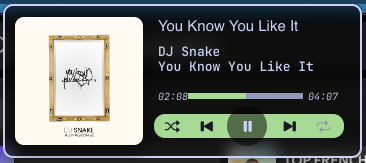

# MARO-001 — Compact player popup redesign

Status: Implementation resolved by the native-card follow-up; remaining manual gates tracked in ACCEPTANCE.md
Priority: Completed implementation; not an open AFK slice
Requested by the user: 2026-10-01

## Current resolution — 2026-10-02

The [resolved transport follow-up](../../.scratch/maro-player-polish/issues/01-align-transport-controls.md)
supersedes the intermediate SketchyBar row layout described below. The installed
companion owns a native card with horizontal transport, independent hit targets,
accessible controls, scrolling titles and proportional artwork. Eleven native
states were rendered; scoped installed inspection verified layout, Favorites/Now
Playing, Escape and handler reopening. This is recorded evidence from that ticket,
not a new inspection performed during reconciliation.

Historical implementation notes below remain for traceability. Their pending
horizontal-layout statements are superseded. Physical menubar interaction and
audible listening remain separate gates in [Acceptance](../ACCEPTANCE.md).
Manual navigation and personal playlists were authorized later; the original
single-track scope exclusions below do not override those later requests.

## Reference and outcome

Redesign the loaded-track SketchyBar popup around this reference: a compact dark
horizontal card, large square artwork at left, track information at right, a thin
progress bar with elapsed/total time, and a rounded pale-green control strip.
The screenshot is visual direction; its sample song/artist is not default content.

## Implementation scope

User refinement (2026-10-01): Favorite is an outlined/filled star; Search YouTube
and Favorites use visible button styling; long titles loop through their full
text using a scrolling animation. Implemented and installed; visible animation
confirmation is pending.

- Aim for roughly 360–400 × 150–180 points, adapting to actual SketchyBar geometry
  and display scaling. Use a near-black card, subtle light outline, rounded corners,
  restrained shadow, light text, muted secondary text and a soft green accent.
- Show artwork around 120–128 points square with rounded corners and a neutral
  missing-artwork fallback. Preserve the image's proportions; avoid stretching.
- Fetch the actual video's YouTube preview image for this artwork, as explicitly
  requested by the user. Reuse source thumbnail metadata and the existing bounded
  thumbnail cache; load asynchronously without delaying playback. Reuse cached
  previews in search and Favorites, and retain a neutral fallback on fetch failure.
- Right column: readable title, quieter creator, thin progress track, and aligned
  elapsed/total timestamps. Clamp progress safely; use an unknown-duration state
  when duration is missing. Long metadata must truncate without covering controls.
- Put real actions in the green capsule: central Play/Pause (Replay when ended),
  Favorite and Search. Provide a clear Favorites view entry and retain the saved
  collection. Keep compact hit targets usable, with readable status/error feedback.
- Preserve the fixed click-to-open/close behavior. Moving from bar to popup must
  not dismiss controls, and stale mouse-exit events must not swallow clicks.
- Keep source/controller ownership and existing cache/IPC boundaries. First use
  SketchyBar item layout, image and drawing properties; do not add a second app or
  dependency just to reproduce the appearance. Investigate layout constraints
  before changing architecture and document any concrete fidelity limitation.
- Refresh progress at a bounded rate only while useful/visible. Avoid making all
  controller position ticks launch full bar redraws. No new seek behavior is needed
  for this visual progress indicator.

## Scope decisions

The reference includes shuffle, previous/next and repeat. Those are not authorized
as new playback features by a visual redesign alone: the current PRD explicitly
excludes queue/autoplay/next/previous. Preserve single-track behavior and adapt the
capsule to existing actions. Do not display decorative nonfunctional buttons.
If matching those functions becomes necessary, obtain a separate scope decision.
The new user request supersedes earlier popup styling, not the playback contract.

## Acceptance

1. The real installed popup visibly matches the reference's two-column composition,
   dark card, prominent artwork, progress/timestamps and green controls.
2. Actual data drives title, creator, artwork and progress; paused, playing, ended,
   missing artwork, long text, unknown duration and source errors remain usable.
3. Opening, closing and reopening with physical clicks works; Play/Pause, Favorite,
   Favorites and Search remain reachable. No audio is started just to inspect style.
4. Favorites remain bounded at 20 and all existing playback/state checks still pass.
5. Changes install reversibly and preserve unrelated SketchyBar configuration.
6. Record real visual evidence and any user confirmation still needed. Do not claim
   visual fidelity from property queries alone.
7. A real YouTube preview appears for a video with available thumbnail metadata;
   unavailable images and offline cache misses do not break controls or playback.

The unfinished 30-minute listening/manual acceptance gates remain tracked in
../ACCEPTANCE.md and must not be silently counted as passed by this redesign.

## Implementation evidence

- Installed intermediate card on 2026-10-01. Fixed observed text-width overflow and
  stale popup ordering; real cached artwork enabled and handler close/reopen passed.
  Playback stayed paused. Scoped screenshot access is unavailable; visual fidelity
  and shared capsule layout remain open. See PROGRESS for rollback and tool limits.

- Native card foundation now uses popup-background artwork across right-column
  metadata/control rows, a dark rounded border and green transport. This avoids
  overlapping full-height horizontal item click windows. Shared horizontal control
  capsule fidelity is still pending; do not treat the current row layout as final.

- 2026-10-01: added elapsed/total time and a native background-based progress track.
  Two-second updates target only those items while visible and playing/buffering;
  closed popups, Favorites and paused state do not poll playback. Unknown duration
  displays `--:--`; invalid numbers and overrun positions are bounded.
- Existing YouTube metadata/cache/image rendering is reused without another fetcher.
- `python3 scripts/check-sketchybar-renderer.py` passes, including visibility and
  minimal-redraw checks. No installed visual acceptance is claimed yet.
- Next: implement and inspect the reference's horizontal artwork/card/control
  composition, then install the complete presentation change reversibly.

Native property reference: [SketchyBar item properties](https://felixkratz.github.io/SketchyBar/config/items).
